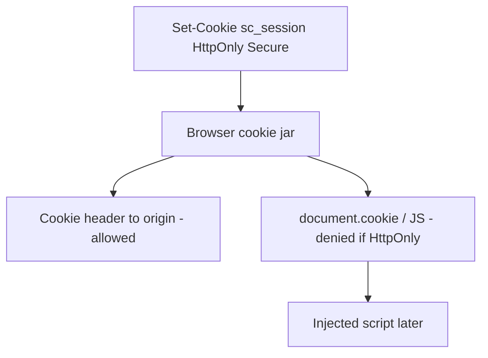
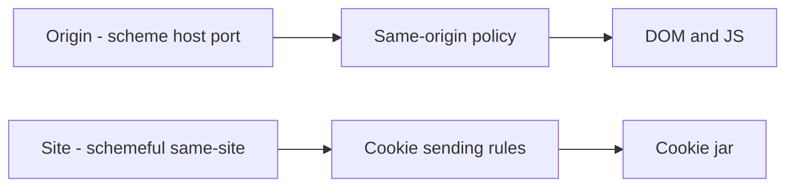

# HttpOnly is a browser setting, not an XSS guarantee

**Kind:** concept-model
**Loop step:** 1 Property

## The rule

The notes app’s session cookie `sc_session` is the login token. If page script can read it, a later injected script can steal who is signed in.

**HttpOnly** is a flag you put on a cookie. When the browser honors it, page script cannot read that cookie through `document.cookie`. The browser may still send it to the origin that set it, on the Cookie header. That is a **browser cookie-jar** rule. It is not a promise that cross-site scripting is impossible.

> For a notes-app session cookie marked HttpOnly, script in the origin cannot read the session value. The browser cookie jar is trusted to honor the flag. The app must actually set it. Missing HttpOnly on a session token is a secrecy failure against script. TLS (`Secure`) is a different rule against the network.

So what must not happen: **script reads the session**. In the practice files, `js_read_session` must not return the dummy value `synthetic-session` for a cookie whose `httponly` flag is true.

Cookie rules ask for HttpOnly on tokens that scripts are not meant to see, and `Secure` on cookies that should not travel in the clear. This week’s check is script-readability, not the whole cookie catalog. A newer cookie RFC is still a **draft** if you cite it. Cookie behavior in the HTML living standard is the living document.

## Picture: two readers of the same cookie

The cookie jar is a shared tool among navigation, subresource loads, and script. HttpOnly takes the script reader out of that share. It does not remove injected script: the script can still call APIs as the user, rewrite the page, and copy **note bodies** the page already loaded. That is why “HttpOnly means no XSS” is false assurance.



**A tool, not the rule:** Next.js `cookies()` defaults, “HttpOnly is on in staging for one cookie,” Content Security Policy Level 3, Trusted Types, SameSite, or `__Host-` prefixes. Prefixes and SameSite are real later rows. They are not this week’s check.

## Picture: origin, site, and the jar



**Origin** is scheme, host, and port. **Site** is the schemeful same-site grouping cookies use. They are not the same word. Origin vs site will matter for third-party iframes and forged cross-site requests. This practice does not prove CORS. Do not try this against other people’s sites.

Content Security Policy Level 3 is a browser load-and-execute policy. In this snapshot the **CSP3 specification** is a Working Draft. Report-Only is a way to **notice**, not this HttpOnly rule. Trusted Types is a Working Draft sink policy. Label both **draft**. Neither replaces output encoding (later work) and neither replaces HttpOnly.

## Why it happens, what it costs, how you stop it, how you notice, how you recover

A session value handed to the script reader fails because **the designers treated a cookie flag as an XSS finish line**, or never set the flag at all.

| Slice | For this rule |
|---|---|
| Why it happens | The session value is shown to the script reader |
| What has to be true first | A cookie without HttpOnly, or a reader that ignores the flag; script runs |
| Trigger | `js_read_session` on `sc_session` |
| What it costs | Session secrecy against script; a thief then acts as the signed-in member |
| How you stop it | Set HttpOnly; only `Set-Cookie` carries the value |
| How you notice | Staging scan: `Set-Cookie` without HttpOnly; never log the value |
| How you recover | Rotate the session; treat it as a stolen login if script could have read it |

## What the framework does vs what you still have to check

“Next.js cookies are httpOnly by default” is not true for every cookie you set by hand, for a second analytics cookie, or for a WebView bridge. FastAPI `Response.set_cookie` will emit whatever flags you pass.

What this practice is supposed to show: `sc_session` object in the practice is unread by `js_read_session` when `httponly` is true — files in `labs/2.3/2.3-browser-policy`. It is not a live browser exploit page.

## What the tool cannot do

- Browser extensions can still read cookies the browser shows them. Leftover; not what you trust for this rule.
- Someone at the laptop, or a debugger. Leftover (same shape as coercion on the recovery page).
- `localStorage` is not “safer.” It is always script-readable. Do not move the session there.
- SameSite is not a complete defense against forged cross-site requests. Purpose-appropriate SameSite is a sister cookie rule; the CSRF check is a later row.
- HttpOnly does not bind company (who is allowed) and does not set the cache key.

## Practice

Name which reader (jar vs script) must not see `sc_session`. Then run the local pair:

```text
python3 -m pytest labs/2.3/2.3-browser-policy/tests --impl vulnerable
python3 -m pytest labs/2.3/2.3-browser-policy/tests --impl fixed
```

Tie the check to script readability, not to “XSS is fixed.”

## Use it somewhere new

A clinic patient-portal session cookie, or a React Native WebView cookie bridge. Which reader is new, and which leftover (extension, WebView injection) must be rewritten rather than deleted?

## What this page is not doing

Do not use live sites, XSS recipes, copy-paste gadget chains, attacking third-party origins through CORS or CSRF. Answer keys are not on this site.
