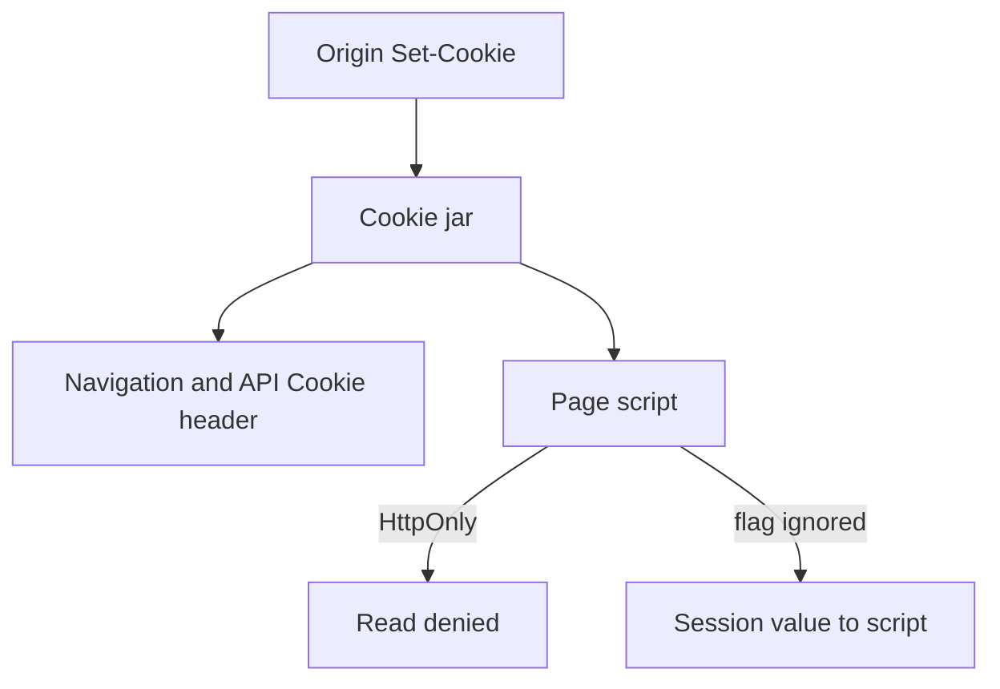

# A browser policy table someone else can test

**Kind:** design-exercise
**Loop step:** 2 Model

## Could someone else name the checks from your table?

A poster of “we use CSP, cookies, and CORS” is not enough without **which reader** may see `sc_session` and **which controls are not this check**.

A local cookie-jar model. No real DOM exploit page, no third-party iframe product, no live CORS test against someone else’s site.

## Picture: the jar sends; script must not read

If `JS` can reach the value while `httponly` is true, the map already predicts `test_script_cannot_read_httponly_session` will fail.

## Step 1: name the pieces

| Piece | This system |
|---|---|
| Who | Page script (including your bundle after XSS); browser jar; later injected script; network attacker (TLS, not this practice); extension (leftover) |
| What | `sc_session` value; `Set-Cookie` flags; `document.cookie` model |
| Actions | `js_read_session`; send Cookie header; set flags |
| Paths | DOM; Cookie header; later WebView bridge |
| What you trust | The browser honors HttpOnly; the server sets the flag on this cookie |
| What you do not trust | Any JavaScript in the origin; cookie flags the client invents |
| Time | Cookie lifetime vs the window while injected script can run |
| The rule | Session secrecy against script |

## Step 2: write the rows

| Who | What | Action | Decision |
|---|---|---|---|
| page script | HttpOnly `sc_session` | read | deny |
| browser | Cookie header to origin | send | allow |
| injected script | session via JS | steal | deny if HttpOnly; XSS still other rules |
| network attacker | cookie on the wire | read | TLS / `Secure` — not this practice |
| your analytics cookie | script | read | allow only if it is not a session token |

A missing analytics row is how a second cookie quietly becomes a session. Write the hole.

## Step 3: draft versus this check

| Control | Status in this snapshot | Relation to HttpOnly |
|---|---|---|
| HttpOnly on `sc_session` | Final cookie-list expectation for tokens scripts must not see | This practice |
| Secure | Final sister expectation | Sister rule; the practice object includes it |
| CSP3 | Working Draft | Not a substitute; Report-Only is notice, not this rule |
| Trusted Types | Working Draft | Sink typing; later encoding work |
| SameSite | Sister cookie rule | CSRF-adjacent; not this check |

## Practice

Label `cookies.py` under `labs/2.3/2.3-browser-policy`.

## Use it somewhere new

Third-party iframe: origin vs schemeful same-site. Add rows. This practice does not prove CORS. Do not plan tests against a public site.

## What can still go wrong

Browser extensions; physical access; injected script that does not need the cookie value.

## What this page is not doing

Naming XSS on a slide does not set HttpOnly on `sc_session`. Answer keys are not on this site.
