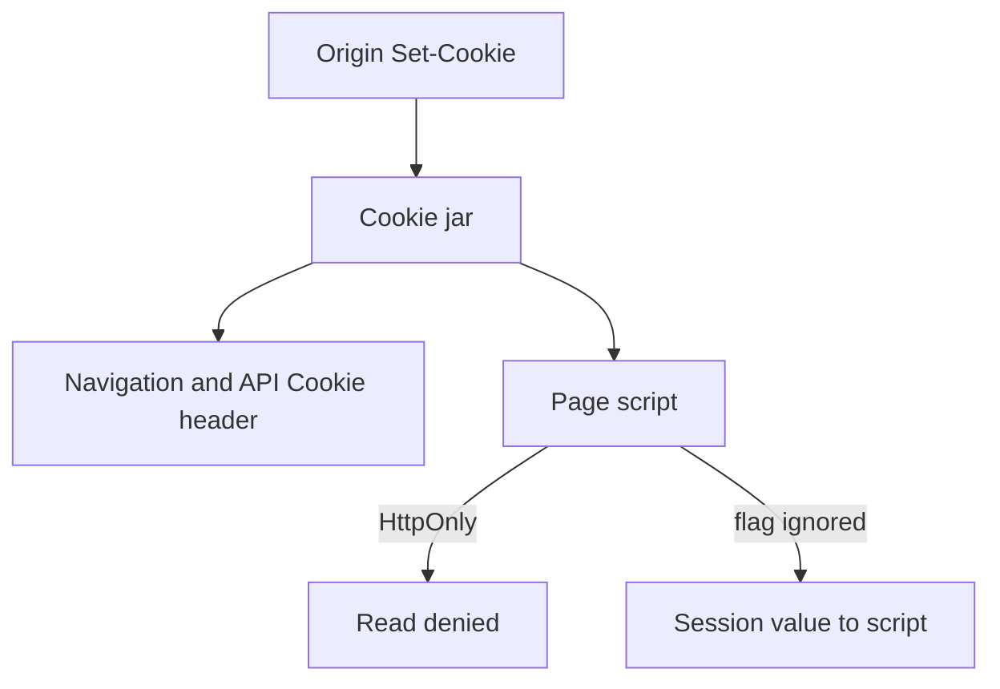

# 2.3-LO-02 — A browser policy matrix a second engineer can test

**Kind:** design-exercise
**Loop step:** 2 Model
**Standards:** HTML Living Standard cookies (living); OWASP ASVS 5.0.0 (final) `v5.0.0-3.3.4` and `v5.0.0-3.3.1`; CSP3 and Trusted Types labeled **draft**.

## Can a second engineer name pytest cases from your matrix?

A poster of “we use CSP, cookies, and CORS” is not this lesson. A browser policy matrix names **which interpreter** may see `sc_session` and **which controls are not this cell**.

SecureCollab Phase 1 freeze: local cookie-jar fixture. No real DOM exploit page, no third-party iframe product, no live CORS test against someone else’s site.

## Mental model: jar sends; script must not read

If `JS` can reach the value while `httponly` is true, the map already predicts `test_script_cannot_read_httponly_session` will fail.

## Step 1: freeze subjects and objects

| Piece | This system |
|---|---|
| Subjects | Page script (including your bundle after XSS); browser jar; later XSS; network attacker (TLS, not this lab); extension (residual) |
| Objects | `sc_session` value; `Set-Cookie` flags; `document.cookie` model |
| Actions | `js_read_session`; send Cookie header; set flags |
| Channels | DOM; Cookie header; later WebView bridge |
| TCB | Browser honors HttpOnly; server sets the flag on this cookie |
| Untrusted | Any JavaScript in origin; client-supplied cookie flags |
| State / time | Cookie lifetime vs XSS window |
| 1.1 cell | Session confidentiality against script |

## Step 2: write cells

| Subject | Object | Action | Decision |
|---|---|---|---|
| page script | HttpOnly `sc_session` | read | deny |
| browser | Cookie header to origin | send | allow |
| XSS | session via JS | steal | deny if HttpOnly; XSS still other cells |
| network attacker | cookie on the wire | read | TLS / `Secure` — not this lab |
| your analytics cookie | script | read | allow only if it is not a session token |

A missing analytics cell is how a second cookie silently becomes a session. Write the hole.

## Step 3: draft versus this oracle

| Control | Status in this snapshot | Relation to HttpOnly |
|---|---|---|
| HttpOnly on `sc_session` | ASVS `v5.0.0-3.3.4` final | This lab |
| Secure | ASVS `v5.0.0-3.3.1` final | Sister cell; fixture includes it |
| CSP3 | Working Draft | Not a substitute; Report-Only is detection |
| Trusted Types | Working Draft | Sink typing; later E2 / 6.2 |
| SameSite | ASVS `v5.0.0-3.3.2` | CSRF-adjacent; not this pytest |

## Practice

Draw the matrix so a second engineer could name pytest cases. Point at `labs/2.3/2.3-browser-policy` file `cookies.py`.

## Transfer

Third-party iframe: origin vs schemeful same-site. Add rows; this lab does not prove CORS. Do not plan tests against a public site.

## Residual risk

Browser extensions; physical access; XSS that does not need the cookie value.

## Non-goals

Top 10 as the definition of security. Keys stay out of lessons.
