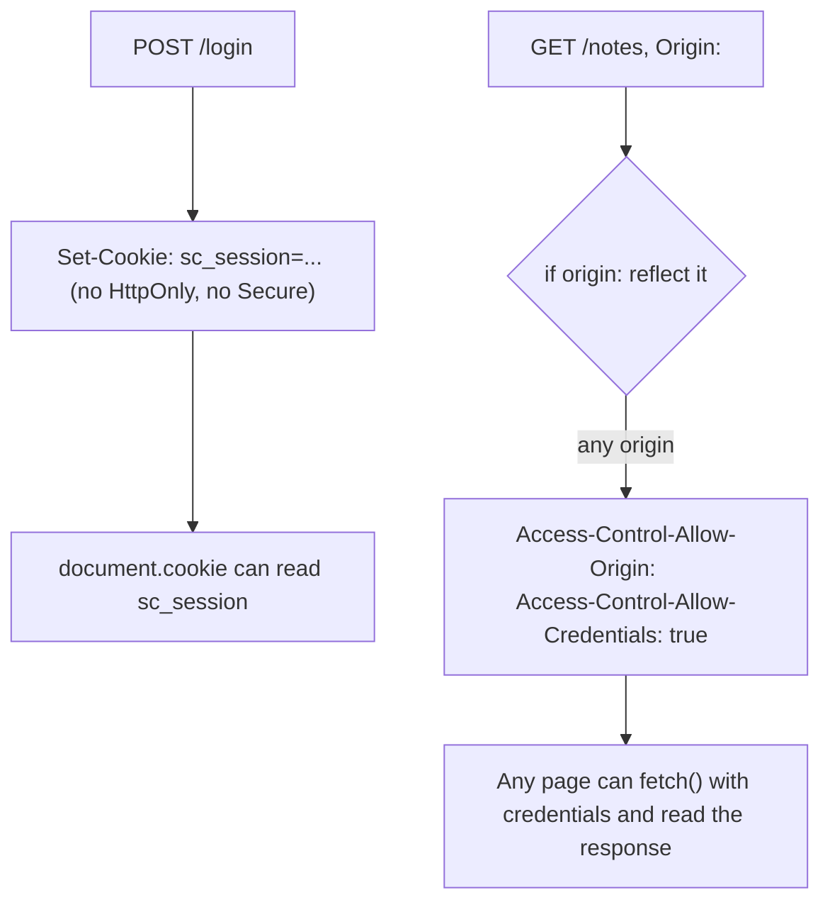

# Local fixture: a reflected origin and a script-readable session cookie

**Kind:** mechanism-lab
**Loop step:** 3 Break

## Try it

The practice is not a website you attack, and it is not a browser you open. `labs/2.3/2.3-browser-policy/vulnerable/app.py` is a small FastAPI application with two routes, `POST /login` and `GET /notes`, reached only through `fastapi.testclient.TestClient` — a Python object that sends real HTTP requests to the app in-process and hands back a real HTTP response, headers included, without ever opening a browser or a network socket to anyone else's machine.

> Script in the origin cannot read `sc_session` when `HttpOnly` is set, and a script at an arbitrary cross-origin cannot get a credentialed answer from `/notes` unless its exact origin was checked first. Both fail in this fixture, for two separate reasons that happen to live in two separate lines of code.

## Where you may practice

Run this only inside `labs/2.3/2.3-browser-policy/`. The data is synthetic; `sc_session`'s value, `synthetic-session`, is a fixture label, not a real credential, and the note text the API returns is placeholder copy, not a real member's data.

```bash
python3 -m pytest labs/2.3/2.3-browser-policy/tests --impl vulnerable
```

Do not paste XSS recipes here, and do not point any of this module's tooling at a public origin, an employer's login cookie, or a classmate's deployment — every request this command sends stays inside the `TestClient`'s in-process app.

## Picture: two defects, staged separately



The diagram's two starting boxes, `Login` and `Notes`, never touch each other — that is the point. `js_read_session`-style cookie exposure and CORS credential leakage are independent failures a fix for one does not touch, which is exactly why the lab stages them as two different assertions rather than one, and why a review that only checks the cookie flag and calls the module "done" walks past the second failure entirely.

## What to look at: the cause, not a hunt

`vulnerable/app.py`'s `login` handler calls `response.set_cookie("sc_session", "synthetic-session")` with none of `httponly`, `secure`, or `samesite` set, so FastAPI's default (all three flags off) is what ships. That single omission is the entire cause of the first forbidden outcome; there is no logic to trace, no branch to misread — the flag was simply never asked for.

The second cause takes a little more reading, because it looks, at a glance, like an allow-list. The `notes` handler reads the caller's `Origin` header and, `if origin:`, sets `Access-Control-Allow-Origin` to that exact value and `Access-Control-Allow-Credentials` to `"true"`. There is no comparison against a list of trusted origins anywhere in that branch — the condition only asks "did the caller send an `Origin` header at all," not "is this origin one we trust." A caller who sends `Origin: https://evil.example` gets `Access-Control-Allow-Origin: https://evil.example` back, because the function's only question was ever "is there a value here to reflect."

Neither defect requires the attacker to do anything unusual to trigger it. A normal browser, following its own ordinary rules, will attach the `sc_session` cookie to any request it sends to `app.securecollab.example`, whether that request was initiated by the member clicking a link or by a script running on a completely different page the member happens to have open in another tab. The vulnerable server's job was to look at the resulting request and decide, correctly, whether to hand the response back to the calling script — and it fails that job not because the request looked malformed, but because the two decisions the server needed to make (is this cookie readable to script; is this origin one I trust with credentials) were each replaced by a simpler question that happens to always answer yes. `if origin:` is true for essentially every real cross-origin request a browser sends, since browsers attach `Origin` automatically; the only requests that omit it are same-origin ones, which never needed a CORS grant in the first place. The branch is, in effect, dead code dressed as a security check — it always takes the "grant" path for the only kind of request that could ever ask for one.

## Why it happens, what it costs, how you stop it, how you notice, how you recover

| Slice | This practice |
|---|---|
| The rule | Session secrecy against script (C1); response secrecy against an uninvited credentialed caller (C2, C3) |
| Why it happens | `set_cookie` was called with the flag arguments omitted; the CORS branch reflects any `Origin` value instead of checking one |
| What's already wrong | `sc_session` has no `httponly`/`secure`; `/notes` has no `ALLOWED_ORIGINS` check anywhere in its CORS branch |
| Trigger | `POST /login` for the cookie; `GET /notes` with `Origin: https://evil.example` and a cookie for the CORS case |
| What it costs | Session secrecy against any same-origin script; for CORS, any cross-origin page can read a signed-in member's notes without needing the cookie's value at all |
| How you stop it | Pass `httponly=True, secure=True` to `set_cookie`; replace the CORS branch's `if origin:` with `if origin in ALLOWED_ORIGINS:` |
| How you notice | A staging scan for `Set-Cookie` missing `HttpOnly`; a staging scan for `Access-Control-Allow-Origin` values that were not in a known allow-list |
| How you recover | Rotate every session that could have been exposed; treat a script-readable cookie or a reflected-origin grant as equivalent to a stolen credential, because both let an attacker act as the member without ever guessing a password |

## Counterexample: fixing the obvious case does not fix the CORS case

A teammate who reads only the cookie handler and adds `httponly=True, secure=True` has genuinely fixed the first forbidden outcome — `document.cookie` really can no longer read `sc_session` after that change. But `test_forbidden_outcome_attacker_origin_gets_no_credentialed_access` still fails against that same partial fix, because nothing about the cookie flags touches the `notes` handler's reflection branch. The two fixes are independent, which is the same lesson [`lessons/01-property.md`](01-property.md) drew from `Secure` and `HttpOnly`: satisfying one browser-enforced check is never evidence about an unrelated one.

## Practice

```bash
python3 -m pytest labs/2.3/2.3-browser-policy/tests --impl vulnerable -q
```

Record which of the eight tests fail and, for each failing test, name which of the two causes above it is failing for — not merely that it failed. Do not weaken an assertion to make it pass; an environment or import error is not security evidence either way, and a test that merely stops raising is not the same thing as a test that now asserts the right property for the right reason.

## Use it somewhere new

A React Native WebView that loads SecureCollab's web client and exposes cookies to injected WebView-side JavaScript introduces a third reader neither of these two causes accounts for. Predict, without leaving this directory, whether fixing `HttpOnly` on `sc_session` would still leave that WebView bridge able to read the session, and why.

## Can people still use it

Neither defect changes anything about the login form's own usability; `HttpOnly` and a CORS allow-list are both invisible to a keyboard user, a screen reader, or someone recovering from a lockout. Do not "fix" either defect by moving the session into `localStorage`, which trades a script-readability failure the browser can enforce against for one it cannot.

## What this page is not doing

No live-target steps, no XSS gadget chains, no real session or note data. Dummy `synthetic-session` value only, inside `labs/2.3/2.3-browser-policy`, and no request in this exercise ever leaves the `TestClient` process.
