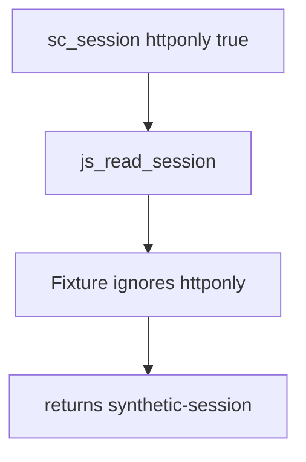

# 2.3-LO-03 — Observe the script-readable session, do not trophy it

**Kind:** mechanism-lab
**Loop step:** 3 Break
**Standards:** HTML Living Standard cookies (living); OWASP ASVS 5.0.0 (final) `v5.0.0-3.3.4`; CSP3 and Trusted Types remain **Working Drafts** and are not this oracle.

## Authorized scope

`labs/2.3/2.3-browser-policy` only. The fixture is an in-process model of `document.cookie`. It does not open a browser, load a page, or talk to a network. Do not paste XSS payloads. Do not point this exercise at a public origin, an employer SSO cookie, or a classmate’s deployment.

**Forbidden outcome:** script reads the HttpOnly SecureCollab session cookie `sc_session`.

Attacker capability in this lab: a same-origin script interpreter that can call `js_read_session`. That stands in for injected script you will meet in 6.2. Trust assumption: the cookie jar is supposed to honor `httponly`. The Next.js client, a CSP scanner, and TLS on the hop are not in the TCB for this cell.

## Mental model: the flag is present and ignored



The vulnerable tree demonstrates **cause** (the session value is presented to the script interpreter), not a trophy exploit. Preconditions: a cookie object whose `httponly` flag is already `True`; a reader that returns `value` anyway. `Secure` is already true in `HTTPONLY_SESSION`—HTTPS does not imply unreadability to JS.

## What to read in the fixture

`vulnerable/cookies.py` `js_read_session` returns `session["value"]` whenever the name exists. The test binds `HTTPONLY_SESSION` with `httponly: True` and `secure: True` and expects `None`. You do not need a new cookie string. The failure of `test_script_cannot_read_httponly_session` *is* the evidence.

Do not open the fixed tree yet. Diagnose the cause first.

## Root cause vs impact vs prevention vs detection vs recovery

| Slice | This lab |
|---|---|
| Required property | Script in the origin cannot read `sc_session` when HttpOnly is set |
| Root cause | Session value is a script-visible string; the flag is not consulted |
| Preconditions | Cookie named `sc_session`; `httponly: True`; a JS-shaped reader exists |
| Trigger | `js_read_session(HTTPONLY_SESSION)` |
| Impact | Confidentiality of the bearer that later 1.2 will treat as the member; Tenant B with XSS (6.2) becomes Tenant A |
| Prevention | Honor HttpOnly in the jar model; do not store the session in `localStorage` |
| Detection | Staging review of `Set-Cookie` flags; never log the value |
| Recovery | Rotate session ids; fix the setter; retest this pytest |
| Not the lesson | “XSS is solved,” a CWE mnemonic, CSP3, or Trusted Types |

## Framework defaults versus the jar guarantee

A FastAPI `Set-Cookie` helper, Next.js `cookies().set`, or “HttpOnly is on in staging for one cookie” is not this pytest. The application must actually set the flag on `sc_session`, and the jar must refuse script reads. Browser defaults differ by name; a debug cookie without the flag is a new cell, not a passing residual.

## Practice

```text
python3 -m pytest labs/2.3/2.3-browser-policy/tests --impl vulnerable
```

Record the failing test `test_script_cannot_read_httponly_session`. Do not weaken the assertion. An environment or import error is not security evidence.

## Transfer

React Native WebView cookie bridge: a new interpreter between the jar and JS. Predict, without leaving this directory, whether HttpOnly on the Android cookie store still hides `sc_session` from injected WebView script.

## Usability

HttpOnly does not make login keyboard-inoperable. 1.4 still applies to the login and recovery widgets. Do not “fix” a mouse-only confirm by putting the session in `localStorage`.

## Non-goals

No live-target instructions. Synthetic session value only. No XSS gadget chains in this file.
