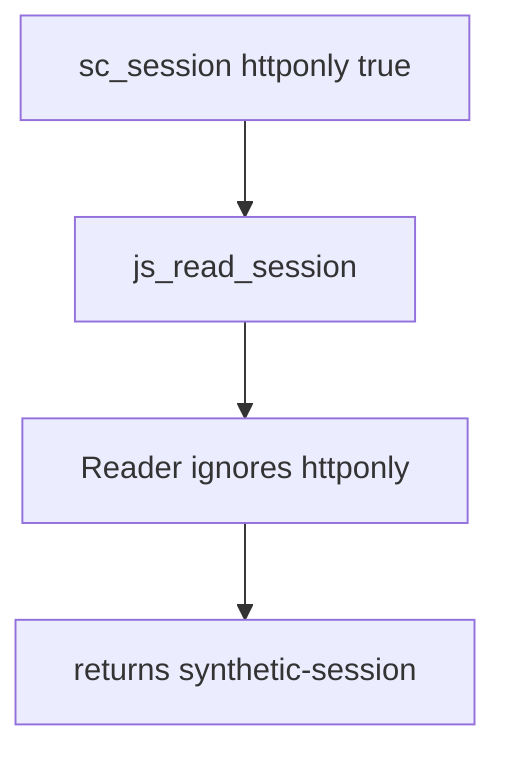

# Practice: script reads the HttpOnly session cookie

**Kind:** mechanism-lab
**Loop step:** 3 Break

## Try it

The practice is not a website you attack. It is a tiny in-process model of `document.cookie`. It does not open a browser, load a page, or talk to a network. The failure is already in the reader: the HttpOnly flag is present and ignored. The point is to see that the check treats that as a **failed rule**, not as a trophy exploit.

The rule under test:

> Script in the origin cannot read `sc_session` when HttpOnly is set.

## Where you may practice

Only `labs/2.3/2.3-browser-policy` is in scope. Fake session value only. Restore the broken and repaired folders from git when you are done.

Do not paste XSS recipes. Do not point this exercise at a public origin, an employer login cookie, or a classmate’s deployment.

What an attacker can do here: a same-origin script reader that can call `js_read_session`. That stands in for injected script you will meet in later encoding work. What is supposed to stop this: the cookie jar is supposed to honor `httponly`. The Next.js client, a CSP scanner, and TLS on the hop are not enough.

## Picture: the flag is present and ignored



The broken files show **cause** (the session value is handed to the script reader), not a trophy exploit. What has to be true first: a cookie object whose `httponly` flag is already `True`; a reader that returns `value` anyway. `Secure` is already true on `HTTPONLY_SESSION` — HTTPS does not mean unreadability to JS.

## What to look at: the cause, not a trophy

`vulnerable/cookies.py` `js_read_session` returns `session["value"]` whenever the name exists. The check binds `HTTPONLY_SESSION` with `httponly: True` and `secure: True` and expects `None`. You do not need a new cookie string. The failure of `test_script_cannot_read_httponly_session` *is* the evidence.

Do not open the repaired files yet. Diagnose the cause first.

## Why it happens, what it costs, how you stop it, how you notice, how you recover

| Slice | This practice |
|---|---|
| The rule | Script in the origin cannot read `sc_session` when HttpOnly is set |
| Why it happens | The session value is a script-visible string; the flag is not consulted |
| What has to be true first | Cookie named `sc_session`; `httponly: True`; a JS-shaped reader exists |
| Trigger | `js_read_session(HTTPONLY_SESSION)` |
| What it costs | Secrecy of the login token; with later XSS, company B can act as company A |
| How you stop it | Honor HttpOnly in the jar model; do not store the session in `localStorage` |
| How you notice | Staging review of `Set-Cookie` flags; never log the value |
| How you recover | Rotate session ids; fix the setter; re-run this check |
| Out of scope | “XSS is solved,” a weakness mnemonic, CSP3, or Trusted Types |

## What the framework does vs what you still have to check

A FastAPI `Set-Cookie` helper, Next.js `cookies().set`, or “HttpOnly is on in staging for one cookie” is not this week’s check. The app must actually set the flag on `sc_session`, and the jar must refuse script reads. Browser defaults differ by name; a debug cookie without the flag is a new row, not a leftover you can ignore.

## Practice

```text
python3 -m pytest labs/2.3/2.3-browser-policy/tests --impl vulnerable
```

Record the failing test `test_script_cannot_read_httponly_session`. Do not weaken the assertion. An environment or import error is not security evidence.

## Use it somewhere new

React Native WebView cookie bridge: a new reader between the jar and JS. Predict, without leaving this directory, whether HttpOnly on the Android cookie store still hides `sc_session` from injected WebView script.

## Can people still use it

HttpOnly does not make login keyboard-inoperable. Usable recovery still applies to the login and recovery widgets. Do not “fix” a mouse-only confirm by putting the session in `localStorage`.

## What this page is not doing

No live-target steps. Dummy session value only. No XSS gadget chains in this file.
