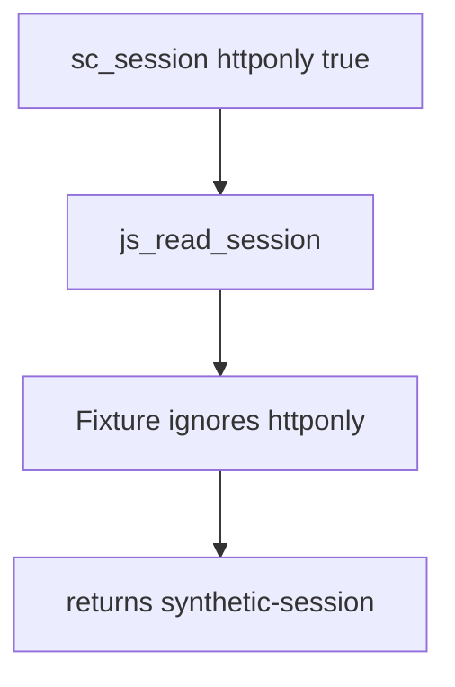

# 2.3-LO-03 — Observe the script-readable session, do not trophy it

**Kind:** mechanism-lab
**Loop step:** 3 Break
**Standards:** HTML Living Standard cookies (living); OWASP ASVS 5.0.0 (final) `v5.0.0-3.3.4`.

## Authorized scope

`labs/2.3/2.3-browser-policy` only. Model of `document.cookie`. No real browser exploit pages. Do not paste XSS payloads.

**Forbidden outcome:** script reads the HttpOnly session cookie.

## Mental model: the flag is present and ignored



The vulnerable tree demonstrates **cause** (session presented to the script interpreter), not a trophy exploit. Preconditions: cookie object with `httponly: True`; reader that returns `value` anyway. `Secure` is already true in the test fixture—HTTPS does not imply unreadability to JS.

## What to read in the fixture

`vulnerable/cookies.py` `js_read_session` returns `session["value"]` whenever the name exists. The test binds `HTTPONLY_SESSION` with `httponly: True` and expects `None`.

## Root cause vs impact

| Slice | Lab |
|---|---|
| Root cause | Session presented to the script interpreter |
| Impact | Session theft then 1.2 as the thief |
| Not the lesson | “XSS is solved,” a CWE mnemonic, or CSP3 |

## Practice

```
python3 -m pytest labs/2.3/2.3-browser-policy/tests --impl vulnerable
```

Record the failing test `test_script_cannot_read_httponly_session`. Do not weaken the assertion.

## Transfer

React Native WebView cookie bridge: a new interpreter. Predict without leaving this directory.

## Non-goals

No live-target instructions. Synthetic session value only.
