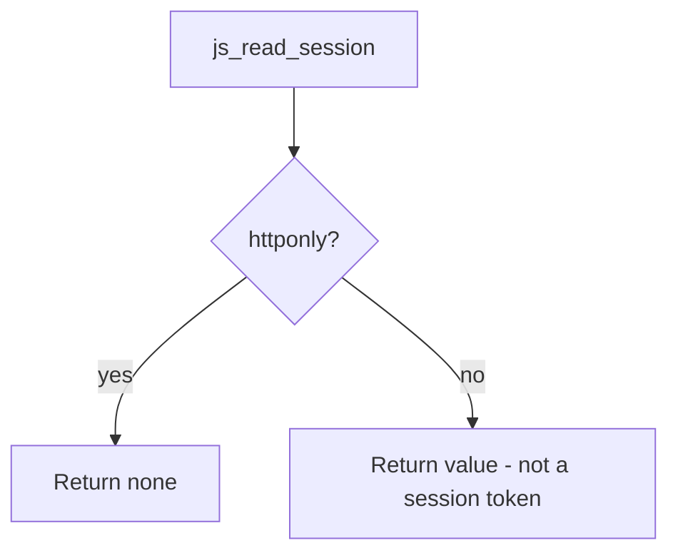

# Set HttpOnly; do not claim XSS is finished

**Kind:** design-exercise
**Loop step:** 4 Build

## The rule

`js_read_session` must return `None` when `httponly` is true. Structural means the cookie model actually branches on the flag — not a comment, not Report-Only CSP, not “we will encode later.”

The smallest restore for the notes-app `sc_session` is: if the cookie is a session token, set HttpOnly, and make the script reader fail closed. Moving the token into `localStorage` enlarges the script share. Prefixes (`__Host-`) and `Secure` are sister rules; they do not replace this branch.

## Picture: one rule restored



The repaired files honor the flag. XSS is **not** solved: encoding, CSP (draft), and Trusted Types (draft) remain later work. Fail-safe for a session token: if the flag is missing, treat it as a defect, not as “readable is fine.”

## Why this restores the rule

| After the fix | Must be true |
|---|---|
| `httponly: True` on `sc_session` | `js_read_session` is `None` |
| Cookie header to the origin | Still allowed; the jar may send `Cookie` |
| Non-session cookies | May remain script-readable if that is the product intent; do not silently reuse the session name |

Cookie rules ask for HttpOnly when the value is not meant for scripts. The check is that cookie rule, not a full cookie list.

## What this is not

CSP3, Trusted Types, SameSite, `__Host-`, or moving the token to `localStorage`. Next.js `cookies()` defaults are not this cookie. Report-Only CSP is detection theater if you count it as this rule. FastAPI `Response.set_cookie(httponly=True)` is a tool; the check still has to observe unreadability.

## What can still go wrong

HttpOnly does not stop the script from calling `/notes` as the user, reading note bodies already in the page, or copying them out. It does not stop extensions that see cookies. It does not set `Secure`. A WebView bridge can still expose the value if the bridge ignores the flag — name that as later leftover, not as a silent pass.

## Practice

Name who (script in the origin), what (`sc_session` value), action (read), and the check that must be true (`httponly` ⇒ `None`). Run:

```text
python3 -m pytest labs/2.3/2.3-browser-policy/tests --impl fixed
```

## Use it somewhere new

Clinic portal session cookie. The fix is still “script cannot read the session token,” not “we shipped a CSP.” If the clinic also has a WebView, the same check must hold on that bridge.

## Leftover you will not delete

Extensions; XSS without cookie theft; missing `Secure` on the same cookie; WebView bridges; draft CSP/Trusted Types unused.

## Can people still use it

The login form remains a usable, who-is-allowed control. HttpOnly is invisible to the keyboard user. Do not trade an accessible login for a script-readable store.
