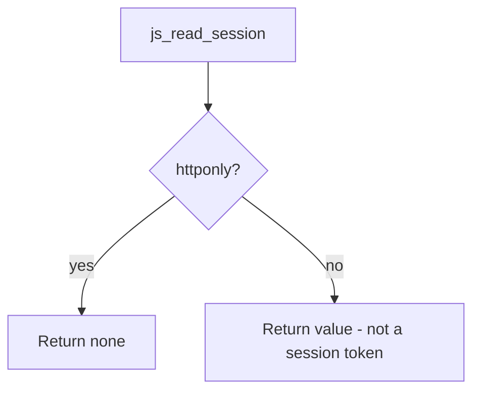

# 2.3-LO-04 — Honor HttpOnly; do not claim XSS is finished

**Kind:** design-exercise
**Loop step:** 4 Build
**Standards:** OWASP ASVS 5.0.0 (final) `v5.0.0-3.3.4`; CSP3 and Trusted Types labeled **draft**.

## Structural means the script interpreter is excluded

`js_read_session` must return `None` when `httponly` is true. Structural means the lab’s cookie model actually branches on the flag—not a comment, not Report-Only CSP, not “we will encode later.”

## Mental model: one cell restored



The fixed tree honors the flag. XSS is **not** solved: encoding, CSP (draft), and Trusted Types (draft) remain later work. Fail-safe for a session token: if the flag is missing, treat it as a defect, not as “readable is fine.”

## Why this restores the cell

| After the fix | Must be true |
|---|---|
| `httponly: True` | `js_read_session` is `None` |
| Session still sent | Cookie header path is out of this function; the jar still sends |

## What this is not

CSP3, Trusted Types, SameSite, `__Host-`, or moving the token to `localStorage`. Next.js defaults are not this cookie.

## Practice

Name subject, object, action, and the predicate. Run:

```
python3 -m pytest labs/2.3/2.3-browser-policy/tests --impl fixed
```

Must pass.

## Transfer

Clinic portal session cookie. The fix is still “script cannot read the session token,” not “we shipped a CSP.”

## Residual risk

Extensions; XSS without cookie theft; missing `Secure` on the same cookie (sister cell).
