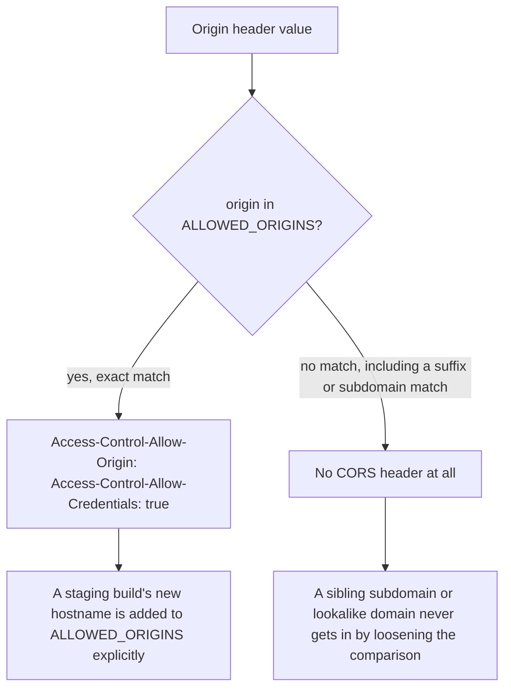

# An exact allow-list, HttpOnly, and an enforcing CSP — not three slogans

**Kind:** design-exercise
**Loop step:** 4 Build

## The rule for each defect

[`lessons/03-break.md`](03-break.md) traced two independent causes to two independent lines of code, so the repair is two independent changes, not one change described twice. For the cookie: `set_cookie` must be called with `httponly=True` and `secure=True`, so the browser's cookie jar — not a comment, not a code-review checklist — refuses `document.cookie` a value. For CORS: the `notes` handler's branch must change from "does the caller have an `Origin` header at all" to "is the caller's `Origin` an exact member of a fixed set of trusted origins," and `Access-Control-Allow-Credentials: true` must be set only inside that same branch, never unconditionally.

> `js_read_session`-style access to `sc_session` must return nothing once `HttpOnly` is set, and `/notes` must reflect `Access-Control-Allow-Origin` only for an origin found by exact string membership in `ALLOWED_ORIGINS` — never by a suffix, a substring, or the bare presence of any `Origin` header at all.

## Picture: the exact check that has to hold



The diagram's branch condition is doing all the work, and it is worth being precise about what "exact match" rules out. `origin in ALLOWED_ORIGINS` where `ALLOWED_ORIGINS` is a Python `frozenset` of literal strings is exact match. `origin.endswith("securecollab.example")` is not, because it is also true for `https://evilsecurecollab.example`, a domain that shares no dot-delimited label with the trusted one at all. `origin.endswith(".securecollab.example")` — the dot-anchored version many real systems reach for as a "smarter" fix — is closer, but it is still not exact match for this fixture's stated design, because it would silently trust every present and future subdomain of `securecollab.example`, including ones nobody has provisioned yet, when the actual design intends to trust exactly one: `https://app.securecollab.example`.

## Why this restores the rule

| After the fix | Must be true |
|---|---|
| `httponly=True, secure=True` on `sc_session` | `document.cookie` in the origin cannot read the value; the browser still sends it on the `Cookie` header for ordinary requests |
| `origin in ALLOWED_ORIGINS` gates both CORS headers together | An origin outside the set gets neither header — not a narrower grant, no grant at all |
| `ALLOWED_ORIGINS` is a literal, explicit set | Adding a staging hostname is a one-line addition to that set, never a loosening of the comparison itself |
| `Content-Security-Policy` (not only `-Report-Only`) is sent on every response | The browser actually refuses a disallowed script load, not merely reports one |

Cookie rules ask for `HttpOnly` specifically on values scripts are not meant to see; CORS rules ask for a comparison against a *fixed* set, specifically because the whole value of an allow-list is that it does not grow by accident when a caller sends a new value. A repair that satisfies the cookie row while leaving the CORS branch's condition unchanged closes exactly one of [`lessons/03-break.md`](03-break.md)'s two causes, and the lab's forbidden-outcome test for the other one keeps failing until both are touched.

## The third change this lesson's title promises

The cookie and CORS fixes above repair C1 through C3; this module's fourth claim, C4, is a different kind of change, because `Content-Security-Policy-Report-Only` is not a weaker version of `Content-Security-Policy` the way an unlisted origin is a weaker version of a listed one — it is a header with an entirely different effect on the browser. Sending `Content-Security-Policy-Report-Only: default-src 'self'` asks the browser to evaluate the policy against every load and execution on the page and send a report to a named endpoint for each violation, while changing nothing about whether any of those loads or executions actually happen. Sending `Content-Security-Policy: default-src 'self'` asks the browser to block them. The fix is therefore not "strengthen the Report-Only header" — there is no strength dial on a reporting header — it is sending the enforcing header at all, with a policy that meets ASVS's stated floor for a global policy: `object-src 'none'` and `base-uri 'none'`, plus `frame-ancestors 'none'` so the page itself cannot be framed by an origin nobody approved. A team that wants the safety of testing a stricter policy before turning it on can legitimately run both headers side by side, with `-Report-Only` carrying the *stricter, not-yet-enforced* draft policy while the plain header keeps enforcing the current one — but a `-Report-Only` header standing alone, with no enforcing sibling, is reporting on a policy that protects nobody.

## Rejected alternatives

A competent engineer might propose **wildcarding `Access-Control-Allow-Origin: *` and dropping credentials entirely**, reasoning that a wildcard cannot leak session-bound data because browsers refuse to pair a wildcard origin with `Access-Control-Allow-Credentials: true`. That is true, and it is also not this system's constraint: `/notes` is meant to answer only a signed-in member's own notes, which requires the credentialed cookie; removing credentials to make the wildcard "safe" removes the feature along with the vulnerability.

A second plausible fix is **checking `Origin` against a regular expression like `^https://[a-z]+\.securecollab\.example$`**, which looks precise because it is anchored at both ends. It still grants every subdomain matching that shape, including ones the security team never provisioned, and it silently accepts `https://ap-p.securecollab.example` or any other single-label subdomain a squatter registers — the anchors constrain the shape of the string, not which specific strings are actually trusted.

## Practice

Name, for `sc_session`, the exact reader (jar vs. script) that must be denied, and, for `/notes`, the exact comparison (not a description of one) the `Origin` header must pass. Then run:

```bash
python3 -m pytest labs/2.3/2.3-browser-policy/tests --impl fixed
```

## Use it somewhere new

If SecureCollab later adds a mobile companion app that calls `/notes` from a native HTTP client rather than a browser, that client sends no `Origin` header and needs no CORS grant at all — predict, from the matrix in [`lessons/02-model.md`](02-model.md), why widening `ALLOWED_ORIGINS` to accommodate it would be solving a problem that client does not actually have.

## Leftover you will not delete

Extensions that can read any cookie the browser shows them; XSS that never needs to read the cookie's value to act as the member; a WebView bridge that copies `sc_session` into JS regardless of `HttpOnly`; a CDN or proxy that caches a CORS response keyed by path instead of by `Origin`. None of these five is fixed by this lesson's two changes, and none of them should be quietly folded into "done."

## Can people still use it

The login form remains a usable, keyboard-operable, screen-reader-legible control after this fix — `HttpOnly` and an exact-origin CORS check are both invisible to a human at the keyboard. Do not trade an accessible login for a script-readable session by moving the token into `localStorage` to "simplify" a client that finds cookies inconvenient.
