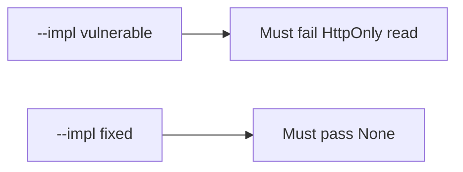

# The broken files must fail a script reading the cookie

**Kind:** verification-lab
**Loop step:** 5 Verify

## If you cannot fail a check, it is still a slogan

A green CSP scanner is not this week’s evidence. “Set-Cookie is present” is a tool observation. The check is: for `HTTPONLY_SESSION`, `js_read_session` returns `None`. That observation must be **false** on `--impl vulnerable` and **true** on `--impl fixed`.

## Picture: broken must fail the HttpOnly read

A test that only counts collected items can pass while the reader still returns the session. Ask whether a script-readable session still counts as a passing control. The broken files must fail that. The repaired files must pass it.



| Mode | Must show for this topic |
|---|---|
| Normal | After the fix, the jar still *has* a session cookie (the header path is not deleted) |
| Wrong input / abuse | Script cannot read HttpOnly `sc_session`; broken files must fail that assertion |
| When things break | Missing flag on a session name is a defect, not a silent readable default |
| Not claimed | XSS impossible; CSP3 enforced; CORS correct; SameSite complete |

The file is `labs/2.3/2.3-browser-policy/tests/test_httponly.py`. It calls `js_read_session` on a dummy cookie with `httponly: True` and `secure: True`. That is a **what-must-not-happen** test: a script-readable session is not allowed to count as a passing control.

```text
python3 -m pytest labs/2.3/2.3-browser-policy/tests --impl vulnerable
python3 -m pytest labs/2.3/2.3-browser-policy/tests --impl fixed
```

Map the test to the script-read row you wrote. Do not paste keys. If broken does not fail, the practice is miswired — fix the wiring, not the assertion.

## What the tests do not prove

- Output encoding (later XSS work)
- CSP3 (Working Draft) enforcement
- Trusted Types (Working Draft)
- SameSite CSRF completeness (sister rule)
- `Secure` / `__Host-` (sister rules)
- WebView bridges (later mobile)
- That note bodies in the page are unreadable to script

Record those as leftover or later topics, not as silent passes.

## Practice

Run both this session. Write the fail/pass pair next to the table row. Reject a “test” that only greps `HttpOnly` in a string without calling the reader.

## Use it somewhere new

Clinic patient portal. A test that only asserts `Set-Cookie` exists is not HttpOnly evidence. A test that loads the real clinic is out of scope.

## What this page is not doing

Do not add a live page. Do not log `synthetic-session`. Answer keys are not on this site.
