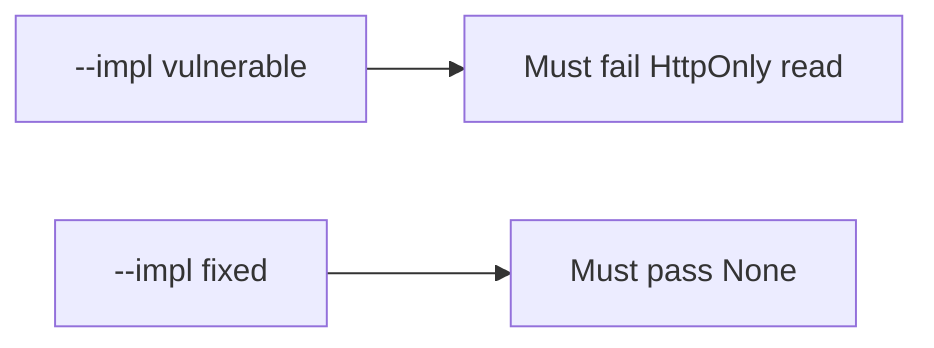

# 2.3-LO-05 — Evidence is a failing script read, then a passing pair

**Kind:** verification-lab
**Loop step:** 5 Verify
**Standards:** OWASP ASVS 5.0.0 (final) `v5.0.0-3.3.4`.

## An invariant that cannot fail a test is still a slogan

A green CSP scanner is not this module’s evidence. The oracle is the local pair.

## Mental model: vulnerable must fail: HttpOnly read

The failing observation on `--impl vulnerable` is **HttpOnly read**. A passing collection count is not this cell.



| Case | Must show |
|---|---|
| Negative / abuse | Script cannot read HttpOnly `sc_session` |
| Not claimed | XSS impossible; CSP enforced; CORS correct |

Lab test: `test_script_cannot_read_httponly_session` in `labs/2.3/2.3-browser-policy/tests/test_httponly.py`.

```
python3 -m pytest labs/2.3/2.3-browser-policy/tests --impl vulnerable
python3 -m pytest labs/2.3/2.3-browser-policy/tests --impl fixed
```

## What the tests do not prove

- Output encoding (6.2)
- CSP3 (draft) enforcement
- SameSite CSRF completeness
- WebView bridges

## Practice

Execute both implementations. Map the test to the LO-02 script-read cell.

## Transfer

Clinic patient portal. A test that only asserts `Set-Cookie` exists is not HttpOnly evidence.
