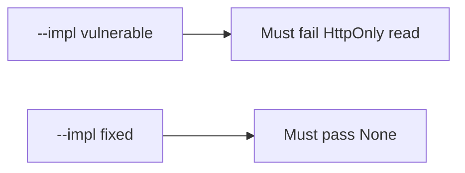

# The broken files must fail a script reading the cookie

**Kind:** verification-lab
**Loop step:** 5 Verify

## If you cannot fail a check, it is still a slogan

A green CSP scanner does not prove the cookie is unreadable from script. A Set-Cookie header is a name, not HttpOnly. For `HTTPONLY_SESSION`, `js_read_session` has to return `None`. Broken: the reader still returns the session. Repair keeps script from reading it.

## Picture: broken must fail the HttpOnly read

A check that only counts collected items can still hide that the reader still returns the session.



| Mode | Must show for this topic |
|---|---|
| Normal | After the fix, the jar still *has* a session cookie (the header path is not deleted) |
| Wrong input / abuse | Script cannot read HttpOnly `sc_session`; broken files must fail that assertion |
| When things break | Missing flag on a session name is a defect, not a silent readable default |
| Not claimed | XSS impossible; CSP3 enforced; CORS correct; SameSite complete |

It calls `js_read_session` on a dummy cookie with `httponly: True` and `secure: True`. That check is there so a script-readable session still fails.

```text
python3 -m pytest labs/2.3/2.3-browser-policy/tests --impl vulnerable
python3 -m pytest labs/2.3/2.3-browser-policy/tests --impl fixed
```

Map the test to the script-read row you wrote. Do not paste keys. If broken does not fail, the practice is miswired — fix the wiring, not the assertion.

## What the tests do not prove

- Output encoding (later XSS work)
- CSP3 (Working Draft) enforcement
- Trusted Types (Working Draft)
- SameSite CSRF completeness (sister rule)
- `Secure` / `__Host-` (sister rules)
- WebView bridges (later mobile)
- That note bodies in the page are unreadable to script

## Practice

Call the cookie reader. An `HttpOnly` substring is the flag name, not `js_read_session`.

## Use it somewhere new

A `Set-Cookie` header on the patient portal is not HttpOnly evidence. Do not run a test that loads the real clinic.

## What this page is not doing

Do not add a live page. Do not log `synthetic-session`. Answer keys are not on this site.
