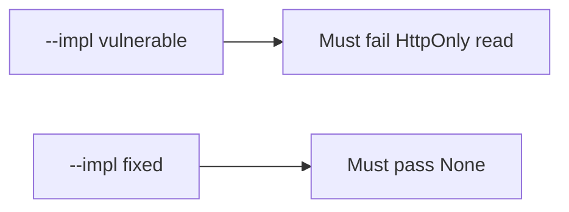

# 2.3-LO-05 — Evidence is a failing script read, then a passing pair

**Kind:** verification-lab
**Loop step:** 5 Verify
**Standards:** OWASP ASVS 5.0.0 (final) `v5.0.0-3.3.4`.

## An invariant that cannot fail a test is still a slogan

A green CSP scanner is not this module’s evidence. “Set-Cookie is present” is a mechanism observation. The oracle is: for `HTTPONLY_SESSION`, `js_read_session` returns `None`. That observation must be **false** on `--impl vulnerable` and **true** on `--impl fixed`.

## Mental model: vulnerable must fail: HttpOnly read

The failing observation on `--impl vulnerable` is **HttpOnly read**. A passing collection count is not this cell.



| Mode | Must show for this module |
|---|---|
| Normal | After the fix, the jar still *has* a session cookie (the header path is not deleted) |
| Negative / abuse | Script cannot read HttpOnly `sc_session`; vulnerable must fail that assertion |
| Failure | Missing flag on a session name is a defect, not a silent readable default |
| Not claimed | XSS impossible; CSP3 enforced; CORS correct; SameSite complete |

Lab test: `test_script_cannot_read_httponly_session` in `labs/2.3/2.3-browser-policy/tests/test_httponly.py`. It calls `js_read_session` on a synthetic cookie with `httponly: True` and `secure: True`. That is a **forbidden-outcome** test: a script-readable session is not allowed to count as a passing control.

```text
python3 -m pytest labs/2.3/2.3-browser-policy/tests --impl vulnerable
python3 -m pytest labs/2.3/2.3-browser-policy/tests --impl fixed
```

Map the test to the LO-02 script-read cell. Do not paste keys. If vulnerable does not fail, the lab is miswired—fix the wiring, not the assertion.

## What the tests do not prove

- Output encoding (6.2)
- CSP3 (Working Draft) enforcement
- Trusted Types (Working Draft)
- SameSite CSRF completeness (`v5.0.0-3.3.2` is a sister cell)
- `Secure` / `__Host-` (`v5.0.0-3.3.1`)
- WebView bridges (8.x)
- That note bodies in the DOM are unreadable to script

Record those as residuals or later modules, not as silent passes.

## Practice

Execute both implementations this session. Write the fail/pass pair next to the matrix row. Reject a “test” that only greps `HttpOnly` in a string without calling the reader.

## Transfer

Clinic patient portal. A test that only asserts `Set-Cookie` exists is not HttpOnly evidence. A test that loads the real clinic is out of scope.

## Non-goals

Do not add a live page. Do not log `synthetic-session`. Keys stay out of this file.
