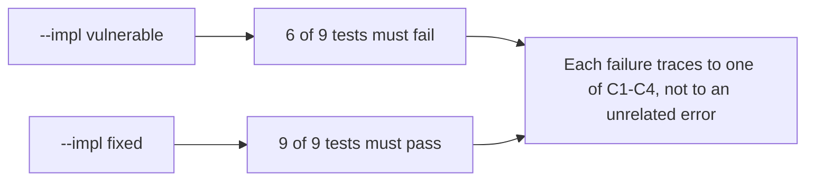

# What a header test can and cannot prove about a browser

**Kind:** verification-lab
**Loop step:** 5 Verify
**Standards:** OWASP ASVS 5.0.0 v5.0.0-3.3.4 (HttpOnly), v5.0.0-3.4.2 (CORS), v5.0.0-3.4.3 (CSP).

## If you cannot fail a check, it is still a slogan

A green CSP dashboard does not prove `/notes` refuses a credentialed cross-origin request; a `Set-Cookie` header's existence does not prove it carries `HttpOnly`. For every claim this module makes, there has to be a request this fixture can send whose response would falsify that claim if the claim were false — and the vulnerable variant has to actually be the thing that falsifies it, not a fixture wired so loosely that both variants happen to pass. A claim that no request can falsify is not a security property; it is a sentence that sounds like one, and the entire discipline of this lesson is refusing to let a sentence stand in for a test that could actually fail.

This matters more here than in a lesson about a single pure function, because this module makes four separate claims across four separate response headers, and a suite that only ever tests one of them would let the other three regress silently while the dashboard for the tested one stayed green. Verification is the step where "we cover this module" gets checked against "we cover this module's four claims," not against "we have a test file in this directory."

## Picture: broken must fail; fixed must pass



| Mode | Must show for this module |
|---|---|
| Normal | The trusted origin's credentialed request to `/notes` still succeeds and still carries the notes after the fix — the fix denies untrusted callers, not the legitimate one |
| Forbidden outcome | `HttpOnly` missing on `sc_session`; an arbitrary origin granted `Access-Control-Allow-Credentials: true` |
| Boundary | A sibling subdomain, a scheme change, and a port change are each a distinct, denied origin |
| Malformed/failure | No `Origin` header at all must not crash the app and must not manufacture a CORS grant |
| Anti-fake | A domain that merely contains the trusted origin as a trailing substring must still be denied |
| Not claimed | XSS is impossible; CORS or CSP is a substitute for output encoding; a real browser was ever driven by this test suite |

## Worked example: tracing why the header, not the body, is the oracle

`httpx`'s `TestClient` — the thing every test in `labs/2.3/2.3-browser-policy/tests` calls through — is not a browser. It never evaluates same-origin policy, never refuses a `fetch`, and never blocks a script load; it simply sends the HTTP request you construct and hands back whatever the server returns, body included, regardless of what a real browser would have done with the response. That is why `test_forbidden_outcome_attacker_origin_gets_no_credentialed_access` asserts against `resp.headers.get("access-control-allow-origin")` rather than against whether the response body was "readable" — the body is always returned by `TestClient`, whichever variant is running, so asserting on it would prove nothing. The header is the correct oracle precisely because it is the one signal a real browser reads before deciding whether to hand a cross-origin script the response at all; the test can check that the server sent (or withheld) the right signal, and that is the most this fixture, running with no real browser anywhere in the loop, is able to prove.

## What the tests do not prove

- That a real browser actually refused to expose the response to a cross-origin script — only that the server sent the header a real browser would have consulted for that decision.
- Output encoding, or that stored/reflected XSS is impossible; this module's oracle is script-readability and CORS/CSP headers, not the injection-prevention chain this course covers separately.
- CSP3's newer directives, or Trusted Types, both Working Drafts this fixture does not implement.
- `SameSite`'s CSRF-mitigation behavior — a sister rule this fixture's cookie sets (`samesite="lax"`) but never tests directly.
- A WebView bridge's or a CDN's handling of any of these headers.

## Counterexample: a suite that passes on both variants is not a suite at all

Before this pass, the module's entire verification story was two tests asserting a pure-Python dict model of `HttpOnly`, with no representation of CORS or CSP anywhere, despite both being named in this module's objective hierarchy since Pass A. A suite that never exercises a claim cannot fail on the vulnerable variant for that claim, and a check that cannot fail is not evidence — it is closer to decoration that happens to sit next to a real one. Running `pytest --impl vulnerable` against the rebuilt suite is what actually distinguishes a real check from decoration: 6 of the 9 tests fail, and each failure traces to a specific line this module's [`lessons/03-break.md`](03-break.md) already named, not to an unrelated setup error.

```bash
python3 -m pytest labs/2.3/2.3-browser-policy/tests --impl vulnerable
python3 -m pytest labs/2.3/2.3-browser-policy/tests --impl fixed
```

Map each failing test on `vulnerable` to the row it exercises in [`lessons/02-model.md`](02-model.md)'s matrix before moving on. Do not paste answer keys here, and do not weaken an assertion to make a failure disappear; if `vulnerable` does not fail, the fixture is miswired and the wiring is the bug to fix, not the assertion.

## Worked example, continued: what the boundary test adds that the forbidden-outcome test alone would miss

`test_forbidden_outcome_attacker_origin_gets_no_credentialed_access` alone would be satisfied by a fixed implementation that simply denies every origin except `https://app.securecollab.example` by exact string comparison, which is in fact the correct behavior — but it would equally be satisfied by an implementation that denies every origin, full stop, including the legitimate one, since an attacker origin and a permanently broken CORS feature look identical from that single test's point of view. `test_origin_vs_site_boundary_subdomain_scheme_and_port_are_each_denied` does not, by itself, close that gap either, since it only ever sends origins that should be denied. What actually closes it is running both that test and `test_trusted_origin_is_reflected_with_credentials` against the same variant: the fixed implementation has to grant the one origin the matrix says is trusted while denying three that merely look similar to it, and a suite where every test shares one polarity — all "must deny," or all "must allow" — cannot tell a working feature from a disabled one. This is the same reasoning [`labs/4.3/4.3-lab`](../../../../../labs/4.3/4.3-lab/README.md)'s own anti-fake pair applies to session lifetime: a checker that always says no is exactly as fake as one that always says yes, and a suite has to contain a test that would fail against each.

## Practice

For each of the nine tests, write one sentence naming which teaching claim (C1–C4) it exercises and which exact header value or attribute distinguishes a pass from a failure.

## Use it somewhere new

A `Set-Cookie` header observed on a real patient-portal response is not, by itself, `HttpOnly` evidence — you would still have to read the header's full value. Do not run any of this module's tests, or a variant of them, against a real clinic system or any other live target.

## What this page is not doing

Do not add a live page or a real browser to this fixture. Do not log `sc_session`'s value or a note body while running these tests. Answer keys are not on this site.
