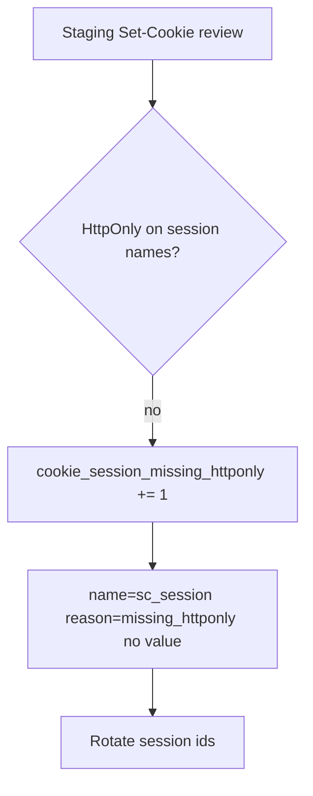

# Notice session cookies without HttpOnly; never log the value

**Kind:** operations-exercise
**Loop step:** 6 Operate

## Fixing it once is not enough

A new cookie, a WebView, a “debug” `Set-Cookie`, or a second name (`sc_refresh`) can drop the flag. Pair notice and recover. Do not log session values, note bodies, or recovery codes.

## Picture: scan the flags, rotate if script could have read

A missing HttpOnly flag is a notice-and-recover problem, not a licence to paste the session into a ticket. Notice names the cookie. Recover rotates it. Neither logs the value.



This still does not pick a log product. It does not prove a checklist. Report-Only CSP is a **different** notice path. It does not restore this rule.

| Outcome | This topic |
|---|---|
| Notice | `Set-Cookie` without HttpOnly on session names in staging or canary |
| What the line holds | cookie **name** + reason + request id; never the value |
| Respond | Stop issuing the broken setter; do not “help” by emailing the session |
| Recover | Rotate session ids; fix the setter; re-run `test_script_cannot_read_httponly_session` |
| Leftover | Extensions; physical access; XSS that never needed the cookie |

A log line a reviewer can accept looks like:

```text
cookie_denied reason=missing_httponly name=sc_session env=staging request_id=req_4b11
```

Not: `synthetic-session`, a note body, or a personal mailbox.

## Practice

Write one log line you would accept in review. Tie it to `labs/2.3/2.3-browser-policy`. Reject any line that includes the dummy session value. Name who owns the WebView leftover and what trigger reopens it.

## Use it somewhere new

Clinic portal. Staging scans must include WebView or second-cookie names, not only `sc_session`. A privacy-safe notice still has no chart text.

## Can people still use it

The alternate path after rotation (sign in again) must itself meet keyboard, name, and not-color-only. Those rules apply to that path too. They are not a cookie policy.

## What this page is not doing

A vendor name is not this week's rule. Answer keys are not on this site.
