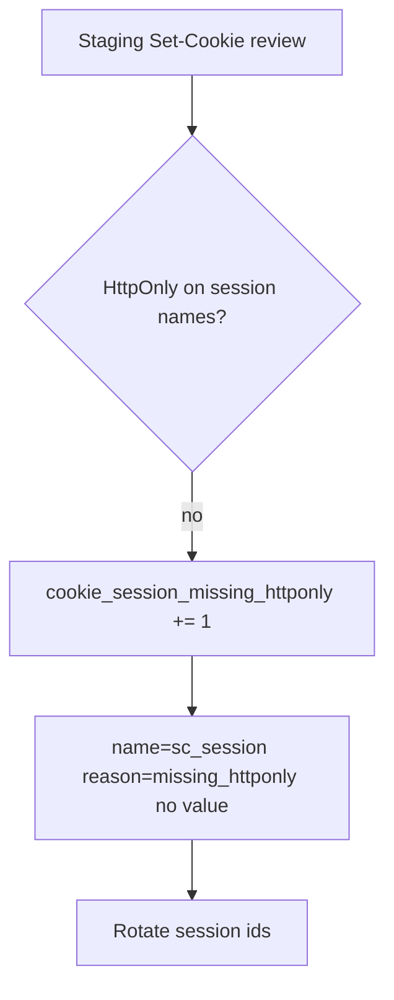

# 2.3-LO-06 — Detect a session cookie without HttpOnly; never log the value

**Kind:** operations-exercise
**Loop step:** 6 Operate
**Standards:** NIST CSF 2.0 (final) DE/RS/RC as outcome labels; OWASP ASVS 5.0.0 (final) `v5.0.0-3.3.4`; Module 3.1 / 5.1.

## Prevention is not absolute

A new cookie, a WebView, or a “debug” `Set-Cookie` can drop the flag. Pair detect and recover. Do not log session values.

## Mental model: scan the flags, rotate if script could have read



| Outcome | This module |
|---|---|
| Detect | `Set-Cookie` without HttpOnly on session names |
| Signal | cookie name + reason; never the value |
| Recover | Rotate sessions; fix the setter |
| Residual | Extensions; physical access |

Report-Only CSP is a **different** detect path (E2). It does not restore this cell.

## Practice

Write one log line you would accept. Tie it to `labs/2.3/2.3-browser-policy`.

```
cookie_denied reason=missing_httponly name=sc_session env=staging request_id=req_4b11
```

Reject any line that includes `synthetic-session`.

## Transfer

Clinic portal. Staging scans must include WebView or second-cookie names, not only `sc_session`.

## Non-goals

SIEM product names are not the property.
