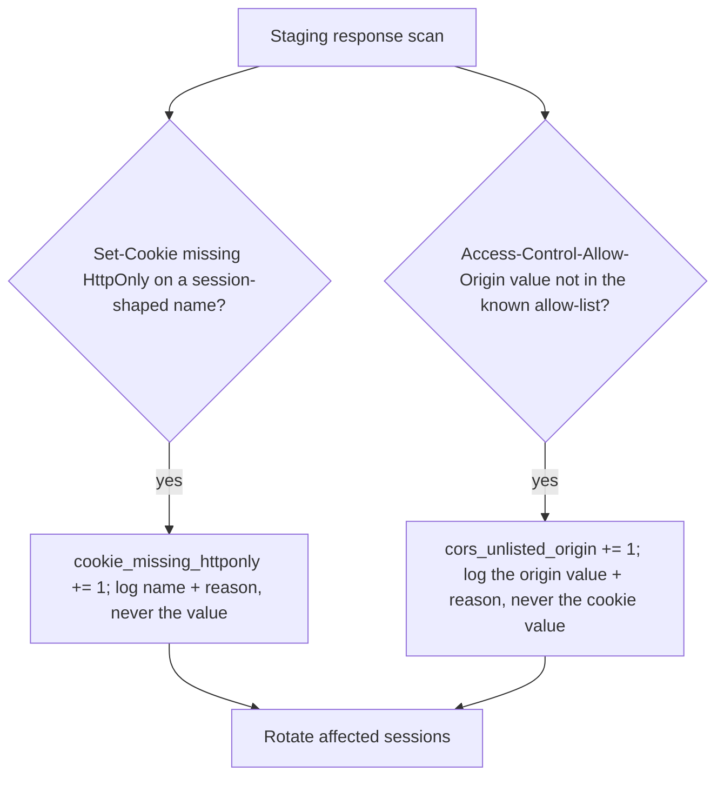

# Notice a missing flag or a reflected origin; never log the value

**Kind:** operations-exercise
**Loop step:** 6 Operate

## Fixing it once is not enough

A fix that ships today does not stay true by itself. A new cookie name (`sc_refresh`, a "debug" cookie a teammate adds for a demo), a load balancer that strips or rewrites `Origin` before the application sees it, or a CDN that caches a CORS response keyed by path rather than by the caller's `Origin` can each quietly reopen one of this module's four claims without anyone touching `vulnerable/app.py` or `fixed/app.py` again. Operating this control means having a signal that would catch each of those regressions in staging, before a member's session or notes are actually exposed — not re-reading the source code by hand every release.

## Picture: scan, alert, rotate



Both branches share one rule and differ on one detail. The rule they share: name the defect and act on it, without ever writing the thing the defect exposes into a log line, a ticket, or a chat message. The detail that differs: an `Origin` value is not a secret — it identifies a caller, not a member — so it is safe and useful to log in full, while `sc_session`'s value must never appear in any signal at all, because logging it to prove the bug exists creates a second, self-inflicted instance of the exact leak the signal is meant to catch.

## Signals that do not become a second leak

| Signal | What the line holds | What it must never hold |
|---|---|---|
| `cookie_missing_httponly` | Cookie name; environment; request id | The cookie's value |
| `cors_unlisted_origin` | The caller's `Origin` value; the path requested; whether credentials were requested | Any cookie value, and any note body from the response |
| `csp_report_only_no_enforcing_header` | That a response carried `-Report-Only` with no sibling enforcing header | The reported violation's source text, if it could contain another user's content |

A worked line for the CORS signal looks like this, and every field in it is either public (the path, the fact that a mismatch occurred) or attacker-supplied and therefore already known to the attacker (their own `Origin` value) — nothing here is a secret being written down for the first time:

```text
cors_unlisted_origin origin=https://evil.example path=/notes credentialed_requested=true env=staging request_id=req_9f21
```

## Why the recover step refuses to guess, even under operational pressure

Once either signal fires for real traffic — not a synthetic staging probe — the correct response is to rotate every session that could plausibly have been exposed, not to try to reconstruct exactly which sessions actually were. A CORS misconfiguration that has been live for even a short window may have been probed by more callers than the ones a log happens to retain, and a script-readable cookie may have been read by an injected script whose activity leaves no trace in a server log at all, because the theft happens entirely inside the browser, between the DOM and `document.cookie`, with nothing sent to the server that would look unusual. Treating "we don't have evidence anyone actually stole a session" as "no sessions need rotating" turns an absence of evidence into evidence of absence, which is a different and much weaker claim — the honest response scope is every session live during the exposure window, not only the ones a log can name.

## Counterexample: a metric that looks like coverage but is not

A team might reasonably ship a single dashboard tile, `csp_violations_reported`, wired to whatever `-Report-Only` sends, and treat a flat zero on that tile as evidence the browser-security posture is healthy. That tile can stay at zero for reasons that have nothing to do with safety: a Report-Only policy that is too permissive to ever trigger a violation in the first place, a report endpoint that is silently failing to receive reports at all, or — the case this module cares about most — the complete absence of any enforcing `Content-Security-Policy` header, which means there was never a control here to violate. A metric that can read "healthy" while the underlying control does not exist is worse than no metric, because it actively discourages anyone from checking further. The corrected signal from the table above, `csp_report_only_no_enforcing_header`, is deliberately built to catch this exact failure mode: it does not ask whether reports are arriving, it asks whether an enforcing header is present at all, which is the one fact a reports-only dashboard can never surface on its own.

## Worked example: reading a real scan result

Suppose a nightly staging scan produces this line, using the field set this lesson's table defines:

```text
cors_unlisted_origin origin=https://staging-preview-4821.securecollab.example path=/notes credentialed_requested=true env=staging request_id=req_a13c
```

Read against [`lessons/02-model.md`](02-model.md)'s matrix, this line describes a caller from a fourth, unplanned preview-deployment subdomain successfully requesting credentialed access to `/notes` in staging — meaning `ALLOWED_ORIGINS` was either widened to a pattern that accepts arbitrary preview subdomains, or a new deployment pipeline is minting subdomains the security team never reviewed. Either explanation is an operational finding worth a ticket; neither is visible from the cookie signal alone, and neither would be visible from a metric that only counted CSP reports. Reading one line correctly here means naming which of this module's four claims it falsifies (C2, C3) before deciding what to do about it, not reacting to the word "unlisted" alone.

## Practice

Draft the two log lines this lesson names for a hypothetical incident where `ALLOWED_ORIGINS` was accidentally deployed as a regex matching any subdomain of `securecollab.example`, using the exact fields the table above allows and none of the fields it forbids.

## Use it somewhere new

The same staging scan that catches a missing `HttpOnly` flag on `sc_session` should also cover any WebView bridge SecureCollab ships later, since a bridge that copies the cookie into JS is a new reader this scan's current scope does not yet include. [`lessons/07-transfer.md`](07-transfer.md) picks this up directly.

## Can people still use it

The alternate path after a forced session rotation — signing in again — must itself remain keyboard-operable, screen-reader-legible, and not rely on color alone to show success or failure; an operational fix that locks out a legitimate member because the re-authentication screen is unusable has traded one security failure for another that is just as real to the person affected.

## What this page is not doing

Do not log `sc_session`'s value, a note body, or a CSP violation's reported source text under any circumstance described here. Answer keys are not on this site.
