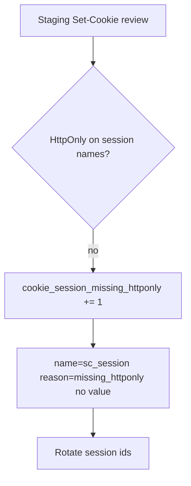

# 2.3-LO-06 — Detect a session cookie without HttpOnly; never log the value

**Kind:** operations-exercise
**Loop step:** 6 Operate
**Standards:** NIST CSF 2.0 (final) Detect / Respond / Recover as *outcome labels*, not proof; OWASP ASVS 5.0.0 (final) `v5.0.0-3.3.4`; Module 3.1 / 5.1 privacy of logs.

## Prevention is not absolute

A new cookie, a WebView, a “debug” `Set-Cookie`, or a second name (`sc_refresh`) can drop the flag. Pair detect and recover. Do not log session values, note bodies, or recovery codes.

## Mental model: scan the flags, rotate if script could have read



CSF **Detect / Respond / Recover** name those boxes. They do not select a SIEM. They do not prove ASVS. Report-Only CSP (E2) is a **different** detect path. It does not restore this cell.

| Outcome | This module |
|---|---|
| Detect | `Set-Cookie` without HttpOnly on session names in staging or canary |
| Signal | cookie **name** + reason + request id; never the value |
| Respond | Stop issuing the broken setter; do not “help” by emailing the session |
| Recover | Rotate session ids; fix the setter; re-run `test_script_cannot_read_httponly_session` |
| Residual | Extensions; physical access; XSS that never needed the cookie |

A log line a reviewer can accept looks like:

```text
cookie_denied reason=missing_httponly name=sc_session env=staging request_id=req_4b11
```

Not: `synthetic-session`, a note body, or a personal mailbox.

## Practice

Write one log line you would accept in review. Tie it to `labs/2.3/2.3-browser-policy`. Reject any line that includes the fixture value. Name who owns the WebView residual and what trigger reopens it.

## Transfer

Clinic portal. Staging scans must include WebView or second-cookie names, not only `sc_session`. A privacy-safe Detect signal still has no chart text.

## Usability

The alternate path after rotation (re-login) must itself meet 1.4: named, keyboard-operable, not color-only. WCAG 2.2 2.1.1, 1.4.1, and 2.5.8 apply to that path. They are not a cookie policy.

## Non-goals

SIEM product names are not the property. Keys stay out of lessons.
