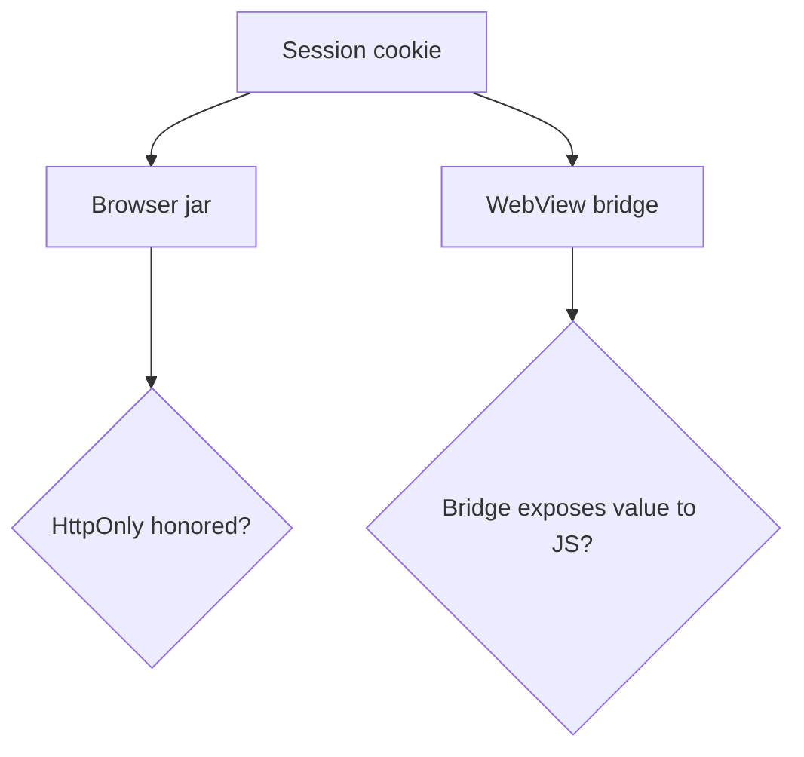

# Same idea on a clinic cookie or WebView

**Kind:** transfer-challenge
**Loop step:** 7 Transfer

## Use it somewhere new

You get a **clinic patient-portal** session cookie, and a **React Native WebView cookie bridge** as a second sketch. Here, `clinic_session` is still `sc_session` for this rule. Person, object, reader, and leftover change. Chart access and a new bridge are new rules. You must rebuild the sentence.

Content Security Policy Level 3 and Trusted Types stay labeled **Working Drafts**. Do not cite a famous-bugs list as the definition of security.

## Picture: a new bridge is a new reader

HttpOnly on the browser jar does not automatically apply to a bridge that copies the value into JS. Delay and a second runtime do not compose on their own — the same lesson who-is-allowed taught for delayed workers.

| Notes app | Clinic / WebView sketch |
|---|---|
| Member session cookie `sc_session` | Patient-portal session, or a copy into a WebView |
| Browser jar vs page script | Browser jar **and** a bridge that may hand the value to JS |
| Script-readable notes-app session | Script-readable chart session |
| Extension leftover | Shared workstation; WebView injection; still extensions |

Use only these dummy sketches. Do not inspect or operate a real hospital, app-store build, or third-party widget.

## Write this for a clinic patient portal session cookie

A second-factor or session cookie is set after login. One of the UIs is a shared workstation.

## Write this for a React Native WebView cookie bridge

The same session is copied into a WebView that exposes cookies to injected JS.

## What your answer must include

1. Who can act (injected script in the origin; WebView injected JS; exhausted clinician on a shared workstation — not a live hospital).
2. What you trust (which jar honors HttpOnly; the app must set the flag; the WebView is a separate thing you must trust, or not).
3. What must not happen (script-readable session, not “XSS everywhere”).
4. A test idea on a local practice you own (the reader returns `None` when HttpOnly is set — never on the real clinic).
5. Leftover (extensions; XSS without cookie theft; draft CSP; lockout if recovery is mouse-only).
6. Whether the human path must meet the web accessibility baseline (yes for login usability; HttpOnly itself is invisible to the keyboard).

## What is not good enough

| Reject | Why |
|---|---|
| HttpOnly means no XSS | Encoding work still exists |
| CSP3 as this check | Draft, different rule |
| Live clinic or third-party CSRF test | Course rules |
| `localStorage` as the “accessible” fix | Script share enlarged; usable login not helped |

## Practice

Write one page. Leave the keys closed. `labs/2.3/2.3-browser-policy` is the only running system you may break.

## What this page is not doing

Do not use real clinics, real patient cookies, real WebView exploits.
