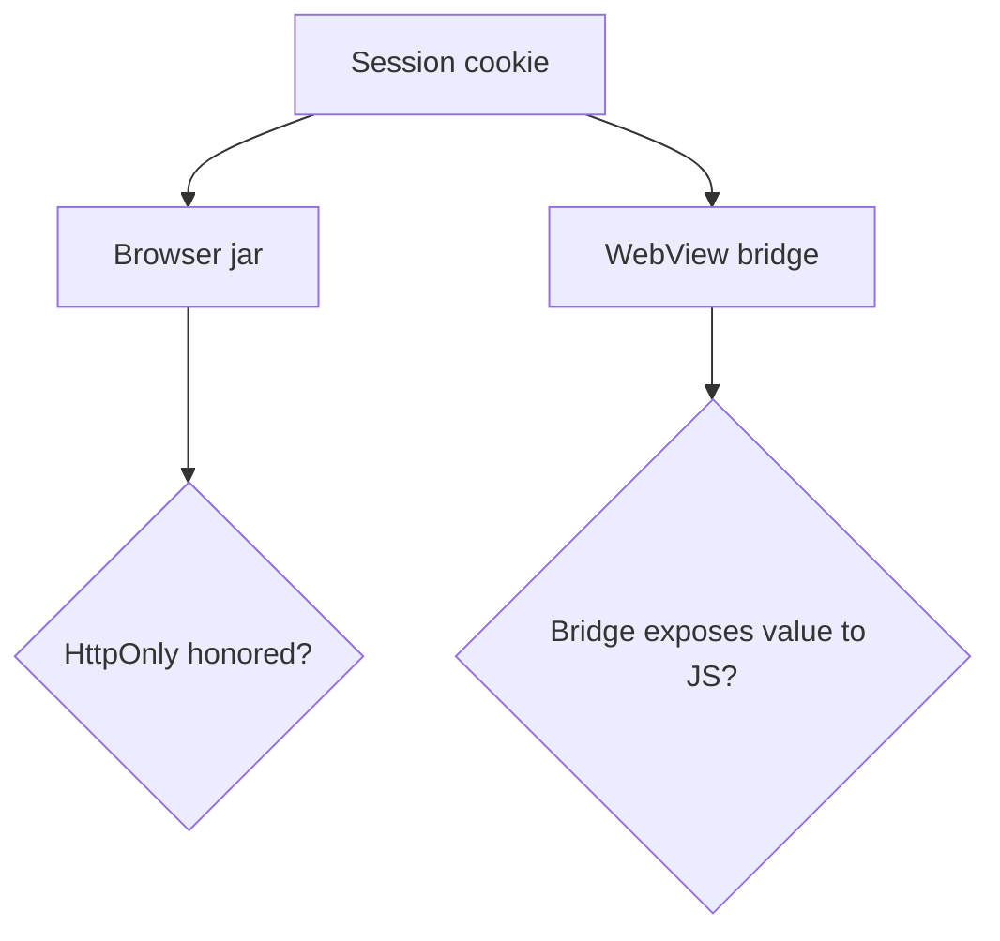

# 2.3-LO-07 — Transfer: clinic portal cookie or WebView bridge

**Kind:** transfer-challenge
**Loop step:** 7 Transfer
**Standards:** OWASP ASVS 5.0.0 (final) `v5.0.0-3.3.4`; CSP3 and Trusted Types labeled **draft**.

## Change the interpreter; keep the jar-versus-script shape

Do not answer with a Top 10 / CWE / scanner as the definition of security.

**Prompt:** Clinic patient portal session cookie.

**Alternate sketch:** React Native WebView cookie bridge.

Rewrite the SecureCollab sentence. Include:

1. attacker capabilities (injected script in origin; WebView injected JS; not a live hospital);
2. trust assumptions (which jar honors HttpOnly; the app must set the flag);
3. forbidden outcome (script-readable session, not “XSS everywhere”);
4. a test idea on a local fixture only;
5. residual (extensions, XSS without cookie theft, draft CSP);
6. WCAG 2.2 only if a human-mediated control is in the claim (login usability is 1.4 / 4.2, not HttpOnly).

## Mental model: a new bridge is a new interpreter

## What graders reject

| Reject | Why |
|---|---|
| HttpOnly means no XSS | 6.2 still exists |
| CSP3 as this cell | Draft, different property |
| Live clinic or third-party CSRF test | Lab policy |

## Practice

One page. No keys. `labs/2.3/2.3-browser-policy` is the only running system you may break.
