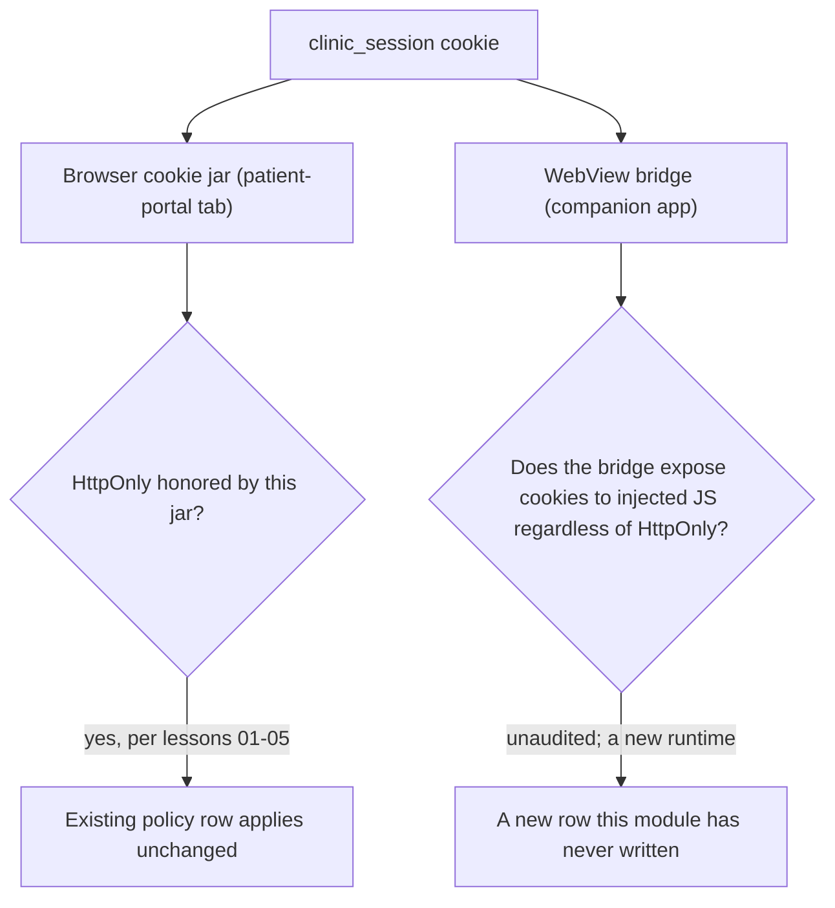

# Same idea on a clinic cookie or a WebView bridge

**Kind:** transfer-challenge
**Loop step:** 7 Generalize

## Use it somewhere new

You get two new sketches: a **clinic patient-portal** session cookie, and a **React Native WebView cookie bridge** for a mobile companion app. `clinic_session` plays the role `sc_session` played throughout this module; the WebView bridge is a reader this module's fixture has never had at all. C5 is the claim under test here: a third-party embed or a bridge is a new reader of the same cookie and DOM state, and its policy rows have to be re-derived, not inherited from the first-party page's rows. Content Security Policy Level 3 and Trusted Types stay labeled **Working Drafts**; do not cite a famous-bugs list as the definition of security for either scenario.

## Picture: a new bridge is a new reader



The diagram's two starting arrows come out of the same cookie, which is exactly why it is tempting to assume one fixed row covers both destinations. `HttpOnly` is a rule the *browser's* cookie jar enforces; a WebView bridge is code the mobile team wrote, running in a different runtime that may or may not consult the flag at all before handing the value to JavaScript inside the WebView. Nothing about verifying the browser side answers the WebView question, which is the whole point of treating this as a new row rather than a restatement of an old one.

## Write this for a clinic patient-portal session cookie

A patient books an appointment through a web portal; the portal issues `clinic_session` after login, on a shared clinic workstation a nurse also uses between patients throughout the day. Using this module's matrix shape from [`lessons/02-model.md`](02-model.md), write the row for "page script on the portal's own origin reads `clinic_session`" and the row for "a script on an unrelated third-party origin requests the patient's appointment history with credentials." Name, for each row, which header decides it and who enforces that header.

## Write this for a React Native WebView cookie bridge

SecureCollab's hypothetical mobile companion app loads the same web client inside a WebView, and the bridge code the mobile team wrote copies `sc_session` into a JavaScript-accessible property so the app's native UI can show "signed in as ___" without a second network round trip. Write the row for this reader specifically: name what the bridge trusts, what it should refuse, and why `HttpOnly` on the cookie, alone, says nothing about whether the bridge's own copy operation happens before or after that flag would matter.

## What your answer must include

1. Who can act: injected script in the portal's own origin; a WebView's injected JavaScript; a clinician under time pressure at a shared workstation — never a real hospital or a real app-store build.
2. What you trust: which jar (browser or bridge) is being asked to honor `HttpOnly`, and whether the WebView bridge is itself something you trust, partially trust, or explicitly do not trust.
3. What must not happen: a script-readable session value, stated exactly — not "XSS everywhere."
4. A test idea against a local practice you own, structured the way `labs/2.3/2.3-browser-policy`'s tests are structured: an assertion against a specific header or return value, never against a real clinic or a real app store build.
5. Leftover this rewrite does not remove: browser extensions; XSS that never needs the cookie's value to act as the patient; a shared-workstation handoff where the prior patient's session was never explicitly signed out.
6. Whether the human-facing path (sign-in, sign-out, session handoff) must meet a web accessibility baseline — yes, for the login and handoff screens a person operates; `HttpOnly` itself is invisible to a keyboard and carries no accessibility claim of its own.

## Worked example: the bridge line that recreates the original defect

A mobile engineer, asked to let the native UI show "signed in as ___" without a second network call, might write a WebView bridge method that looks like this, in whatever bridging API React Native exposes for injecting a JavaScript-callable native function:

```javascript
// Native-side bridge, exposed to the WebView's JS context:
window.NativeBridge.getSessionForDisplay = function () {
  return document.cookie
    .split("; ")
    .find((row) => row.startsWith("sc_session="))
    .split("=")[1];
};
```

This function is not attacker code, and the engineer who wrote it may never touch `vulnerable/app.py` or read this module's lessons at all — but it recreates C1's exact forbidden outcome from a completely different direction. `HttpOnly` on the `Set-Cookie` header stops *page script* from reading `sc_session` through `document.cookie`; it says nothing about a native bridge method that is not page script, was never subject to the browser's same-origin script sandbox in the same way, and calls `document.cookie` from inside the WebView's own execution context, where some WebView implementations expose cookies through APIs `HttpOnly` was never designed to cover. Once this bridge method exists, any JavaScript running inside that WebView — including injected script, exactly as in the original module — can call `window.NativeBridge.getSessionForDisplay()` and get the session value back, `HttpOnly` or not. The fix a security review of this bridge should demand is the same fix [`lessons/04-build.md`](04-build.md) applied to the server: never expose a path that hands the raw session value to a script context at all, native or web, and let the native UI show a display name the login response already provided instead of extracting it from the cookie after the fact.

## What is not good enough

| Reject | Why |
|---|---|
| "`HttpOnly` on `clinic_session` means the WebView bridge is safe too" | The bridge is a different reader in a different runtime; nothing about the browser cookie jar constrains code the mobile team wrote |
| "CSP3 finishes this transfer task" | CSP3 is a Working Draft browser load/execution policy; it says nothing about a native WebView bridge's own code |
| "We'll test this against our own live clinic deployment" | Forbidden by this course's laboratory policy regardless of who owns the deployment |
| "`localStorage` in the WebView is more `accessible` to the bridge" | Trades a script-readability failure the browser can enforce against for one no browser mechanism enforces at all |

## Practice

Treat `clinic_session` exactly like `sc_session` for the purposes of this exercise, and treat the WebView bridge as a genuinely new row rather than a variation on an old one. `labs/2.3/2.3-browser-policy` remains the only running system this module authorizes you to break; do not extend this exercise into code that reaches any other target, and write your two rows before checking them against the worked example above, so the exercise tests your own reasoning rather than your memory of the sample.

## What this page is not doing

Do not use real clinics, real patient cookies, or a real WebView build. Do not treat this page's two sample rows as a substitute for writing your own. Answer keys are not on this site.
