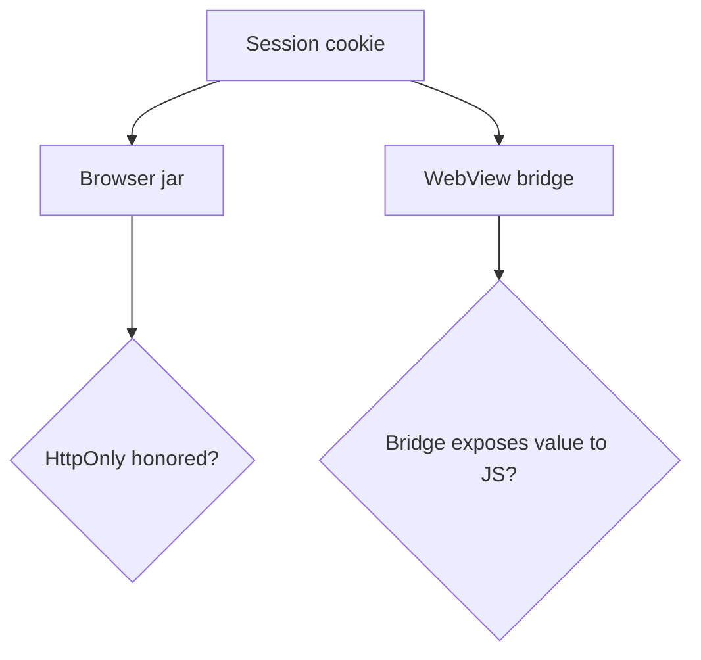

# 2.3-LO-07 — Transfer: clinic portal cookie or WebView bridge

**Kind:** transfer-challenge
**Loop step:** 7 Transfer
**Standards:** OWASP ASVS 5.0.0 (final) `v5.0.0-3.3.4`; CSP3 and Trusted Types labeled **Working Drafts**. Do not cite a Top 10 item as the definition of security.

## Change the interpreter; keep the jar-versus-script shape

Renaming `sc_session` to `clinic_session` is not transfer. The clinic portal changes the object (chart access), the interpreter (browser jar and possibly a WebView bridge), and the residual (shared workstation, 1.4 lockout). You must rebuild the sentence.

**Prompt A — clinic patient portal session cookie**

A second-factor or session cookie is set after login. One of the UIs is a shared workstation.

**Prompt B — React Native WebView cookie bridge**

The same session is copied into a WebView that exposes cookies to injected JS.

Use only these synthetic sketches. Do not inspect or operate a real hospital, app store build, or third-party widget.

## Mental model: a new bridge is a new interpreter

HttpOnly on the browser jar does not automatically apply to a bridge that copies the value into JS. Delay and a second runtime do not compose on their own—the same lesson 1.2 taught for delayed workers.

## What your answer must include

1. Attacker capabilities (injected script in origin; WebView injected JS; exhausted clinician on a shared workstation—not a live hospital).
2. Trust assumptions (which jar honors HttpOnly; the app must set the flag; the WebView is a separate TCB).
3. Forbidden outcome (script-readable session, not “XSS everywhere”).
4. A test idea on a local fixture you own (oracle: reader returns `None` when HttpOnly is set).
5. Residual (extensions; XSS without cookie theft; draft CSP; 1.4 lockout if recovery is mouse-only).
6. WCAG 2.2 only if a human-mediated control is in the claim (login usability is 1.4 / 4.2, not HttpOnly itself).

## What graders reject

| Reject | Why |
|---|---|
| HttpOnly means no XSS | 6.2 still exists |
| CSP3 as this cell | Draft, different property |
| Live clinic or third-party CSRF test | Lab policy |
| `localStorage` as the “accessible” fix | Script share enlarged; 1.4 not helped |

## Practice

One page. No keys. `labs/2.3/2.3-browser-policy` is the only running system you may break.

## Non-goals

Real clinics, real patient cookies, real WebView exploits. Gates stay unmarked without evidence.
