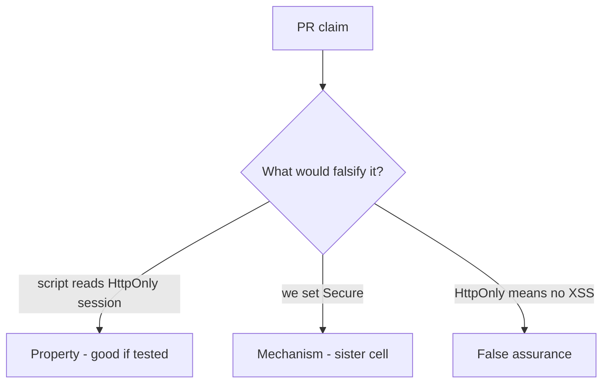

# 2.3-LO-08 — Review the script-readable session as a PR, not a slogan

**Kind:** code-review
**Loop step:** Review
**Standards:** OWASP ASVS 5.0.0 (final) `v5.0.0-3.3.4`; CSP3 labeled **draft**.

## Review the fixture as if it were SecureCollab cookie policy

Review `labs/2.3/2.3-browser-policy/vulnerable/` as a SecureCollab PR. Intended findings live only in `content/assessment/keys/2.3.md` — not here.

## Mental model: property, mechanism, or false assurance

Seeded smells (label them yourself; do not open the keys file):

- `document.cookie` used to persist session
- SECURITY.md equates HttpOnly with “no XSS”
- CSP Report-Only treated as enforcement (see E2)
- Missing Secure on the same cookie

Also reject: `localStorage` for session, client trust, closing findings without retest, keys in lessons, live-target CORS tests.

## Misconceptions

- HttpOnly is XSS defense
- SameSite is CSRF complete
- `localStorage` is safer than cookies

## Practice

Write three review notes. Tie at least one to `test_script_cannot_read_httponly_session`.

## Transfer

Clinic portal or WebView bridge. A PR that “adds CSP3” without HttpOnly on the session is an incomplete mediation review.
