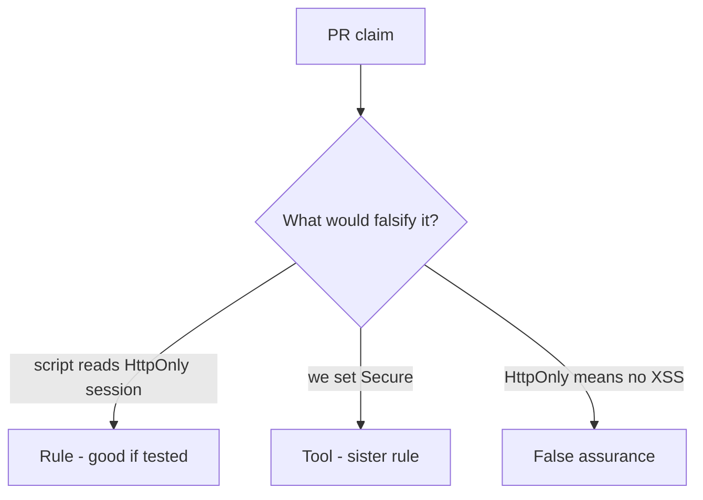

# Review of script-readable sessions

**Kind:** code-review
**Loop step:** Review

Wait until someone has looked at your review before opening the keys.

## What you are reviewing

Review `labs/2.3/2.3-browser-policy/vulnerable/` as a change to notes-app cookie policy. Check whether the jar still hands `sc_session` to script.

Start at the cookie reader, not at a CSP badge.

## Picture: problems to find (name them yourself)

**`document.cookie` used to persist session**.

A script still has to be blocked from reading the session. If that read never honors HttpOnly, that leftover path is still open.

## Problems to label yourself

- `document.cookie` used to persist session
- SECURITY.md equates HttpOnly with “no XSS”
- CSP Report-Only treated as enforcement
- Missing Secure on the same cookie

Also reject: `localStorage` for session; trusting the client as what you trust; closing a finding without re-running `test_script_cannot_read_httponly_session`; keys in learner notes; live-target CORS or CSRF against a public site.

## Common mix-ups this topic refuses

- HttpOnly is XSS defense
- SameSite is CSRF complete
- `localStorage` is safer than cookies
- Next.js cookie defaults are the application promise
- A draft CSP3 header finishes later encoding work

## Practice

Write three notes a maintainer could act on, and tie at least one to `test_script_cannot_read_httponly_session`. For each: what you saw, whether it is a rule or false assurance, a structural change, leftover you will **not** delete.

## Use it somewhere new

Clinic portal or WebView bridge. A change that “adds CSP3” without HttpOnly on the session is an incomplete review. Name the independent falsehood that would still stop script from reading the token.

## What this page is not doing

Do not merge by adding a comment “will add HttpOnly later.” That comment is leftover risk without an owner.
