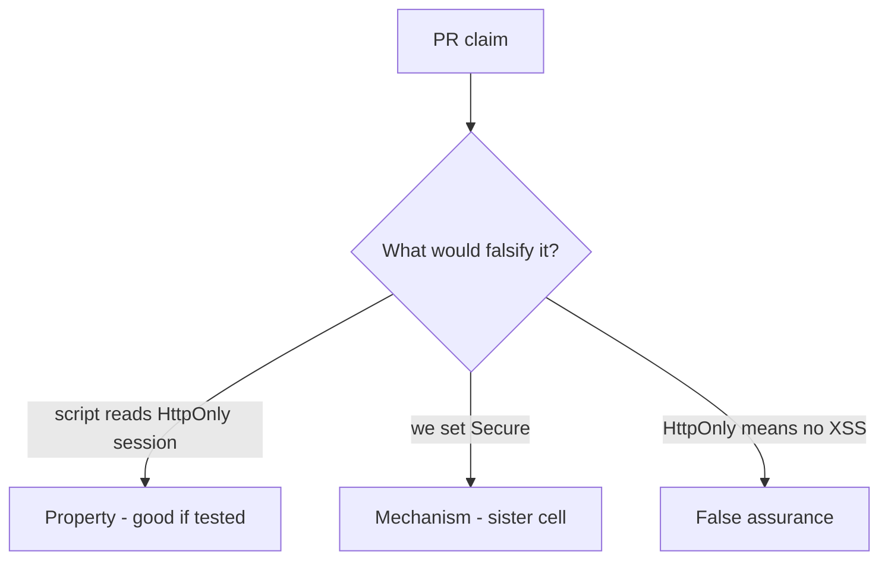

# 2.3-LO-08 — Review the script-readable session as a PR, not a slogan

**Kind:** code-review
**Loop step:** Review
**Standards:** OWASP ASVS 5.0.0 (final) `v5.0.0-3.3.4`; CSP3 labeled **Working Draft**.

## Review the fixture as if it were SecureCollab cookie policy

Review `labs/2.3/2.3-browser-policy/vulnerable/` as a SecureCollab PR. Your job is not to count suspicious lines. Reconstruct whether the jar still presents `sc_session` to script, compare that with the module invariant, and write changes a developer can verify.

Intended findings live only in `content/assessment/keys/2.3.md` — not here. Do not open the keys file until your review has been evaluated.

## Mental model: document.cookie used to persist session

Start with this seeded smell: **`document.cookie` used to persist session**. Label it property, mechanism, or false assurance before you accept the PR.

Classification starts at the protected effect (script read of the session). Everything that is not an HttpOnly honor at that read is a candidate ambient path.

## Seeded smells (label them yourself)

- `document.cookie` used to persist session
- SECURITY.md equates HttpOnly with “no XSS”
- CSP Report-Only treated as enforcement (see E2)
- Missing Secure on the same cookie

Also reject: `localStorage` for session; client trust as the TCB; closing a finding without re-running `test_script_cannot_read_httponly_session`; keys in learner notes; live-target CORS or CSRF against a public site.

## Misconceptions this module refuses

- HttpOnly is XSS defense
- SameSite is CSRF complete
- `localStorage` is safer than cookies
- Next.js cookie defaults are the application guarantee
- A draft CSP3 header finishes 6.2 encoding

## Practice

Write three review notes a maintainer could act on. Each note: observation, property or false assurance, suggested structural change, residual you will **not** delete. Tie at least one to `test_script_cannot_read_httponly_session`.

## Transfer

Clinic portal or WebView bridge. A PR that “adds CSP3” without HttpOnly on the session is an incomplete mediation review. Name the independent falsehood that would still stop script from reading the token.

## Non-goals

Do not merge by adding a comment “will add HttpOnly later.” That comment is a residual without an owner.
