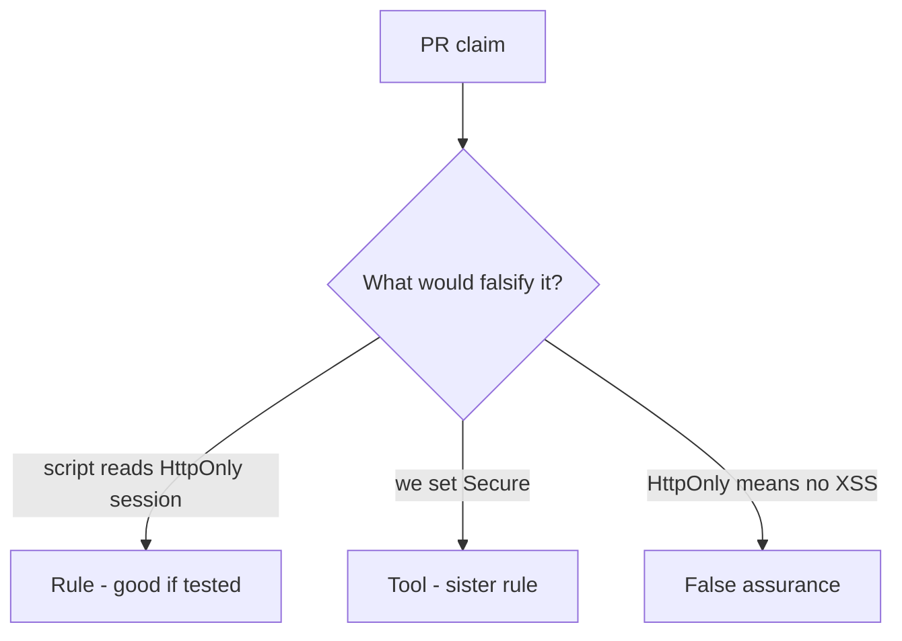

# Review of script-readable sessions

**Kind:** code-review
**Loop step:** Review

## What you are reviewing

Read `labs/2.3/2.3-browser-policy/vulnerable/` as a cookie-policy change. Does the jar still hand `sc_session` to script?

Start at the cookie reader, not at a CSP badge.

## Picture: problems to find (name them yourself)

**`document.cookie` used to persist session**.

A script still has to be blocked from reading the session. If the jar ignores HttpOnly, `document.cookie` still wins.

## Problems to label yourself

- `document.cookie` used to persist session
- SECURITY.md equates HttpOnly with “no XSS”
- CSP Report-Only treated as enforcement
- Missing Secure on the same cookie

Also reject: `localStorage` for session; trusting the client as what you trust; closing a finding without re-running `test_script_cannot_read_httponly_session`; keys in learner notes; live-target CORS or CSRF against a public site.

## Common mix-ups this topic refuses

- HttpOnly is XSS defense
- SameSite is CSRF complete
- `localStorage` is safer than cookies
- Next.js cookie defaults are the application promise
- A draft CSP3 header finishes later encoding work

## Use it somewhere new

On a portal or WebView bridge, CSP3 without HttpOnly on the session still lets script read the token. What would still stop script from reading the token if CSP3 is on?

## What this page is not doing

A script-readable session plus “will add HttpOnly later” is leftover with no owner.
