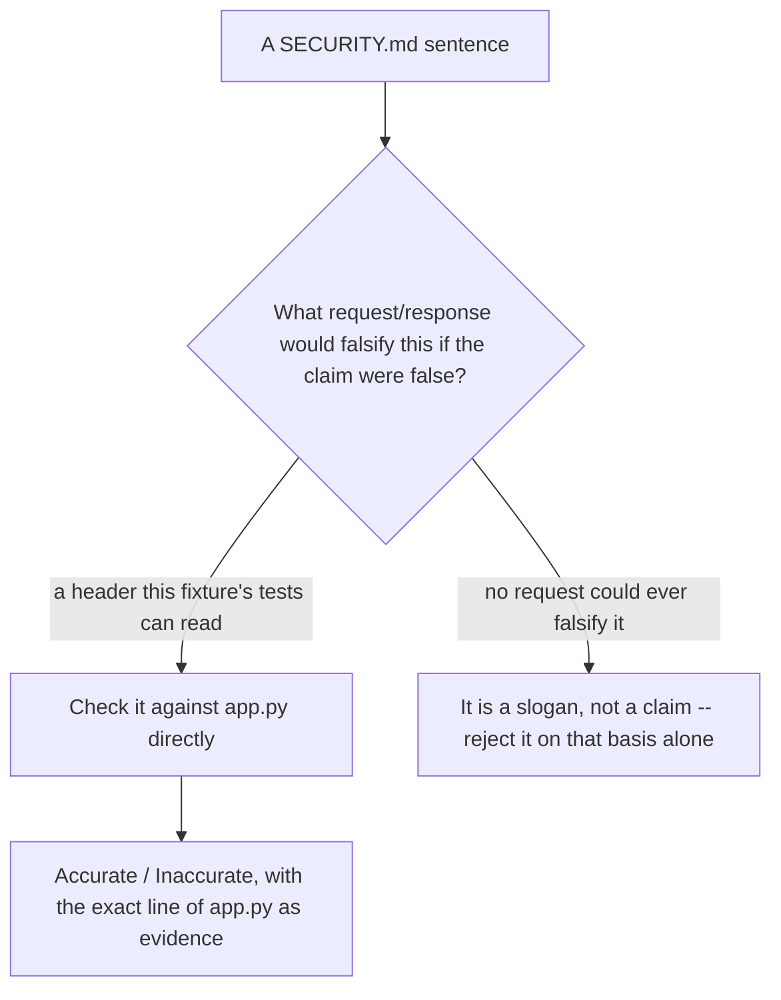

# Seeded review of a SECURITY.md that mistakes tools for the property

**Kind:** code-review
**Loop step:** 5 Verify

## What you are reviewing

Read `labs/2.3/2.3-browser-policy/vulnerable/SECURITY.md` alongside `vulnerable/app.py`, the way a real code reviewer would: as a set of claims a pull request makes about its own security posture, checked against the code that pull request actually ships, not against the confidence with which the claims are written. Every sentence in that file was written to sound reasonable to someone skimming it; the review's job is deciding, for each one, whether the code in the same directory backs it up.

This is the same skill [`lessons/05-verify.md`](05-verify.md) built for a passing test suite, aimed instead at prose. A test that never actually asserts the property it claims to is a familiar failure by now; a SECURITY.md sentence that never actually corresponds to a line of code is the same failure, wearing English instead of `assert`, and it is arguably more dangerous, because a reviewer's eyes slide past a well-written sentence far more easily than a test runner slides past a missing assertion.

## Picture: what would falsify each claim



A claim that no request could ever falsify is not merely unproven; it is not the kind of sentence a review can accept or reject on evidence at all, which is itself a finding worth writing down rather than skimming past.

## Problems to label yourself

Read `vulnerable/SECURITY.md`'s five bullets against `vulnerable/app.py`'s actual `login` and `notes` handlers, and label each bullet **accurate**, **inaccurate**, or **unfalsifiable as written** before reading any further in this lesson. Then check your own labels against these questions, without changing your answers to match: Does `login` actually set `HttpOnly`? Does an `HttpOnly` flag, if it were set, actually stop stored or reflected XSS as a class, or only one reader of one cookie? Does the CORS branch check anything before reflecting `Origin`, regardless of what a bullet claims about "the mobile team's staging builds"? Does `Content-Security-Policy-Report-Only` block anything at all, ever, under any circumstance? Is `Secure` present on `sc_session`?

## Common mix-ups this module refuses

- `HttpOnly` is complete XSS defense, rather than one browser-enforced reader denial among several unrelated controls.
- `SameSite` is complete CSRF defense, rather than a sister cookie rule this module names but does not test.
- `localStorage` is "safer" than a cookie, rather than a store with no flag-based reader denial available at all.
- A reflected `Access-Control-Allow-Origin` is an allow-list, because a variable happens to be named `ALLOWED_ORIGINS` somewhere nearby in the mental picture of the system, even when the code path a reviewer is looking at never reads that variable.
- `Content-Security-Policy-Report-Only`, deployed alone, is "CSP is on."

## Worked example: reading one bullet the way this review expects

Take the SECURITY.md bullet claiming CORS is intentionally permissive:

```text
CORS on /notes reflects the caller's Origin with credentials enabled on
purpose: the mobile team's staging builds change hostname every sprint,
and pinning one allowed origin would break their pipeline each time they
redeploy.
```

Read in isolation, this sounds like a reasonable trade-off a team might actually choose to make under real deployment pressure — pipelines really do get broken by pinned configuration, and a reviewer who has been burned by that before has every reason to find the justification plausible. Read against `vulnerable/app.py`'s `notes` handler, the claim does not describe what the code does at all:

```python
origin = request.headers.get("origin")
if origin:
    response.headers["Access-Control-Allow-Origin"] = origin
    response.headers["Access-Control-Allow-Credentials"] = "true"
```

The code contains no reference to a mobile team, no staging-hostname allow-list with a documented gap, and no comment marking this as a deliberate, time-boxed trade-off — it contains an unconditional `if origin:` that grants every caller, mobile staging build or not, the exact same credentialed access. The bullet is not a defensible trade-off with a real cost attached; it is a plausible-sounding justification invented after the fact for code that never made the trade-off it describes, and the distinction matters because a reviewer who accepts the justification's *reasoning* without checking it against the *code* would approve this exact pull request. The lesson generalizes past this one bullet: a justification's plausibility and a claim's truth are two different properties, and a review that only tests the first is not reviewing the code at all.

## Counterexample: a bullet that would survive this same scrutiny

Not every bullet in the file fails this test, which is itself worth noticing, because a review that rejects everything uniformly is not discriminating between claims any better than one that accepts everything. Suppose `vulnerable/SECURITY.md` instead read "`sc_session` is set without `Secure`; tracked separately as low priority" — checking this against `login`'s actual call to `set_cookie` confirms `secure` genuinely is omitted, so the claim is accurate on its own narrow terms, even though "low priority" is a judgment call a reviewer might still push back on given `HttpOnly` is also missing on the same cookie. Accurate-but-incomplete is a different finding from false, and a review that cannot tell the two apart will either reject a team's honest disclosures alongside their false ones, or accept a false one because a true one sat next to it in the same file.

## Use it somewhere new

On a patient-portal or WebView bridge pull request, a `Content-Security-Policy` header without `HttpOnly` on the session cookie still lets script read the token; naming one control in a SECURITY.md is not evidence about an unrelated one. Write the specific script-read-denial sentence a reviewer would need to see before approving such a change, rather than accepting "we added CSP" as sufficient reassurance on its own, and rather than assuming the reviewer who wrote that approval comment checked anything beyond the sentence itself.

## What this page is not doing

A script-readable session plus "we'll add `HttpOnly` next sprint" in a merged pull request is leftover risk with no owner and no deadline, not a closed finding. Do not accept a SECURITY.md claim on the strength of its own prose; check it against `vulnerable/app.py` directly, every time, including the bullets that sound the most reasonable, and including the ones a tired reviewer at the end of a long review queue would most want to wave through. Answer keys, including the seeded findings' full rationale, are not on this site.
