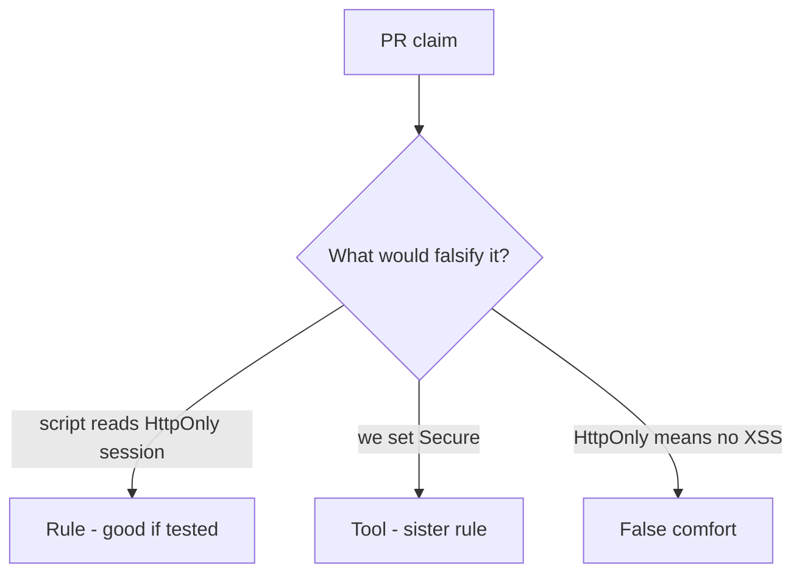

# Review of script-readable sessions

**Kind:** code-review
**Loop step:** Review

Intended findings live only in the answer-key folder — not here. Do not open that file until your review has been evaluated.

## What you are reviewing

A colleague ships notes-app cookie policy. Review `labs/2.3/2.3-browser-policy/vulnerable/` as if it were that change. Your job is not to count suspicious lines. Reconstruct whether the jar still hands `sc_session` to script, compare that with the rule, and write changes a developer can verify.

Start at the cookie reader, not at a CSP badge.

## Picture: problems to find (name them yourself)

Start with this seeded problem: **`document.cookie` used to persist session**. Label it rule, tool, or false comfort before you accept the change.

Classification starts at the protected effect (script read of the session). Everything that is not an HttpOnly honor at that read is a leftover path.

## Problems to label yourself

- `document.cookie` used to persist session
- SECURITY.md equates HttpOnly with “no XSS”
- CSP Report-Only treated as enforcement
- Missing Secure on the same cookie

Also reject: `localStorage` for session; trusting the client as what you trust; closing a finding without re-running `test_script_cannot_read_httponly_session`; keys in learner notes; live-target CORS or CSRF against a public site.

## Common mix-ups this topic refuses

- HttpOnly is XSS defense
- SameSite is CSRF complete
- `localStorage` is safer than cookies
- Next.js cookie defaults are the application promise
- A draft CSP3 header finishes later encoding work

## Practice

Write three review notes a maintainer could act on. Each note: what you saw, rule or false comfort, suggested structural change, leftover you will **not** delete. Tie at least one to `test_script_cannot_read_httponly_session`.

## Use it somewhere new

Clinic portal or WebView bridge. A change that “adds CSP3” without HttpOnly on the session is an incomplete review. Name the independent falsehood that would still stop script from reading the token.

## What this page is not doing

Do not merge by adding a comment “will add HttpOnly later.” That comment is leftover risk without an owner.
