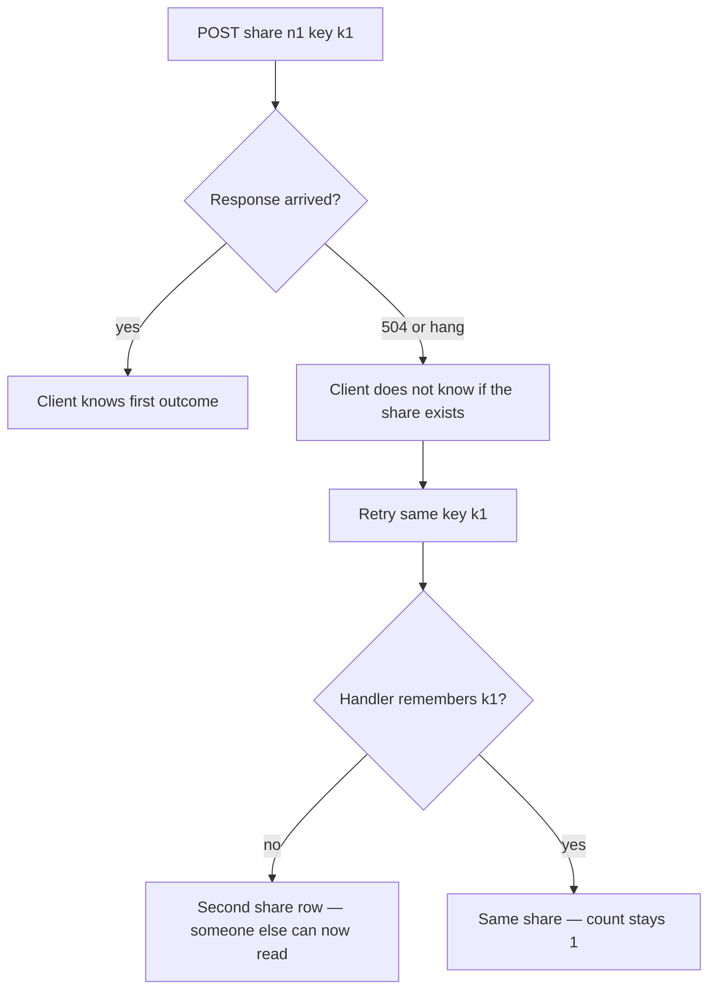
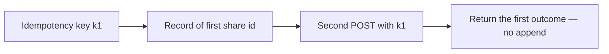

# A retry is a second attempt, not a second grant

**Kind:** concept-model
**Loop step:** 1 Property

## The rule

The notes app lets an owner share a note. Sharing changes who may later read that note. A client that times out, a double-click, or a later worker that delivers the same job again will try again. HTTP does not make POST happen once.

> For a share of note `n1`, two requests that carry the same idempotency key must produce **one** share. Timeouts and retries are part of whether the share list stays honest, not only a smoother click. If the key store is missing or unknown, fail closed for this high-impact action: do not insert a second share because the store was slow.

What must not happen is a **second grant**: `share_note("n1", idempotency_key="k1")` twice must not leave `share_count() == 2`. That extra row is someone else on the note who nobody meant to add.

Awareness lists name “something went wrong” as a family. They are not this sentence. A business step to succeed all the way or roll back, and they want a last clinic slot not to be booked twice. This practice’s check is share-count under retry, not a payment network.

## Picture: a timeout splits “did it land?”



Nobody needs a new bug name. A retrying client, a load balancer that retries POST, or a worker that delivers at least once is enough. Trusting “the user will not click twice” is not what you trust.

**A tool is not the rule.** FastAPI does not remember POSTs. HTTP 201 twice is still two rows. Disable-on-submit is a hint on the screen; users, proxies, and workers retry anyway. A “still working” status that people can hear must not mint a **new** key each time it speaks.

## Picture: the key binds the first outcome



What you trust is the **idempotency store** keyed by (actor, key) holding the first outcome. The key the client sends is data: it must be scoped to the sharer so company B cannot replay company A’s key onto a different note. Clocks may skew; do not use wall time as the only uniqueness.

If the key store is down, fail closed for share (do not insert “just this once”). A lost first response still needs a path so the owner can see the existing share without minting another key.

## Why it happens, what it costs, how you stop it, how you notice, how you recover

| Slice | For this rule |
|---|---|
| Why it happens | A side effect that is not bound to the key, plus a retry |
| What has to be true first | A timeout or double-submit; the handler inserts again |
| Trigger | Second `share_note` with the same key |
| What it costs | Who is allowed to read the note changes over time; an extra person on the note |
| How you stop it | Persist key → first share; the second POST returns the first |
| How you notice | Hits on a key you already saw; `share_count` versus unique keys |
| How you recover | Take extra shares back; tell the owner; never fail open if the key store is down |

## What the framework does vs what you still have to check

FastAPI, Next.js `fetch` retries, and HTTP retry logic do not remember your share list. A unique constraint on `(note_id)` would block **any** second share, including a legitimate new key — wrong check. What this practice is supposed to show: two calls with `k1`, `share_count() == 1`. The folder is `labs/2.4/2.4-state-time`. No live race against a public API.

## What the tool cannot do

- Keys that expire too fast replay as new shares.
- A new key on every retry (a client bug) walks around the store by construction — cap how many shares a note may have, and teach the client to reuse the key.
- A GET that shares the note will also duplicate if the browser prefetches it.
- A worker that retries a share after membership was taken back is a later topic: time is part of the check, not only remembering the first outcome.

## Practice

Draw the state machine `pending → shared` with retry edges labeled **same key** vs **new key**. Then run:

```text
python3 -m pytest labs/2.4/2.4-state-time/tests --impl vulnerable
python3 -m pytest labs/2.4/2.4-state-time/tests --impl fixed
```

The first command must fail. The second must pass. Tie the check to a second grant, not to an awareness-list name.

## Use it somewhere new

A clinic example: two POSTs book the last slot. Payment capture and invite tokens are the same shape. A worker that delivers a share again after membership was taken back is a later topic.

## Can people still use it

Disable-on-submit is not the rule. An accessible “still working” message must reuse the same idempotency key if it starts the work again.

## What this page is not doing

Live targets, load-testing third-party APIs, clock tricks against NTP, real payments, and treating an awareness list as the definition of security. Answer keys are not on this site.
