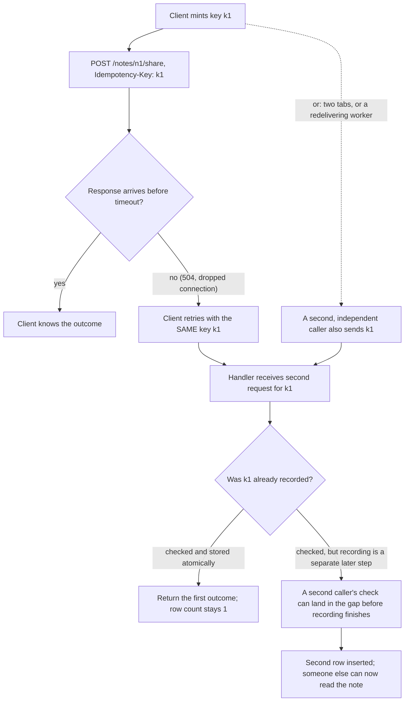

# A retry is a second attempt, not a second grant

**Kind:** concept-model
**Loop step:** 1 Property
**Standards:** OWASP ASVS 5.0.0 v5.0.0-2.3.3, v5.0.0-2.3.4, v5.0.0-16.5.3 (final). IETF RFC 9110 §9.2.2, `post-not-idempotent` (final).

## The property

Start with a sentence you can prove false, the way `1.2 Authority and authorization` and `1.3 Trust boundaries` both do before naming any mechanism: for a share of note `n1` in SecureCollab, two requests that carry the same idempotency key must produce exactly one share row, and the answer stays exactly one whether those two requests arrive one after the other or genuinely at the same time. An **idempotency key** is a value the client mints once for one intended action and resends unchanged on every retry of that same action, so the server can tell "this is the same attempt again" apart from "this is a new attempt." The word "produce" is doing real work in that sentence: it is not enough for the *second* HTTP response to look identical to the first, because a response is only evidence of what the client saw, not of what the server actually recorded. The claim is about the row, not the reply.

Every clause of that sentence can be individually falsified, and each failure is a distinct, nameable bug rather than one generic "duplicate" label. If two *sequential* requests with the same key both insert a row, the handler never checked the key at all — this is the module's headline forbidden outcome, and it is what a client actually does when a POST times out, when a user double-clicks a Share button before it visually disables, or when a load balancer or message queue redelivers a request it never got a clean acknowledgment for. If two requests arrive close enough in time that their "have I seen this key" checks both run before either request's "record this key" step runs, the same duplicate can happen even though a careless read of the code looks like it checks first and acts second — this is a race, and it is the failure a sequential retry test cannot see, because a sequential test's two calls never actually overlap in time. If the store that remembers keys cannot be reached, the safe answer is to refuse the share, not to accept it "just this once" and hope the client never notices nothing was recorded — this is a fail-open failure, and it is the one most often justified by a sentence that sounds reasonable in isolation ("the database was just restarting, this is a one-in-a-million case") and is exactly how a one-in-a-million case becomes a permanent access grant nobody chose to make.

## What HTTP already tells you, and what it does not

The Hypertext Transfer Protocol defines a method **idempotent** when the intended effect on the server of sending the same request more than once is the same as sending it once; GET, HEAD, PUT, DELETE, and OPTIONS are idempotent by this definition, and POST is explicitly not. [RFC 9110](https://datatracker.ietf.org/doc/html/rfc9110) §9.2.2 spells this out and adds a detail worth reading closely: the idempotent property only applies to what the client asked for, and "a server is free to log each request separately, retain a revision control history, or implement other non-idempotent side effects for each idempotent request." That sentence closes off a tempting shortcut — switching the share endpoint from POST to PUT does not, by itself, make a repeat share safe, because the server is still free to append a log line, bump a counter, or fire a notification on every call regardless of which HTTP method carried it. The method name is a hint about what a well-behaved client and proxy are allowed to assume about automatic retries; it is not an enforcement mechanism, and nothing in the HTTP specification requires that a server actually behave the way its method choice implies. SecureCollab's `share_note` endpoint is a POST for the same reason most real write actions are: it has a side effect (a new row that changes who may read the note) that the client is asking the server to perform, and RFC 9110 is explicit that a client "SHOULD NOT automatically retry a request with a non-idempotent method unless it has some means to know that the request semantics are actually idempotent" — the idempotency key is exactly that "some means," supplied by the application because HTTP's own method semantics do not supply it for POST.

## Picture: two ways the same key can reach the handler twice



This diagram has two authority paths converging on the same decision point, and that convergence is the point: a retry from the *same* client after a timeout and a genuinely independent second caller sending the *same* key arrive at the handler in the same shape, and the handler cannot tell them apart from the request alone — it has no way to know whether the party behind `k1` right now is the original client trying again or two callers that happen to be racing. Both paths must be denied a second row for the same reason, which is why the property statement at the top of this lesson does not distinguish "retry" from "race" as two different rules: from the handler's point of view, the request looks identical either way, and a fix that only closes the sequential path (checking a key and setting it as one line of code, trusting that nothing else runs in between) is closing half of one bug.

## What must be trusted, and why the list is different for the fail-closed claim

For the retry claim — two sequential requests with key `k1` must leave one row — what has to be trusted is narrow: the idempotency store's write path must actually persist the key before the handler tells the client the share succeeded, and the read path that checks "have I seen this key" must read a value that was actually committed, not a value cached from before the first request finished. Nothing about the client needs to be trusted at all; the client is exactly the actor this rule defends against, whether it retries by honest accident or resends a captured request on purpose. Nothing about the network path between client and handler needs to be trusted either, since the property has to hold regardless of how many times, or in what order, the bytes carrying `k1` happen to arrive.

For the fail-closed claim — the share endpoint must deny the action, not accept it, when its idempotency store cannot be reached — the trust list changes in a way that is easy to miss if you assume "the same store" means "the same trust requirements." Now the handler's own error-handling path has to be trusted: specifically, that every code path which can fail to reach the store also routes through the same "deny" decision, rather than one exception handler somewhere quietly catching the failure and falling through to "insert anyway." A single `except Exception: pass` above an insert statement — written for an entirely unrelated reason, perhaps to keep one flaky dependency from crashing the whole request — can silently reopen the fail-closed guarantee even though nothing about the idempotency-checking logic itself changed. This is exactly the discipline [1.3 Trust boundaries and attack surface](../../../1/1.3/lessons/01-property.md) teaches with its own two-rule contrast between note secrecy and availability: what you must trust is tied to the specific rule you stated, and restating the rule changes the list, so "the database is trusted" is never itself a security claim — the claim has to name which behavior of the database, under which failure, a specific rule depends on.

## Attacker and failure capabilities in scope, and what is deliberately excluded

The actor this module defends against is not assumed to be malicious in every scenario; a legitimate, honestly-behaving client is enough to trigger the retry case, because timeouts and dropped connections happen to well-behaved software constantly, at a rate that has nothing to do with anyone's intent. The capabilities in scope are: sending the same idempotency key more than once, whether by an honest retry, a doubled click, two open tabs, a load balancer's own retry policy, or a queue redelivering a message at least once; and causing or waiting for the idempotency store to be briefly unreachable, whether by bad luck or, for an adversary specifically trying to slip a duplicate through during a known maintenance window, on purpose. Deliberately excluded from this module's scope: forging a *different* idempotency key to get a *second, illegitimate* share (that is an authorization question — whether the requester was allowed to share the note at all — and belongs to [1.2 Authority and protection](../../../1/1.2/lessons/01-property.md), not here); attacking the transport that carries the key (TLS and header integrity are out of scope for this lesson); and any timing-side-channel attack that infers information from how long the check-then-record path takes to respond, which is a distinct and much narrower research question this course does not teach.

## Why "the tests pass" is not the same claim as "it works"

A team that ships a passing `test_single_share` and stops there has tested that the happy path exists, not that the property holds under any of the three failure shapes above. This is the module's central misconception, worth stating plainly because it is exactly how a real incident gets past review: a green test suite that only ever calls an endpoint once, or twice in strict sequence, cannot distinguish a correctly atomic implementation from one that merely got lucky because nothing forced its two operations to overlap during the test run. [`03-break.md`](03-break.md) makes this concrete with a fixture; [`05-verify.md`](05-verify.md) shows the specific test that a sequential-only suite is blind to, and names the standards clause — ASVS v5.0.0-15.4.2 — that exists precisely to require testing the check-then-use gap directly rather than trusting that it never gets exercised in production either.

## A worked trace, and a counterexample that looks almost identical

The clearest way to see why "checked, then acted" is not the same claim as "checked and acted as one step" is to trace both shapes against the same two calls. Here is the shape this module's lab ships as the structural fix, described as pseudocode rather than the exact Python so the reasoning is not tied to one language:

```text
handler(note_id, key):
    outcome = database.insert_if_key_absent(note_id, key)   # one atomic statement
    return outcome.share_id
```

Trace two calls with the same key `k1` through this shape, one after the other: the first call's `insert_if_key_absent` runs to completion — including the uniqueness check — before the second call's `insert_if_key_absent` is even allowed to start, because the database itself serializes writes to the same constrained column. The second call's attempt is rejected by the constraint, and the handler returns the first call's `share_id`. Nothing about *when* the second call arrives changes this trace; even if it arrives one microsecond after the first, the database's own write-serialization is what decides the ordering, not the Python interpreter's scheduling of two threads.

Now trace the almost-identical-looking counterexample a competent engineer might write instead, believing it does the same thing:

```text
handler(note_id, key):
    existing = database.select_by_key(key)     # step 1: check
    if existing:
        return existing.share_id
    row = database.insert(note_id, key)         # step 2: act, separately
    return row.share_id
```

For one call at a time, this reads identically to the atomic version, and a test that calls `handler` twice in strict sequence cannot tell them apart — the first call's `select_by_key` finds nothing, inserts, and returns; the second call's `select_by_key` finds the first call's row and returns it without inserting. The difference only appears when two calls' `select_by_key` steps can both run before either call's `insert` step runs: now both see "nothing exists yet," both proceed to insert, and the row count is two. [`03-break.md`](03-break.md) stages exactly this fixture, and [`05-verify.md`](05-verify.md) names the specific test — one that holds eight requests genuinely in flight at once rather than two requests in sequence — that a sequential-only suite would never write, and that this counterexample would quietly pass without ever getting caught.

## Where this goes next

[`02-model.md`](02-model.md) draws the share workflow as a state machine and names which of its transitions belong to a retry, which belong to a race, and which belong to neither. [`03-break.md`](03-break.md) stages the smallest fixture that exhibits a duplicate share under a real retry. [`04-build.md`](04-build.md) compares two candidate fixes — an application-level check-then-insert, and a database-enforced uniqueness constraint — and shows exactly where the first one still fails. [`06-operate.md`](06-operate.md) covers what a fail-closed denial should log, and what it must never log. [`07-transfer.md`](07-transfer.md) moves the same three failure shapes to a different limited resource. The residual this module does not close — a worker that redelivers a share request after the underlying grant has since been revoked — is named explicitly where it belongs, in [7.4 Queues, workers, events, and service identity](../../../7/7.4/lessons/01-property.md), not solved here.
