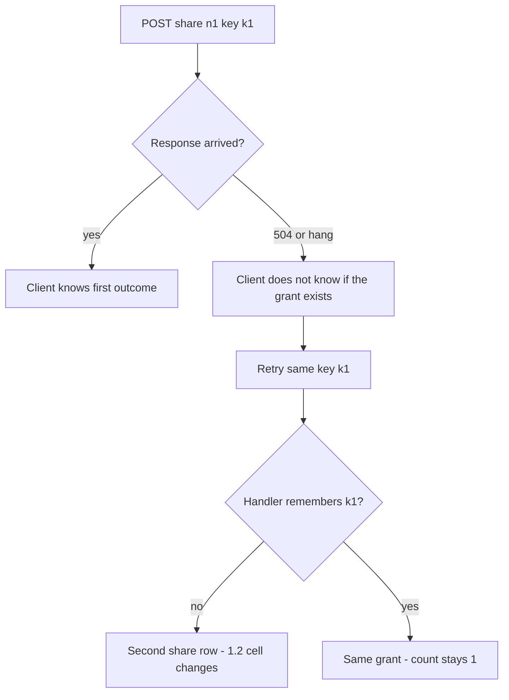
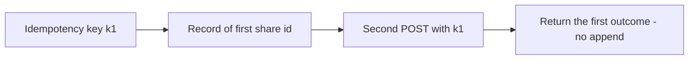

# 2.4-LO-01 — A retry is a second attempt, not a second grant

**Kind:** concept-model
**Loop step:** 1 Property
**Standards:** Saltzer and Schroeder (1975, seminal), especially complete mediation, fail-safe defaults, and economy of mechanism; IETF RFC 9110 HTTP Semantics (final) — POST is not idempotent; OWASP ASVS 5.0.0 (final) `v5.0.0-2.3.3` and `v5.0.0-2.3.4`; OWASP Top 10:2025 A10 (awareness only, not the syllabus); WCAG 2.2 (final) Success Criterion 4.1.3 Status Messages for “still working,” which is not the idempotency property.

## The claim this module owns

SecureCollab Phase 1 lets an owner share a note. Sharing is an authorization-state change (1.2): another principal may later read. A client that times out, a double-click, or a later worker redelivery (7.4) will try again. RFC 9110 does not make POST happen once.

> For a SecureCollab Phase 1 `share_note` of note `n1`, two requests that carry the same idempotency key must produce **one** share grant. Timeouts and retries are part of the integrity of the share graph, not only UX. Missing or unknown key-store state fails closed for this high-impact action: do not insert a second grant because the store was slow. Top 10:2025 A10 names exceptional conditions as an awareness item; it is not this sentence and not the course outline.

The forbidden outcome is **duplicate grant**: `share_note("n1", idempotency_key="k1")` twice yields `share_count() == 2`. That extra row is a 1.2 cell that nobody intended.

ASVS `v5.0.0-2.3.3` wants business-logic transactions to succeed entirely or roll back. `v5.0.0-2.3.4` wants locking so limited resources cannot be double-booked—the clinic transfer uses that shape. This lab’s oracle is share-count under retry, not a payment network.

## Mental model: timeout splits “did it land?”



The attacker in this module is not a novel CVE. It is a **retrying client**, a load balancer that retries POST, or an at-least-once worker. Trusting “the user won’t click twice” is not a TCB.

**Mechanism (not the property):** FastAPI does not dedupe POSTs. HTTP 201 twice is still two rows. Disable-on-submit is a UI hint; users, proxies, and workers retry anyway. An accessible “still working” status (WCAG 4.1.3) must not mint a **new** key on each announcement.

## Mental model: the key binds the first outcome



The TCB is the **idempotency store** keyed by (actor, key) holding the first outcome. The client-supplied key is data: it must be scoped to the sharer so Tenant B cannot replay Tenant A’s key into a different note. Clocks may skew; do not use wall time as the only uniqueness.

If the key store is down, fail closed for share (do not insert “just this once”). Lost first response still needs a read-your-write path so the owner can see the existing grant without minting another key.

## Root cause vs impact vs prevention vs detection vs recovery

| Slice | For this property |
|---|---|
| Root cause | Non-idempotent side effect plus retry |
| Preconditions | Timeout or double-submit; handler inserts again |
| Trigger | Second `share_note` with the same key |
| Impact | Integrity of authorization state over time; extra principal on the note |
| Prevention | Persist key → first share; second POST returns the first |
| Detection | Duplicate-key hits; `share_count` vs unique keys |
| Recovery | Revoke extra shares; notify owner; never fail-open if the key store is down |

## Framework defaults versus the share guarantee

FastAPI, Next.js `fetch` retries, and HTTP/2 retry logic do not remember your share graph. A unique constraint on `(note_id)` would block **any** second share, including a legitimate new key—wrong predicate. The application guarantee is: **this** fixture, two calls with `k1`, `share_count() == 1`. Oracle: `labs/2.4/2.4-state-time`. No live race against a public API.

## Mechanism limits

- Keys that expire too fast replay as new shares.
- A new key on every retry (client bug) bypasses the store by construction—cap grants (1.2) and teach the client to reuse the key.
- GET-with-side-effect violates RFC 9110 safety and duplicates on prefetch.
- Worker retry with a **stale** 1.2 grant is Module 7.4: time is part of mediation, not only idempotency.

## Practice

Draw the state machine `pending → shared` with retry edges labeled **same key** vs **new key**. Then run:

```
python3 -m pytest labs/2.4/2.4-state-time/tests --impl vulnerable
python3 -m pytest labs/2.4/2.4-state-time/tests --impl fixed
```

The first command must fail. The second must pass. Map the assertion to duplicate grant, not to A10.

## Transfer

Clinic: two POSTs book the last slot. Payment capture (E3) and invite tokens (6.6) are the same shape. Worker redelivery of a share whose membership was revoked is 7.4.

## Non-goals

Live targets, load-testing third-party APIs, NTP attacks, real payments, and A10 as the definition of security. Gates 0–10 and milestones M0–M5 stay **not-attempted** without learner or product evidence. Answer keys are not in this file.

## Usability and accessibility

Disable-on-submit is not the property. An accessible status message must reuse the same idempotency key if it retriggers work.
