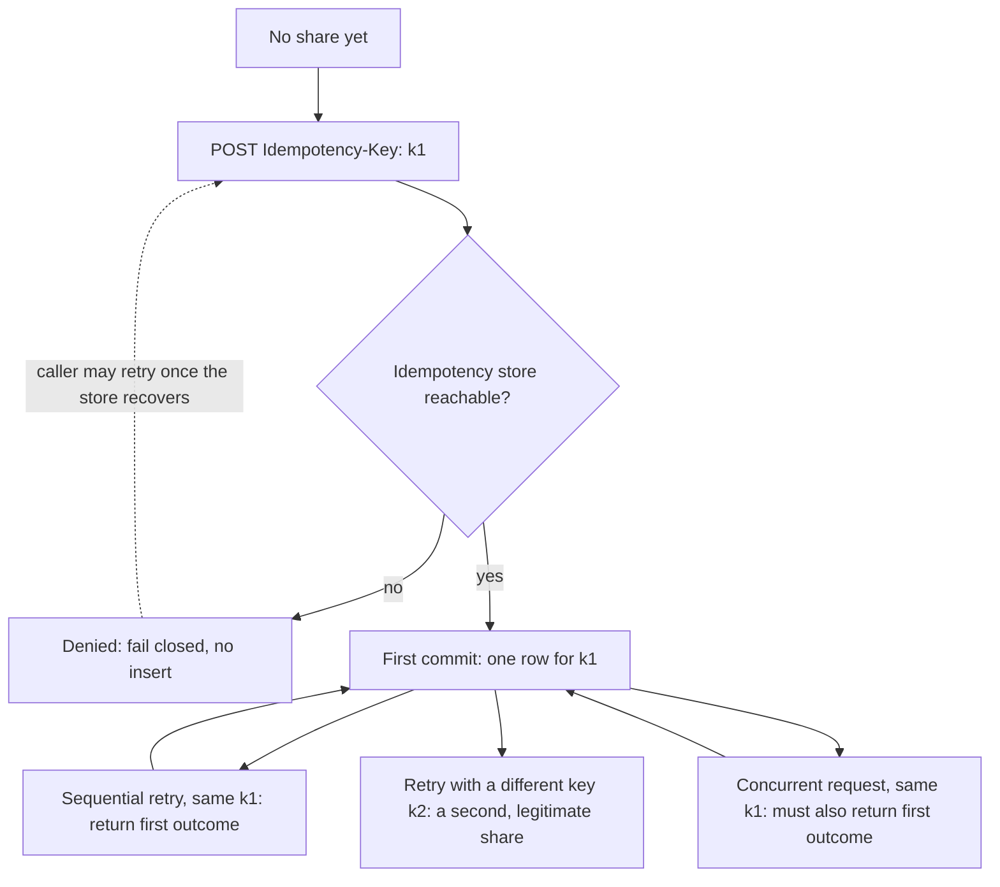

# A share state machine that names retry, race, and store failure

**Kind:** design-exercise
**Loop step:** 2 Model

## Why a sequence diagram of "owner clicks Share" is not a model

A diagram that shows a browser, an arrow, and a server box is a slogan dressed as engineering, because it cannot answer the two questions this module actually needs answered: which events may fire more than once for the same logical action, and what must the share table still contain after any combination of those events has happened. Until a diagram commits to naming states, transitions, and which transitions are the same event arriving twice, it has not modeled anything a reviewer could check it against, and a reviewer who cannot check a model against a claim is being asked to trust it instead of verify it.

## Keep these words from collapsing

[1.3 Trust boundaries and attack surface](../../../1/1.3/lessons/02-model.md) teaches this table for the notes-app export path; this page copies its discipline, not its content, for the SecureCollab share workflow this week.

| Word | Precise question | This system, this phase |
|---|---|---|
| Actor | Who or what takes part? | The note owner (sharer); a retrying browser tab; a redelivering worker (named as a hole this fixture does not model, see [`01-property.md`](01-property.md)) |
| Principal | Which identity is used for a decision? | The owner's session identity, established before this workflow starts and out of scope for this module |
| Component | Where does the code or data run? | The `share_note` FastAPI handler; the SQLite `shares` table it writes to |
| Channel | How is the data carried? | An HTTP POST body and an `Idempotency-Key` header, over one request/response cycle per attempt |
| Entry point | Where can an actor or a failure first change in-scope behavior? | The `POST /notes/{note_id}/share` route; the point where the handler's exception handling decides whether a store failure is visible or swallowed |
| Trust boundary | Where does a relevant assumption or ability change? | Where the request's client-supplied key stops being "whatever the client sent" and becomes "the value the database has agreed to treat as unique" |

Two of these rows are easy to blur into one. The channel is the header carrying the key; the entry point is where that header first has consequences. A key can travel over several different channels in a redesigned system — a header today, a queue-message field tomorrow — without moving the entry point, because the entry point is defined by where the decision happens, not by which wire carried the bytes that fed it.

## Discrimination one: a hop that looks like a boundary and is not

Suppose SecureCollab's share requests pass through a reverse proxy that adds a `Via` header and forwards the request unchanged. A diagram that draws a box for this proxy and labels the line into it "trust boundary" has invented a boundary that is not there for this claim: the proxy does not verify the idempotency key, does not decide anything about it, and does not change what the handler must assume about it. Before the hop, the key is "whatever bytes the client sent." After the hop, the key is still "whatever bytes the client sent," just relayed. Nothing about what the receiving side may rely on has changed, and [1.3 Trust boundaries and attack surface](../../../1/1.3/lessons/01-property.md) names exactly this pattern: a network hop is not automatically a boundary, and drawing a line there because a box exists on the diagram invents trust rather than describing it.

## Discrimination two: a boundary that does not look like one

Now consider the opposite mistake in the other direction, inside a single Python process with no network hop at all. The `share_note` handler calls one library function — the database driver's `execute()` — to run an `INSERT` statement against a column that carries a `UNIQUE` constraint. Nothing about this looks like a boundary; it is one function call to one library, inside one process, on one thread of execution. But this is exactly where the relevant assumption changes for the concurrency claim: before this call, "has this key been recorded" is a question the *application's* Python code would have to answer for itself, by reading some state it does not fully control the timing of; after this call returns (successfully, or with a constraint violation), the answer is a fact the *database engine* has already settled, atomically, with respect to every other write attempt racing it for the same row. The line is not drawn by a network diagram's convention of boxes and arrows; it is drawn by which side of the call gets to assume the check-then-act gap has already been closed on its behalf. A function call inside one process can be the most important trust boundary on the page, and a diagram that only draws lines at process or network edges will never show it.

## Picture: states, and which transitions are the same event twice



Three branches leave `FirstCommit`, and that is the point the earlier sequence-diagram slogan could never show: a sequential retry with `k1`, a genuinely concurrent second request with `k1`, and a caller retrying with a *different* key `k2` all look, from outside the box, like "another POST arrived." Only the third one is actually a new action the who-may-read policy has to evaluate; the first two must resolve back to the exact same `FirstCommit` row that already exists, which is why both of their arrows loop back into it rather than fanning out to a new state, and the model has to say so explicitly rather than trusting that "the handler will figure it out." The `Denied` state exists because [`01-property.md`](01-property.md)'s fail-closed claim is not a side note — it is a state the machine can actually be in, with its own explicit recovery edge back to `Attempt`, not a crash the diagram pretends never happens.

## What can change between the check and the use

State, time, and concurrency all bear on the same question: between the instant a fact is checked and the instant that fact is acted on, can the world have changed underneath the decision? For the sequential retry case, the answer this module cares about is almost trivially "yes, and that is fine" — the second request's check happens strictly after the first request's act has already completed and committed, so the second check correctly observes the first request's outcome. The genuinely hard case is the one a state machine drawn only for the sequential story hides: two requests whose check-then-act windows overlap in wall-clock time, so that *neither* request's check can see the other's act, because neither act has happened yet when both checks run. This is not a hypothetical for a system with more than one request-handling process or thread, which describes essentially every real deployment target this course assumes (FastAPI under `uvicorn` with multiple workers, or multiple pods behind a load balancer); it is the default condition, and a model that only accounts for one request being handled "at a time" has quietly assumed away the exact thing Phase 2 exists to stop assuming away.

## Practice

Draw this state machine yourself before opening the picture above, labeling the three branches leaving `FirstCommit` by name (sequential retry, race, new key), and mark which one is this module's forbidden outcome versus which one is out of scope by policy rather than by the check. Then open [`03-break.md`](03-break.md), which stages the fixture whose failing test is exactly the `Attempt --> FirstCommit` transition firing twice for one `k1` instead of resolving to the loop-back edge the second time.

Here is what tracing the vulnerable fixture's two calls against this model looks like, worked through by hand rather than left as an exercise:

```text
call 1: POST key=k1  -> handler has no check at all -> INSERT -> row count 1
call 2: POST key=k1  -> handler has no check at all -> INSERT -> row count 2
```

Against the state machine above, both calls take the `Attempt --> FirstCommit` edge, because nothing in the vulnerable handler ever asks whether a row for `k1` already exists; there is no branch, so there is no way for the second call to be routed onto the `SeqRetry` loop-back instead. The model predicts this exact failure before you have read one line of `vulnerable/app.py`: a diagram with only one edge out of `Attempt` and no way back into `FirstCommit` for a repeated key is, by construction, a diagram of code that cannot distinguish a retry from a first attempt.

## Use it somewhere new

A clinic booking a limited number of appointment slots, a payment capture, and an invite-token redemption all share this same state shape: one identifier that must resolve to at most one committed outcome, with a `Denied` state for when the backing store cannot answer. [`07-transfer.md`](07-transfer.md) asks you to redraw this diagram for one of those systems and say which of the three branches out of `FirstCommit` changes meaning and which does not.

## What can still go wrong

This model does not include a worker that redelivers a share job after the underlying grant has since been revoked between when the job was enqueued and when it runs — that is a genuinely different state machine, with a fourth actor (the queue) and a fifth question (has authority changed since this message was written), and it is named as a residual rather than solved here. It also does not include what happens if two entirely different idempotency keys are minted by mistake for what a human would call "the same" share attempt, because nothing in this system can detect that two keys were meant to represent one intention; that failure lives in client-side key generation discipline, outside this module's scope.

## What this page is not doing

This model is a design exercise against a local fixture, not a claim about SecureCollab's production networking, a real queue, or a deployed high-availability database cluster. Do not run any of this against a live target.
