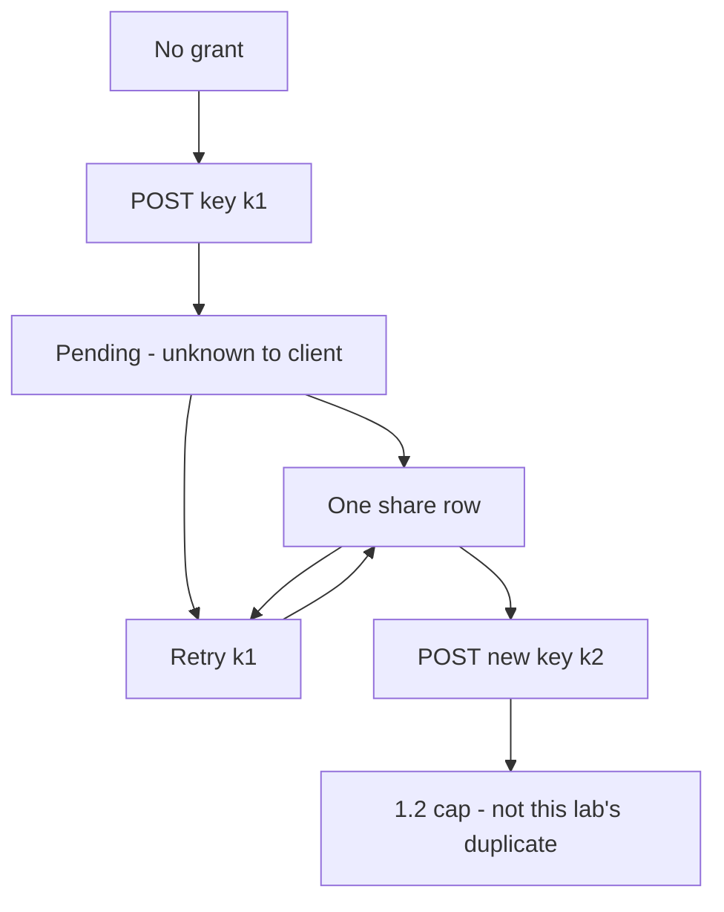

# 2.4-LO-02 — A share state machine a second engineer can test

**Kind:** design-exercise
**Loop step:** 2 Model
**Standards:** IETF RFC 9110 (final); OWASP ASVS 5.0.0 (final) `v5.0.0-2.3.3`; Saltzer and Schroeder fail-safe defaults.

## Can a second engineer name pytest cases from your machine?

A sequence diagram “owner clicks Share” is not this lesson. A state machine names **which events** may fire twice and **what the share table must still contain**.

SecureCollab Phase 1 freeze: local `share_note` fixture. No payment processor, no live queue, no NTP lab.

## Mental model: pending, shared, and retry

If `RetrySame` draws a second arrow into a **new** row, the map already predicts `test_retry_does_not_duplicate_side_effect` will fail.

## Step 1: freeze subjects, objects, time

| Piece | This system |
|---|---|
| Subjects | Sharer; retrying client; later worker (7.4 hole) |
| Objects | Share row; idempotency key; note `n1` |
| Actions | `share_note`; retry; read-your-write |
| Channels | HTTP POST now; queue redelivery later |
| TCB | Idempotency store keyed by (actor, key) with the first outcome |
| Untrusted | “I only clicked once”; load-balancer POST retry; wall clock as uniqueness |
| State / time | Two POSTs 200ms apart; worker tomorrow |
| 1.1 cell | Integrity of authorization state over time |

## Step 2: write cells the lab can fail

| Subject | Object | Action | Decision |
|---|---|---|---|
| owner | n1 | share once, key k1 | allow; count 1 |
| owner | n1 | share retry, same k1 | no second row; count 1 |
| owner | n1 | share new key k2 | 1.2 policy (cap, recipient); not this pytest |
| worker | n1 | redeliver k1 | same as retry (write the hole) |
| handler | key store down | share | fail closed; do not insert |

## Step 3: clocks and uniqueness

Do not use “timestamp rounded to the second” as the key. Skew and two clients in the same second collide or duplicate. The client (or origin) must mint a key and **reuse** it across retries.

## Practice

Draw the machine so a second engineer could name pytest cases. Point at `labs/2.4/2.4-state-time` file `share.py`. Label missing-key behavior as residual (the lab still shares once if the key is omitted).

## Transfer

Payment capture (E3); invite tokens (6.6); clinic last slot (`v5.0.0-2.3.4`).

## Residual risk

Lost first response still needs a read-your-write path. Keys that expire too fast replay.

## Non-goals

Top 10 as the definition of security. Keys stay out of lessons.
