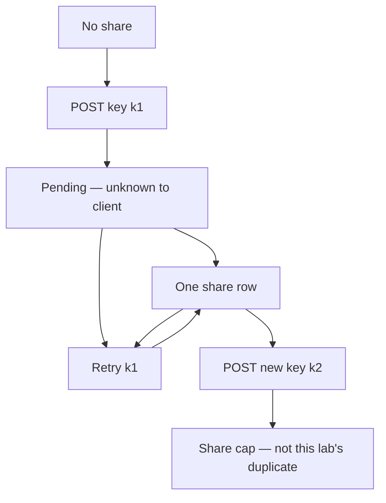

# A share state machine someone else can test

**Kind:** design-exercise
**Loop step:** 2 Model

## Could someone else name checks from your machine?

A sequence diagram that says “owner clicks Share” is not this page. A state machine names **which events** may fire twice and **what the share table must still contain**.

This week’s freeze: a local `share_note` practice. No payment processor, no live queue, no NTP lab.

## Picture: pending, shared, and retry

If `RetrySame` draws a second arrow into a **new** row, the map already predicts `test_retry_does_not_duplicate_side_effect` will fail.

## Step 1: freeze who, what, and time

| Piece | This system |
|---|---|
| Who | Sharer; retrying client; later worker (a hole you will write down) |
| What | Share row; idempotency key; note `n1` |
| Actions | `share_note`; retry; read the share you just made |
| Paths | HTTP POST now; queue redelivery later |
| What you trust | Idempotency store keyed by (actor, key) with the first outcome |
| What you do not trust | “I only clicked once”; load-balancer POST retry; wall clock as uniqueness |
| State / time | Two POSTs 200ms apart; a worker tomorrow |
| The rule | Who is allowed to read the note stays honest over time |

## Step 2: write rows the lab can fail

| Who | What | Action | Decision |
|---|---|---|---|
| owner | n1 | share once, key k1 | allow; count 1 |
| owner | n1 | share retry, same k1 | no second row; count 1 |
| owner | n1 | share new key k2 | who-is-allowed policy (cap, recipient); not this check |
| worker | n1 | redeliver k1 | same as retry (write the hole) |
| handler | key store down | share | fail closed; do not insert |

## Step 3: clocks and uniqueness

Do not use “timestamp rounded to the second” as the key. Skew and two clients in the same second collide or duplicate. The client (or origin) must mint a key and **reuse** it across retries.

## Practice

Look in `labs/2.4/2.4-state-time`, starting with `share.py`. Label missing-key behavior as leftover (the lab still shares once if the key is omitted).

## Use it somewhere new

Payment capture; invite tokens; a clinic last slot that must not be booked twice.

## What can still go wrong

A lost first response still needs a path so the owner can see the existing share. Keys that expire too fast replay.

## What this page is not doing

Do not treat a famous-bugs list as the definition of security. Answer keys are not on this site.
