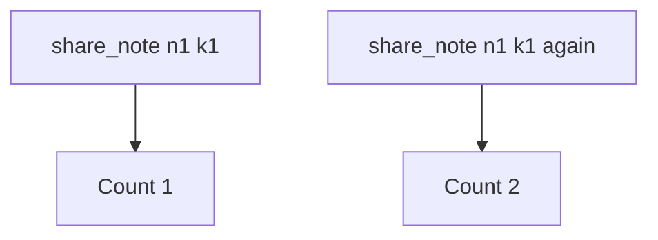

# Practice: a retry creates a second share

**Kind:** mechanism-lab
**Loop step:** 3 Break

## Try it

The practice is not a website you attack. It is a tiny in-process `share_note` list. It does not open a browser, talk to a payment network, or race a public API. The failure is already in the object: every call appends a row and ignores the key. That is a **failed rule**, not a clumsy click.

The rule under test:

> Two `share_note` calls with the same idempotency key must produce one share. A retry is a second attempt, not a second grant.

## Where you may practice

Only `labs/2.4/2.4-state-time` is in scope. Restore the broken and repaired folders from git when you are done. Fake note ids only.

Do not load-test third-party APIs. Do not run clock tricks against NTP. Do not point this exercise at a live clinic booking page, a classmate’s FastAPI, or an employer checkout.

What must not happen: a retry creates a second share. Two `share_note("n1", idempotency_key="k1")` calls leave `share_count() == 2`.

Who could do this: a **retrying client** that can call `share_note` twice with the same key. That stands in for a 504, a double-click, a load balancer that retries POST, or a later worker that delivers at least once. What is supposed to stop this: the handler treats `k1` as “this attempt already landed.” FastAPI, Next.js `fetch` retries, HTTP retry logic, and “the user will not click twice” are not enough.

## Picture: every call is a new row



The broken files show **cause** (the share side effect is not bound to the key), not a trophy race. What has to be true first: two calls with the same key; the handler appends `note_id` every time and ignores `idempotency_key`. A 504 is modeled by the second call — you do not need a real timeout, a sleep, or a second process.

HTTP does not make POST happen once. HTTP 201 twice is still two rows. An awareness list that names “something went wrong” is not the failing check.

## What to look at: the cause, not a trophy

Read `vulnerable/share.py`. `share_note` appends `note_id` to `_SHARES` on every call. The parameter `idempotency_key` is accepted and discarded. Checks:

- `test_single_share` — one call still creates one share (honest happy path)
- `test_retry_does_not_duplicate_side_effect` — two calls with `k1` must leave `share_count() == 1`

You do not need a new key string. The failure of `test_retry_does_not_duplicate_side_effect` *is* the evidence.

## Why it happens, what it costs, how you stop it, how you notice, how you recover

| Slice | This practice |
|---|---|
| The rule | Two `share_note` calls with the same key produce one share |
| Why it happens | A side effect that is not bound to the key, plus a retry; the key does not mediate the append |
| What has to be true first | Note `n1`; key `k1`; the handler inserts on every POST |
| Trigger | Second `share_note("n1", idempotency_key="k1")` |
| What it costs | Who is allowed to read the note changes over time; an extra share nobody meant |
| How you stop it | Persist key → first share; the second POST returns the first outcome |
| How you notice | Hits on a key you already saw; `share_count` versus unique keys |
| How you recover | Take extra shares back; tell the owner; never fail open if the key store is down |
| Not the lesson | An awareness-list name, “the user double-clicked wrong,” disable-on-submit, or a scanner name |

## What the framework does vs what you still have to check

A FastAPI route, Next.js disable-on-submit, or “PostgreSQL will unique-constrain it” is not this check. A unique constraint on `(note_id)` would block **any** second share, including a legitimate new key — wrong check. What this practice is supposed to show: two calls with `k1`, `share_count() == 1`.

## Practice

```text
python3 -m pytest labs/2.4/2.4-state-time/tests --impl vulnerable
```

Record the failing test `test_retry_does_not_duplicate_side_effect`. Do not weaken the check to “HTTP 200 once.” An environment or import error is not security evidence.

## Use it somewhere new

Payment capture and invite tokens. Predict, without leaving this directory, whether a second POST with the same capture key must still leave one capture. A clinic last slot is the same fork, different object: locking so a limited quantity cannot be booked twice.

## Can people still use it

Disable-on-submit is not the rule. An accessible “still working” status must not mint a **new** key on each announcement.

## What this page is not doing

No live-target steps. Fake note ids only. No NTP or payment-network walkthroughs. Do not “fix” the practice by deleting the check.
