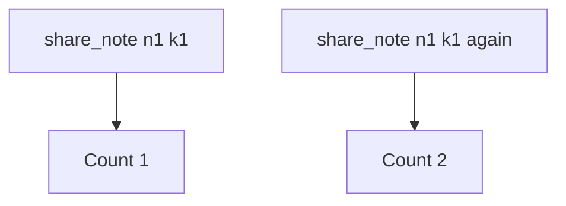

# 2.4-LO-03 — Observe the second append, do not trophy it

**Kind:** mechanism-lab
**Loop step:** 3 Break
**Standards:** IETF RFC 9110 (final); OWASP Top 10:2025 A10 as *awareness* only.

## Authorized scope

`labs/2.4/2.4-state-time` only. Do not load-test third-party APIs. Do not run wall-clock attacks on NTP.

**Forbidden outcome:** retry creates a second share grant.

## Mental model: every call is a new row



The vulnerable tree demonstrates **cause** (side effect not bound to the key), not a trophy race exploit. Preconditions: two calls with the same key; handler appends every time. A 504 is modeled by the second call—you do not need a real timeout.

## What to read in the fixture

`vulnerable/share.py` appends `note_id` on every `share_note` and ignores `idempotency_key`. Tests:

- `test_single_share` — one call still creates one grant
- `test_retry_does_not_duplicate_side_effect` — two calls with `k1` must leave count 1

## Root cause vs impact

| Slice | Lab |
|---|---|
| Root cause | Non-idempotent side effect plus retry |
| Impact | Extra principal on the note (1.2 cell changes) |
| Not the lesson | A10 mnemonic, scanner name, or “the user double-clicked wrong” |

## Practice

```
python3 -m pytest labs/2.4/2.4-state-time/tests --impl vulnerable
```

Record the failing test name. Do not weaken the assertion.

## Transfer

Payment capture (E3) and invite tokens (6.6). Predict without leaving this directory.

## Non-goals

No live-target instructions. Synthetic note ids only.
