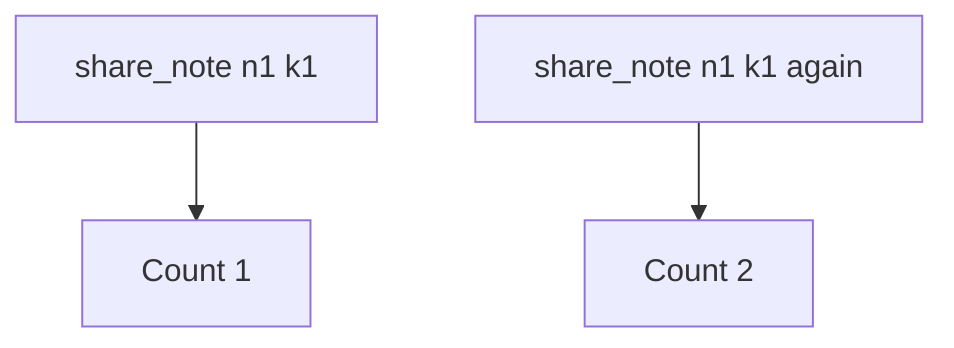

# 2.4-LO-03 — Observe the second append, do not trophy it

**Kind:** mechanism-lab
**Loop step:** 3 Break
**Standards:** IETF RFC 9110 HTTP Semantics (final) — POST is not idempotent; OWASP ASVS 5.0.0 (final) `v5.0.0-2.3.3`; OWASP Top 10:2025 A10 as *awareness* only, not this oracle.

## Authorized scope

`labs/2.4/2.4-state-time` only. The fixture is an in-process `share_note` list. It does not open a browser, talk to a payment network, or race a public API. Do not load-test third-party APIs. Do not run wall-clock attacks on NTP. Do not point this exercise at a live clinic booking page, a classmate’s FastAPI, or an employer checkout.

**Forbidden outcome:** retry creates a second share grant. Two `share_note("n1", idempotency_key="k1")` calls leave `share_count() == 2`.

Attacker capability in this lab: a **retrying client** that can call `share_note` twice with the same key. That stands in for a 504, a double-click, a load balancer that retries POST, or an at-least-once worker you will meet in 7.4. Trust assumption: the handler is supposed to treat `k1` as “this attempt already landed.” FastAPI, Next.js `fetch` retries, HTTP/2 retry logic, and “the user will not click twice” are not in the TCB for this cell.

## Mental model: every call is a new row



The vulnerable tree demonstrates **cause** (the share side effect is not bound to the key), not a trophy race exploit. Preconditions: two calls with the same key; the handler appends `note_id` every time and ignores `idempotency_key`. A 504 is modeled by the second call—you do not need a real timeout, a sleep, or a second process.

RFC 9110 does not make POST happen once. HTTP 201 twice is still two rows. A10 names exceptional conditions as awareness; it is not the failing assertion.

## What to read in the fixture

`vulnerable/share.py` `share_note` appends `note_id` to `_SHARES` on every call. The parameter `idempotency_key` is accepted and discarded. Tests:

- `test_single_share` — one call still creates one grant (honest happy path)
- `test_retry_does_not_duplicate_side_effect` — two calls with `k1` must leave `share_count() == 1`

You do not need a new key string. The failure of `test_retry_does_not_duplicate_side_effect` *is* the evidence.

Do not open the fixed tree yet. Diagnose the cause first.

## Root cause vs impact vs prevention vs detection vs recovery

| Slice | This lab |
|---|---|
| Required property | Two `share_note` calls with the same key produce one grant |
| Root cause | Non-idempotent side effect plus retry; the key does not mediate the append |
| Preconditions | Note `n1`; key `k1`; handler inserts on every POST |
| Trigger | Second `share_note("n1", idempotency_key="k1")` |
| Impact | Integrity of authorization state over time; an extra 1.2 cell nobody intended |
| Prevention | Persist key → first share; second POST returns the first outcome |
| Detection | Duplicate-key hits; `share_count` versus unique keys |
| Recovery | Revoke extra shares; notify owner; never fail-open if the key store is down |
| Not the lesson | A10 mnemonic, “the user double-clicked wrong,” disable-on-submit, or a scanner name |

## Framework defaults versus the share guarantee

A FastAPI route, Next.js disable-on-submit, or “PostgreSQL will unique-constrain it” is not this pytest. A unique constraint on `(note_id)` would block **any** second share, including a legitimate new key—wrong predicate. The application guarantee is: **this** fixture, two calls with `k1`, `share_count() == 1`.

## Practice

```text
python3 -m pytest labs/2.4/2.4-state-time/tests --impl vulnerable
```

Record the failing test `test_retry_does_not_duplicate_side_effect`. Do not weaken the assertion to “HTTP 200 once.” An environment or import error is not security evidence.

## Transfer

Payment capture (E3) and invite tokens (6.6). Predict, without leaving this directory, whether a second POST with the same capture key must still leave one capture. Clinic last slot uses `v5.0.0-2.3.4` (locking limited quantity)—same fork, different object.

## Usability

Disable-on-submit is not the property. An accessible “still working” status (WCAG 2.2 Success Criterion 4.1.3) must not mint a **new** key on each announcement.

## Non-goals

No live-target instructions. Synthetic note ids only. No NTP or payment-network walkthroughs.
