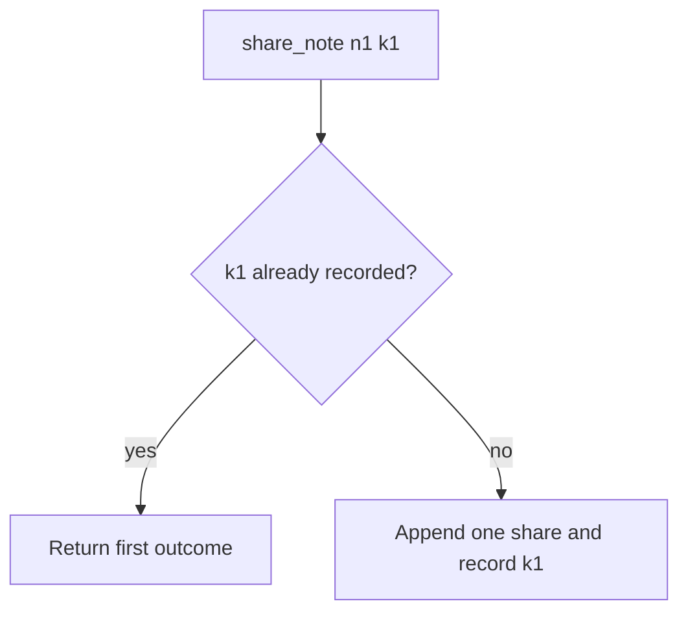

# 2.4-LO-04 — Remember the first outcome; do not append again

**Kind:** design-exercise
**Loop step:** 4 Build
**Standards:** OWASP ASVS 5.0.0 (final) `v5.0.0-2.3.3`; Saltzer and Schroeder (1975, seminal) fail-safe defaults; RFC 9110 (final) does not replace the store.

## Structural means the key mediates the side effect

`share_note` with the same idempotency key must not increase `share_count`. Structural means the store actually remembers the first outcome—not a log comment, not disable-on-submit, not “FastAPI will dedupe,” not a unique constraint on `note_id` that also blocks a legitimate new key.

The smallest restore for SecureCollab Phase 1 share is: if `k1` is already recorded, return the first grant and do not append. Missing key still shares once in this lab (simplicity); production should **require** keys for high-impact grants (residual). Fail-safe: if the key store cannot be reached, **do not** insert a share “just this once.”

## Mental model: seen-key returns



The lab’s fixed tree records keys in `_SEEN` and returns on replay. Production should persist `(actor, key) → share_id` and return that id. The client-supplied key is data: it must be scoped to the sharer so Tenant B cannot replay Tenant A’s key into a different note. Clocks may skew; do not use wall time as the only uniqueness.

ASVS `v5.0.0-2.3.3` (Level 2) wants business-logic transactions to succeed entirely or roll back. The lab is that sentence for share-count under retry, not a payment network.

## Why this restores the cell

| After the fix | Must be true |
|---|---|
| One call with k1 | `share_count() == 1` |
| Two calls with k1 | `share_count() == 1` |
| Two calls with different keys | not this pytest; 1.2 may still cap grants |
| Key store unreachable | do not insert (not in this pytest; write it as residual) |

## What this is not

HTTP 201 twice is still two rows if you did not remember the key. Keys that expire too fast replay as new shares. Databases are not automatically idempotent. GET-with-side-effect violates RFC 9110 safety and duplicates on prefetch. A UI that disables the Share button is a hint; users, proxies, and workers retry anyway.

## Mechanism limits

- A new key on every retry (client bug) bypasses the store by construction—cap grants (1.2) and teach the client to reuse the key.
- Lost first response still needs a read-your-write path so the owner can see the existing grant without minting another key.
- Worker retry with a **stale** 1.2 grant is Module 7.4: time is part of mediation, not only idempotency.
- Concurrent two-first-writes without a unique constraint on `(actor, key)` can still double-insert; this fixture is sequential.

## Practice

Name subject (retrying client), object (share row for `n1`), action (append), and the predicate (seen `k1` ⇒ no second row). Run:

```text
python3 -m pytest labs/2.4/2.4-state-time/tests --impl fixed
```

Must pass.

## Transfer

Clinic last slot: lock or unique booking key (`v5.0.0-2.3.4`), not “the UI disabled the button.” Payment capture (E3) uses the same store shape: first capture id, not a second debit.

## Residual risk

Key TTL too short; fail-open on store timeout; WCAG status that mints a new key; worker stale grants (7.4); true races without a unique constraint.

## Usability

The share widget remains a 1.4 / 4.2 control. Idempotency is invisible to the keyboard user. Do not trade an accessible “still working” message for a new key.
