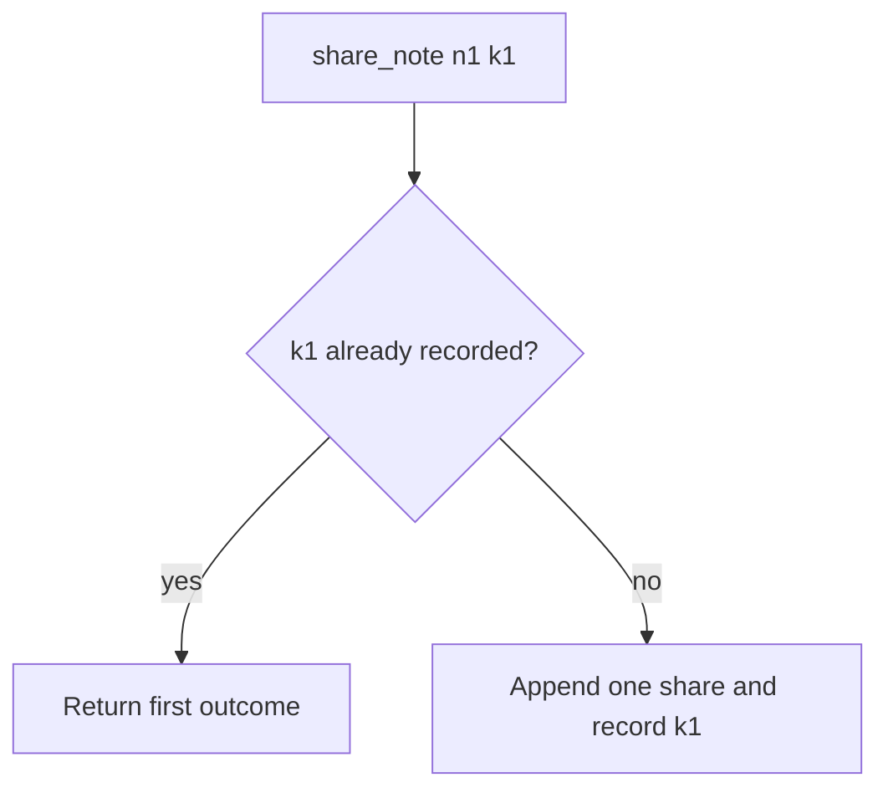

# 2.4-LO-04 — Remember the first outcome; do not append again

**Kind:** design-exercise
**Loop step:** 4 Build
**Standards:** OWASP ASVS 5.0.0 (final) `v5.0.0-2.3.3`; Saltzer and Schroeder fail-safe defaults.

## Structural means the key mediates the side effect

`share_note` with the same idempotency key must not increase `share_count`. Structural means the store actually remembers the first outcome—not a log comment, not disable-on-submit, not “FastAPI will dedupe.”

## Mental model: seen-key returns



The lab’s fixed tree records keys in `_SEEN` and returns on replay. Production should persist `(actor, key) → share_id` and return that id. Missing key still shares once in the lab (simplicity); production should **require** keys for high-impact grants (residual).

Fail-safe: if the key store cannot be reached, **do not** insert a share “just this once.”

## Why this restores the cell

| After the fix | Must be true |
|---|---|
| One call with k1 | count 1 |
| Two calls with k1 | count 1 |
| Two calls with different keys | not this pytest; 1.2 may still cap |

## What this is not

HTTP 201 twice is still two rows if you did not remember the key. Keys that expire too fast replay as new shares. Databases are not automatically idempotent.

## Practice

Name subject, object, action, and the predicate. Run:

```
python3 -m pytest labs/2.4/2.4-state-time/tests --impl fixed
```

Must pass.

## Transfer

Clinic last slot: lock or unique booking key (`v5.0.0-2.3.4`), not “the UI disabled the button.”

## Residual risk

Lost first response still needs a read-your-write path. Worker stale grants are 7.4.
