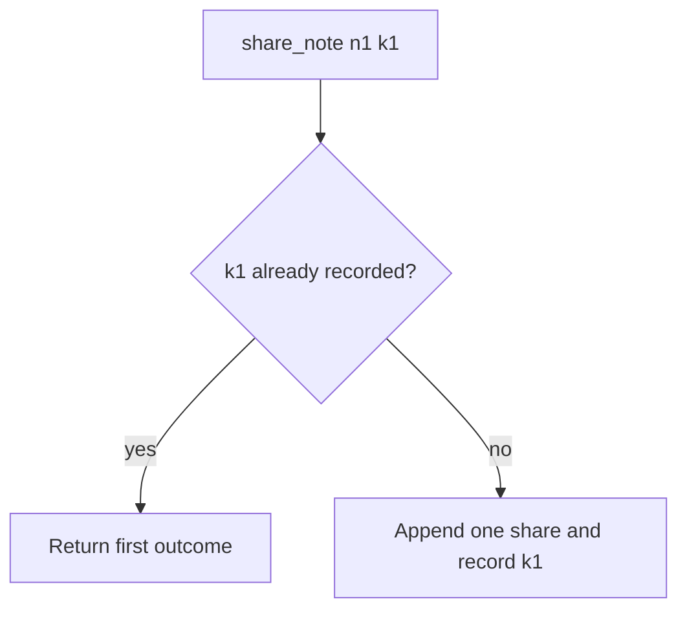

# Remember the first outcome; do not append again

**Kind:** design-exercise
**Loop step:** 4 Build

## The rule

`share_note` with the same idempotency key must not increase `share_count`. In short, the store actually remembers the first outcome — not a log comment, not disable-on-submit, not “FastAPI will remember,” not a unique constraint on `note_id` that also blocks a legitimate new key.

For share: if `k1` is already recorded, return the first share and do not append. Missing key still shares once in this lab (simplicity); production should **require** keys for high-impact shares (leftover). If the key store cannot be reached, **do not** insert a share “just this once.”

## Picture: a seen key returns



The lab’s repaired files record keys in `_SEEN` and return on replay. Production should persist `(actor, key) → share_id` and return that id. The key the client sends is data: it must be scoped to the sharer so company B cannot replay company A’s key onto a different note. Clocks may skew; do not use wall time as the only uniqueness.

A business step has to succeed all the way or roll back. The lab covers share-count under retry, not a payment network.

## What the repaired files must show

| After the fix | Must be true |
|---|---|
| One call with k1 | `share_count() == 1` |
| Two calls with k1 | `share_count() == 1` |
| Two calls with different keys | not this check; who-is-allowed policy may still cap shares |
| Key store unreachable | do not insert (not in this check; write it as leftover) |

## What this is not

HTTP 201 twice is still two rows if you did not remember the key. Keys that expire too fast replay as new shares. Databases are not automatically remembering. A GET that shares the note will also duplicate if the browser prefetches it. A UI that disables the Share button is a hint; users, proxies, and workers retry anyway.

## What can still go wrong

- A new key on every retry (a client bug) walks around the store by construction — cap how many shares a note may have, and teach the client to reuse the key.
- A lost first response still needs a path so the owner can see the existing share without minting another key.
- A worker that retries a share after membership was taken back is a later topic: time is part of the check, not only remembering the first outcome.
- Two first writes at the same time without a unique constraint on `(actor, key)` can still double-insert; this practice is sequential.
- Key lifetime too short; fail open on store timeout; a “still working” status that mints a new key.

## Practice

Name who (retrying client), what (share row for `n1`), action (append), and the check (seen `k1` ⇒ no second row). Run:

```text
python3 -m pytest labs/2.4/2.4-state-time/tests --impl fixed
```

## Use it somewhere new

The last slot needs a lock or unique booking key, not “the UI disabled the button.” Payment capture uses the same store shape: first capture id, not a second debit.

## Can people still use it

The share widget still needs a name, a keyboard path, and a cue that is not only color. Remembering the first outcome is invisible to the keyboard user. Do not trade an accessible “still working” message for a new key.
