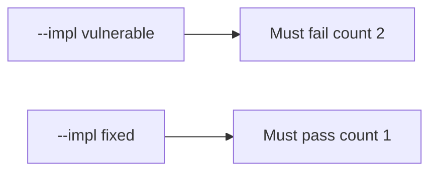

# 2.4-LO-05 — Evidence is a failing duplicate count, then a passing pair

**Kind:** verification-lab
**Loop step:** 5 Verify
**Standards:** OWASP ASVS 5.0.0 (final) `v5.0.0-2.3.3`; RFC 9110 (final).

## An invariant that cannot fail a test is still a slogan

HTTP 200 on a single click is not this module’s evidence (see 9.3). The oracle is two calls with the same key.

## Mental model: vulnerable must fail: count 2

The failing observation on `--impl vulnerable` is **count 2**. A passing collection count is not this cell.



| Case | Must show |
|---|---|
| Normal | One `share_note` with k1 → count 1 |
| Negative / abuse | Two calls with k1 → count 1 |
| Failure default | Key-store uncertainty does not insert (not in this pytest; write it as residual) |

Lab tests: `test_single_share` and `test_retry_does_not_duplicate_side_effect` in `labs/2.4/2.4-state-time/tests/test_idempotency.py`.

```
python3 -m pytest labs/2.4/2.4-state-time/tests --impl vulnerable
python3 -m pytest labs/2.4/2.4-state-time/tests --impl fixed
```

Map each test to a matrix cell from LO-02. Do not paste keys.

## What the tests do not prove

- Concurrent two-first-writes (true race) without a unique constraint
- Worker stale 1.2 grants (7.4)
- Payment capture (E3)
- A10 compliance

## Practice

Execute both implementations. If vulnerable does not fail, the lab is miswired.

## Transfer

Clinic last slot. A test that only asserts 201 once is not double-book evidence.
