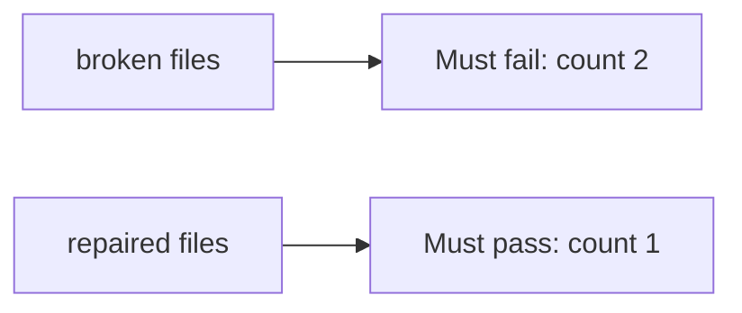

# A retry that writes twice must fail

**Kind:** verification-lab
**Loop step:** 5 Verify

## Check it

HTTP 200 on a single click is not this topic’s evidence. “The button is disabled” is a tool observation. The check is: for two `share_note("n1", idempotency_key="k1")` calls, `share_count() == 1`. That observation must be **false** on the broken files and **true** on the repaired files.

## Picture: a retry that appends twice must fail

A check that only asserts HTTP 200 once can still look green while a retry still appends a second share.



| Mode | Must show for this topic |
|---|---|
| Normal | After the fix, one `share_note` with k1 still creates one share (`test_single_share`) |
| Wrong input / abuse | Two calls with k1 → count 1; broken files must fail that check |
| When things break | Key-store uncertainty does not insert (not in this check; write it as leftover) |
| Not claimed | Two first writes at the same time solved; worker stale shares gone; awareness-list “compliant”; payments safe |

Lab tests: `test_single_share` and `test_retry_does_not_duplicate_side_effect` in `labs/2.4/2.4-state-time/tests/test_idempotency.py`. The second test calls `share_note` twice with `k1` and expects count 1. That check is there so a second grant cannot sneak through.

```text
python3 -m pytest labs/2.4/2.4-state-time/tests --impl vulnerable
python3 -m pytest labs/2.4/2.4-state-time/tests --impl fixed
```

Map each test to the retry row you wrote on the state-machine page. Do not paste keys. If the broken files do not fail, the lab is miswired — fix the wiring, not the check. A setup error is not proof the rule holds.

## What the tests do not prove

- Two first writes at the same time (a true race) without a unique constraint
- A worker retrying a stale share (later topic)
- Payment capture
- Invite-token reuse
- Clinic last-slot locking
- Awareness-list compliance
- That GET is safe (HTTP still does not make POST happen once, and GET must not share)

Record those as leftover or later topics, not as silent passes.

## Practice

Run both this session. Write the fail/pass pair next to the matrix row. Reject a “test” that only greps `idempotency` in a string without calling `share_note` twice.

## Use it somewhere new

Clinic last slot. A test that only asserts HTTP 201 once is not double-book evidence. A test that loads the real clinic is out of scope.

## What this page is not doing

Do not add a live race. Do not log note bodies. Answer keys are not on this site.
