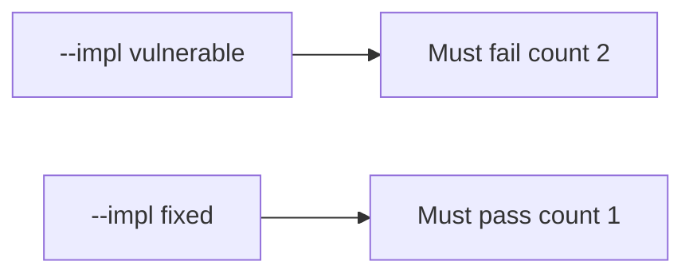

# 2.4-LO-05 — Evidence is a failing duplicate count, then a passing pair

**Kind:** verification-lab
**Loop step:** 5 Verify
**Standards:** OWASP ASVS 5.0.0 (final) `v5.0.0-2.3.3`; RFC 9110 (final). Top 10:2025 A10 is awareness, not this pair.

## An invariant that cannot fail a test is still a slogan

HTTP 200 on a single click is not this module’s evidence (see 9.3). “The button is disabled” is a mechanism observation. The oracle is: for two `share_note("n1", idempotency_key="k1")` calls, `share_count() == 1`. That observation must be **false** on `--impl vulnerable` and **true** on `--impl fixed`.

## Mental model: vulnerable must fail: count 2

The failing observation on `--impl vulnerable` is **count 2**. A passing collection count is not this cell.



| Mode | Must show for this module |
|---|---|
| Normal | After the fix, one `share_note` with k1 still creates one grant (`test_single_share`) |
| Negative / abuse | Two calls with k1 → count 1; vulnerable must fail that assertion |
| Failure | Key-store uncertainty does not insert (not in this pytest; write it as residual) |
| Not claimed | Concurrent two-first-writes solved; worker stale grants gone; A10 “compliant”; payments safe |

Lab tests: `test_single_share` and `test_retry_does_not_duplicate_side_effect` in `labs/2.4/2.4-state-time/tests/test_idempotency.py`. The second test calls `share_note` twice with `k1` and expects count 1. That is a **forbidden-outcome** test: a duplicate grant is not allowed to count as a passing control.

```text
python3 -m pytest labs/2.4/2.4-state-time/tests --impl vulnerable
python3 -m pytest labs/2.4/2.4-state-time/tests --impl fixed
```

Map each test to the LO-02 retry cell. Do not paste keys. If vulnerable does not fail, the lab is miswired—fix the wiring, not the assertion. An environment error is not security evidence.

## What the tests do not prove

- Concurrent two-first-writes (true race) without a unique constraint
- Worker stale 1.2 grants (7.4)
- Payment capture (E3)
- Invite-token reuse (6.6)
- Clinic last-slot locking (`v5.0.0-2.3.4`)
- A10 compliance
- That GET is safe (RFC 9110)

Record those as residuals or later modules, not as silent passes.

## Practice

Execute both implementations this session. Write the fail/pass pair next to the matrix row. Reject a “test” that only greps `idempotency` in a string without calling `share_note` twice.

## Transfer

Clinic last slot. A test that only asserts HTTP 201 once is not double-book evidence. A test that loads the real clinic is out of scope.

## Non-goals

Do not add a live race. Do not log note bodies. Keys stay out of this file.
