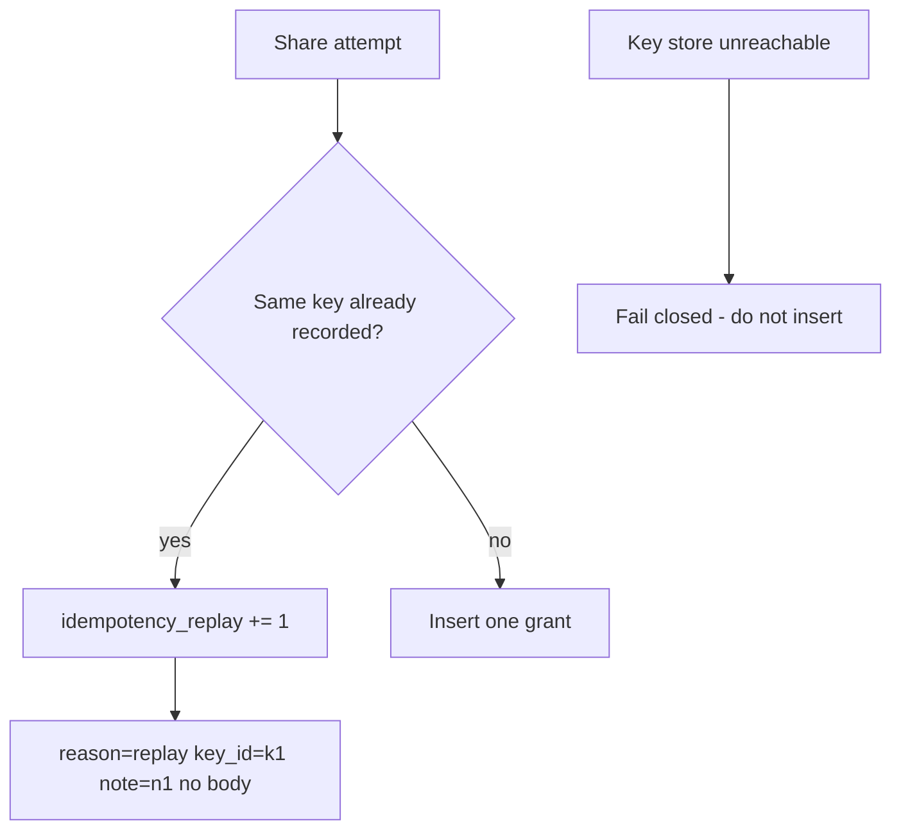

# 2.4-LO-06 — Detect a second grant; never fail-open the key store

**Kind:** operations-exercise
**Loop step:** 6 Operate
**Standards:** NIST CSF 2.0 (final) DE/RS/RC as outcome labels; OWASP ASVS 5.0.0 (final) `v5.0.0-2.3.3`; Module 3.1 / 5.1.

## Prevention is not absolute

A new client that mints a key per retry, a TTL that is too short, or a store outage can reintroduce duplicates. Pair detect and recover. Do not log note bodies or session values.

## Mental model: count versus unique keys



| Outcome | This module |
|---|---|
| Detect | Duplicate-key hits; `share_count` vs unique keys |
| Signal | key id, note id, actor id; never the note body |
| Recover | Revoke extra shares; notify owner |
| Residual | Lost first response needs read-your-write; never fail-open if the key store is down |

CSF 2.0 names outcomes. They do not prove ASVS. A10 is awareness regression, not the runbook title.

## Practice

Write one log line you would accept. Tie it to `labs/2.4/2.4-state-time`.

```
share_replay reason=same_idempotency_key note_id=n1 key_id=k1 actor=owner_a request_id=req_22c1
```

Reject any line that includes a note body or a real email.

## Transfer

Payment capture (E3): detect double capture without logging PAN. Clinic: detect double-book without logging the chart.

## Usability

Disable-on-submit is not the property. Accessible “still working” (WCAG 4.1.3) must reuse the same key.

## Non-goals

SIEM product names are not the property.
