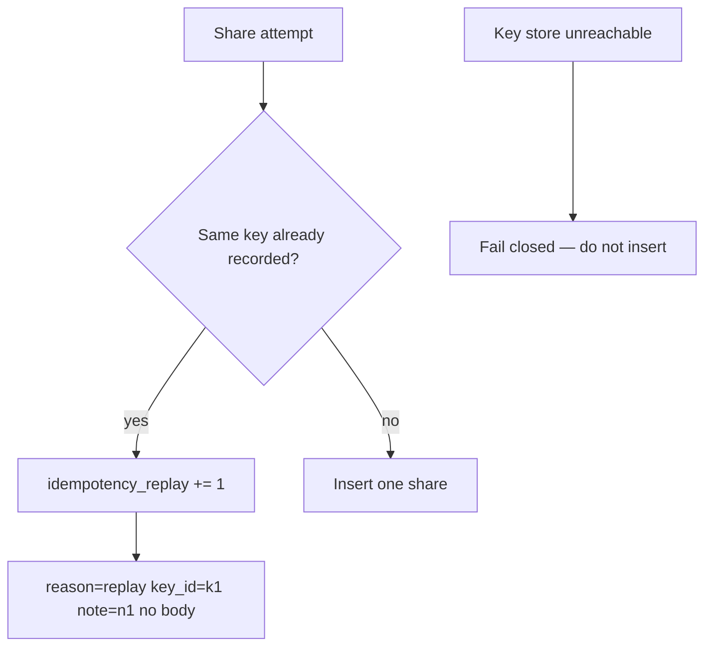

# Notice a second grant; never fail open the key store

**Kind:** operations-exercise
**Loop step:** 6 Operate

## Fixing it once is not enough

A client that mints a key per retry, a lifetime that is too short, or a store outage can reintroduce duplicates. Keep note bodies and session values out of the ticket. Do not fail open: if the idempotency store is unreachable, do not insert “just this once.”

## Picture: count versus unique keys



On a broken retry, fail closed, and keep the note out of the log.

| Outcome | This topic |
|---|---|
| Notice | Hits on a key you already saw; `share_count` versus unique keys; the local pair still red then green |
| What the line holds | key id, note id, actor id, request id; never the note body |
| Recover | Take extra shares back; tell the owner; re-run `test_retry_does_not_duplicate_side_effect` |
| Leftover | A lost first response needs a path so the owner can see the share; never fail open if the key store is down |

A log product does not prove this share rule. A famous-bugs-list name is not the runbook title.

## What the framework does vs what you still have to check

uvicorn access logs, FastAPI exception handlers, and Next.js analytics will store query strings and error text. Those drains are not this replay metric. If you log the note body while investigating a duplicate share, you have opened a leak.

## Practice

```text
share_replay reason=same_idempotency_key note_id=n1 key_id=k1 actor=owner_a request_id=req_22c1
```

Reject any line that includes a note body, a real email, a session value, or “awareness list handled.”

## Use it somewhere new

Payment capture: notice a double capture without logging card numbers. Last-slot booking: notice a double-book without logging the chart. Invite tokens: notice a replay without logging the token.

## Can people still use it

Disable-on-submit is not the rule. Accessible “still working” must reuse the same key if it starts the work again.

## What this page is not doing

Do not instruct live load tests. Answer keys are not on this site.
