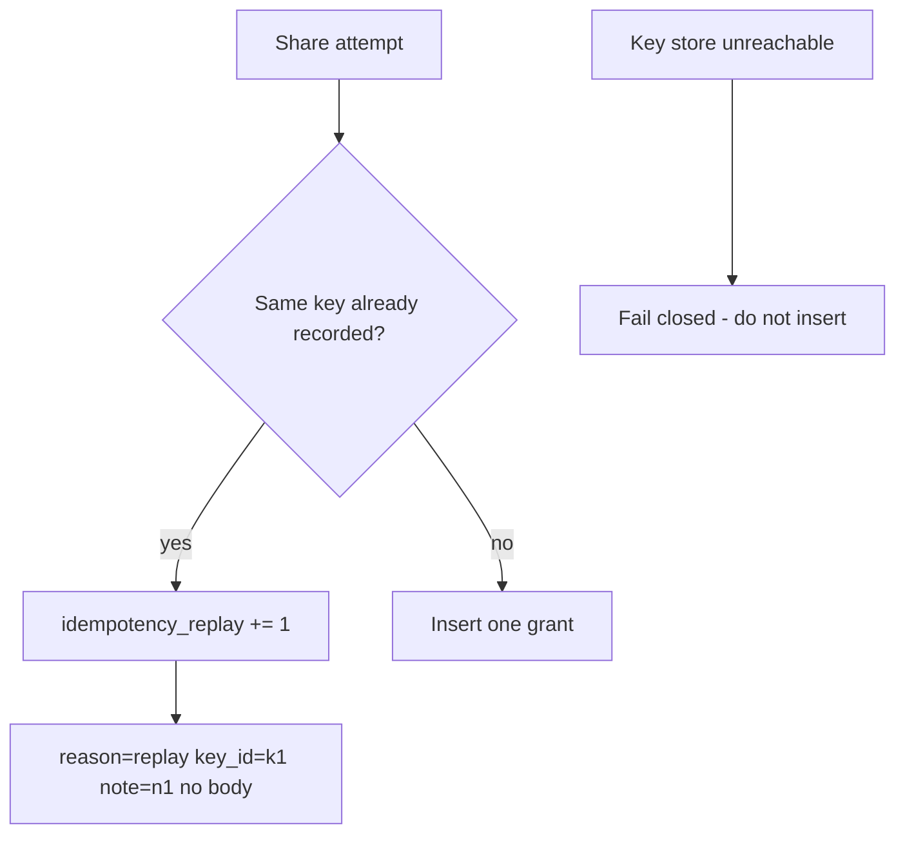

# 2.4-LO-06 — Detect a second grant; never fail-open the key store

**Kind:** operations-exercise
**Loop step:** 6 Operate
**Standards:** NIST CSF 2.0 (final) DE/RS/RC as outcome labels; OWASP ASVS 5.0.0 (final) `v5.0.0-2.3.3`; Module 3.1 / 5.1. CSF names outcomes; it does not prove ASVS.

## Prevention is not absolute

A new client that mints a key per retry, a TTL that is too short, or a store outage can reintroduce duplicates after `_SEEN` was “set once.” Pair detect and recover. Do not log note bodies or session values. Do not fail-open: if the idempotency store is unreachable, do not insert “just this once.”

## Mental model: count versus unique keys



| Outcome | This module |
|---|---|
| Detect | Duplicate-key hits; `share_count` versus unique keys; CI pair still red/green |
| Signal | key id, note id, actor id, request id; never the note body |
| Recover | Revoke extra shares; notify owner; re-run `test_retry_does_not_duplicate_side_effect` |
| Residual | Lost first response needs read-your-write; never fail-open if the key store is down |

CSF 2.0 names Detect / Respond / Recover outcomes. They do not prove `v5.0.0-2.3.3`. A10 is awareness regression, not the runbook title. A SIEM product name is not the property.

## Framework defaults versus the operate guarantee

uvicorn access logs, FastAPI exception handlers, and Next.js analytics will store query strings and error `repr`s (3.1 / 4.3). Those drains are not this replay metric. If you log the note body while investigating a duplicate share, you have opened a 3.1 cell.

## Practice

Write one log line you would accept. Tie it to `labs/2.4/2.4-state-time`.

```text
share_replay reason=same_idempotency_key note_id=n1 key_id=k1 actor=owner_a request_id=req_22c1
```

Reject any line that includes a note body, a real email, a session value, or “A10 handled.”

## Transfer

Payment capture (E3): detect double capture without logging PAN. Clinic: detect double-book without logging the chart. Invite tokens (6.6): detect replay without logging the token.

## Usability

Disable-on-submit is not the property. Accessible “still working” (WCAG 2.2 Success Criterion 4.1.3) must reuse the same key if it retriggers work.

## Non-goals

SIEM product names are not the property. Do not instruct live load tests. Gate 2 stays not-attempted without learner or product evidence.
