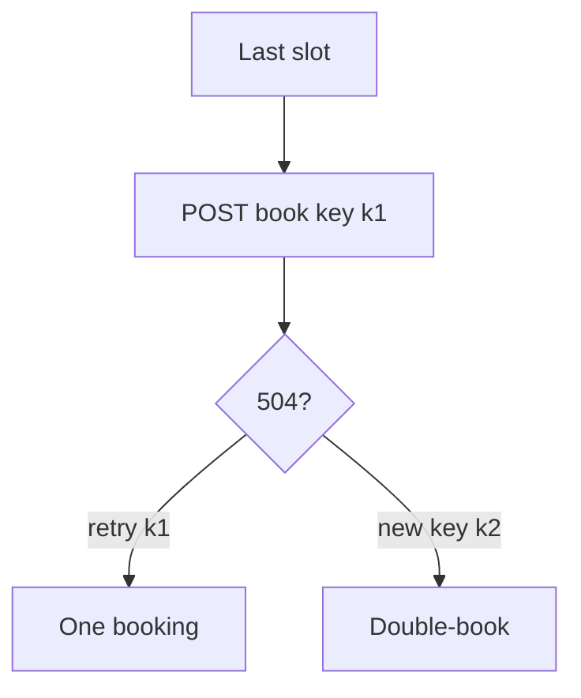

# Same idea on a last slot, a payment, or an invite

**Kind:** transfer-challenge
**Loop step:** 7 Transfer

## Use it somewhere new

You get a **clinic last slot**, a **payment capture**, or an **invite token**. Two `share_note` calls with `k1` leave one share.

Payment capture and invite tokens are the same shape.

Clinic: two POSTs book the last slot.

1. who can act (retry after 504; double-click; two tabs; load-balancer POST retry — **not** a live clinic, payment network, or public booking page);
2. what you trust (whose store remembers the first booking; clocks may skew; the UI is not what you trust);
3. what must not happen (two patients in one slot, two captures, or two invite redemptions — not an awareness-list name);
4. a test idea on a **local** practice only (`share_count`-shaped: two calls, one booking);
5. leftover (key lifetime too short; fail open on store timeout; a “still working” status that mints a new key; a worker retry of a share that was **taken back** — later topic);
6. whether a human path must meet the web accessibility baseline (status messages yes as baseline if you show “still working”; that still must reuse the key).

## Picture: limited quantity is the same fork

Here, “booking” is still “share” for this rule. Double-book and a second debit are new rules. Disable-on-submit is still not what you trust.

Locking so a limited quantity cannot be booked twice. That is the clinic transfer. They also want a business step to succeed all the way or roll back. Neither sentence is an awareness-list name. HTTP still does not make POST happen once.

## What is not good enough

| Reject | Why |
|---|---|
| An awareness-list name as the rule | Awareness only |
| Disable-on-submit as the promise | Users, proxies, and workers retry |
| Live clinic or payment network | Course rules |
| Unique constraint on `slot_id` that also blocks a legitimate wait-list | Wrong check |
| “HTTP 201 means once” | Tool observation, not the store |

## Practice

Write one page. Leave the keys closed. `labs/2.4/2.4-state-time` is the only running system you may break. A worker retry of a share that was **taken back** is an acceptable extra sentence pointing at a later topic. Do not fetch a clinic, a payment sandbox you do not own, or a public invite API.

## What this page is not doing

Do not try live-target walkthroughs. Do not use clock tricks against NTP. Do not use real card numbers or patient identifiers. This page does not finish a check-in.
