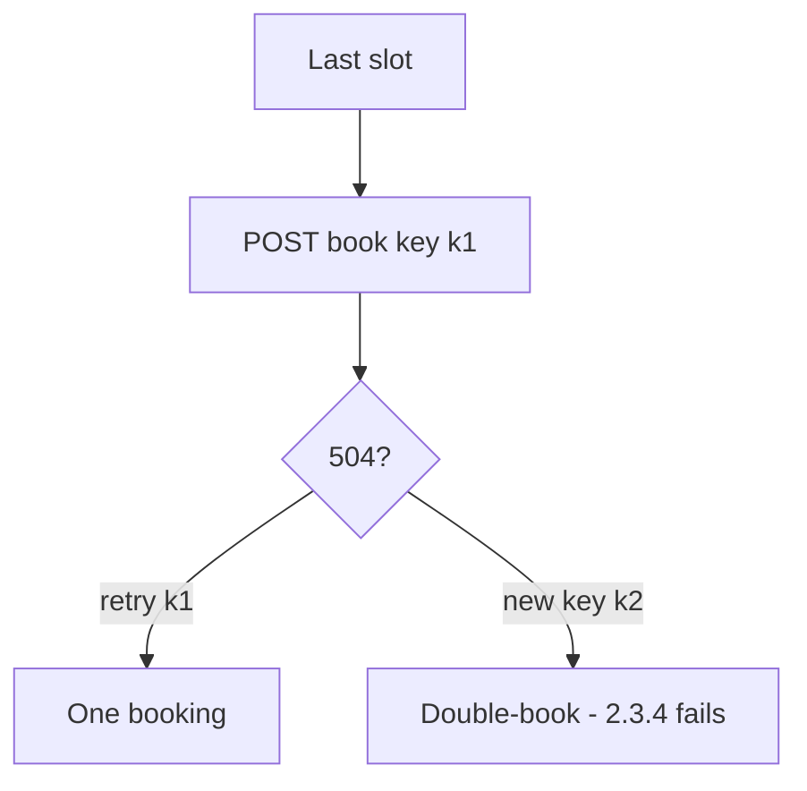

# 2.4-LO-07 — Transfer: last clinic slot, payment, or invite token

**Kind:** transfer-challenge
**Loop step:** 7 Transfer
**Standards:** OWASP ASVS 5.0.0 (final) `v5.0.0-2.3.3` and `v5.0.0-2.3.4`; RFC 9110 (final); Top 10:2025 A10 as awareness only.

## Change the object; keep the retry-is-not-a-second-effect shape

Do not answer with a Top 10 / CWE / scanner as the definition of security.

**Prompt:** Payment capture (E3) and invite tokens (6.6) are the same shape.

**Product sketch:** Clinic: two POSTs book the last slot.

Rewrite the SecureCollab sentence. Include:

1. attacker capabilities (retry after 504; double-click; two tabs; not a live clinic);
2. trust assumptions (whose store remembers the first booking; clocks may skew);
3. forbidden outcome (two patients in one slot, or two captures, not “A10”);
4. a test idea on a local fixture only;
5. residual (key TTL too short; fail-open on store timeout; WCAG status that mints a new key);
6. whether a human path must meet WCAG 2.2 (status messages yes as baseline if you show “still working”; that still must reuse the key).

## Mental model: limited quantity is the same fork

## What graders reject

| Reject | Why |
|---|---|
| A10 as the property | Awareness only |
| Disable-on-submit as the guarantee | Users and proxies retry |
| Live clinic or payment network | Lab policy |

## Practice

One page. No keys. `labs/2.4/2.4-state-time` is the only running system you may break. Worker retry of a **revoked** share is an acceptable extra sentence pointing at 7.4.
