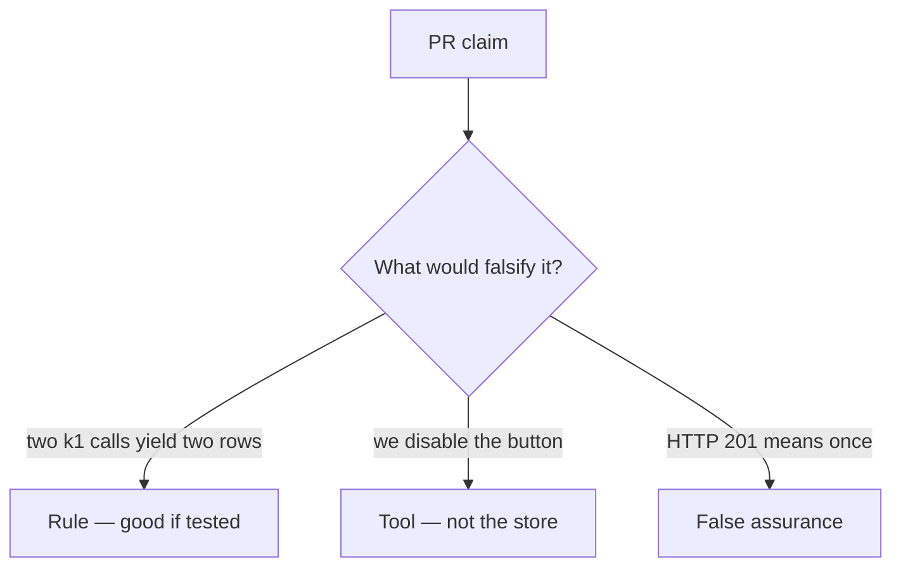

# Review of duplicate share inserts

**Kind:** code-review
**Loop step:** Review

The answers are not on this page. Do not open the keys file until someone has looked at your review.

## What you are reviewing

A colleague ships notes-app share. Review `labs/2.4/2.4-state-time/vulnerable/` as that change. Check whether a second `share_note` with `k1` still appends a row, compare that with the rule, and write changes a developer can verify.

The check you already ran (`test_retry_does_not_duplicate_side_effect`) is the rule test. A comment “will add remembering later” is not.

## Picture: INSERT share on every POST

**INSERT share on every POST**. Label it rule, tool, or false assurance before you accept the change.

What has to stay true: share count under retry. If that second call never includes a remembered first outcome, that leftover path is still open.

## Problems to find (name them yourself)

- INSERT share on every POST
- Idempotency key in a log comment only
- Test only happy-path single click
- Fail open on idempotency store timeout

Also reject: treating the client as what you trust; an awareness-list name as the finding title; closing findings without re-running `test_retry_does_not_duplicate_side_effect`; keys in learner notes; live load tests against a public API; unique-on-`note_id` as if it were this rule.

## Common mix-ups

- Retries are a client bug, not ours
- HTTP 200 means once
- Databases automatically remember
- Disable-on-submit is the promise
- FastAPI or Next.js retries remember the share list
- An awareness-list name as the definition of the finding

## Practice

Write three review notes a maintainer could act on. Each note: what you saw, rule or false assurance, suggested structural change, leftover you will **not** delete. Tie at least one to `test_retry_does_not_duplicate_side_effect`. Do not open the keys file.

## Use it somewhere new

Payment capture, invite token, or clinic last slot. A change that “handles the awareness list” without a replay test is an incomplete review. Name the independent falsehood that would still stop a second grant.

## Can people still use it

Disable-on-submit is not the rule. Accessible “still working” must not mint a new key.

## What this page is not doing

Do not merge by adding a comment “will add remembering later.” That comment is leftover risk without an owner.
